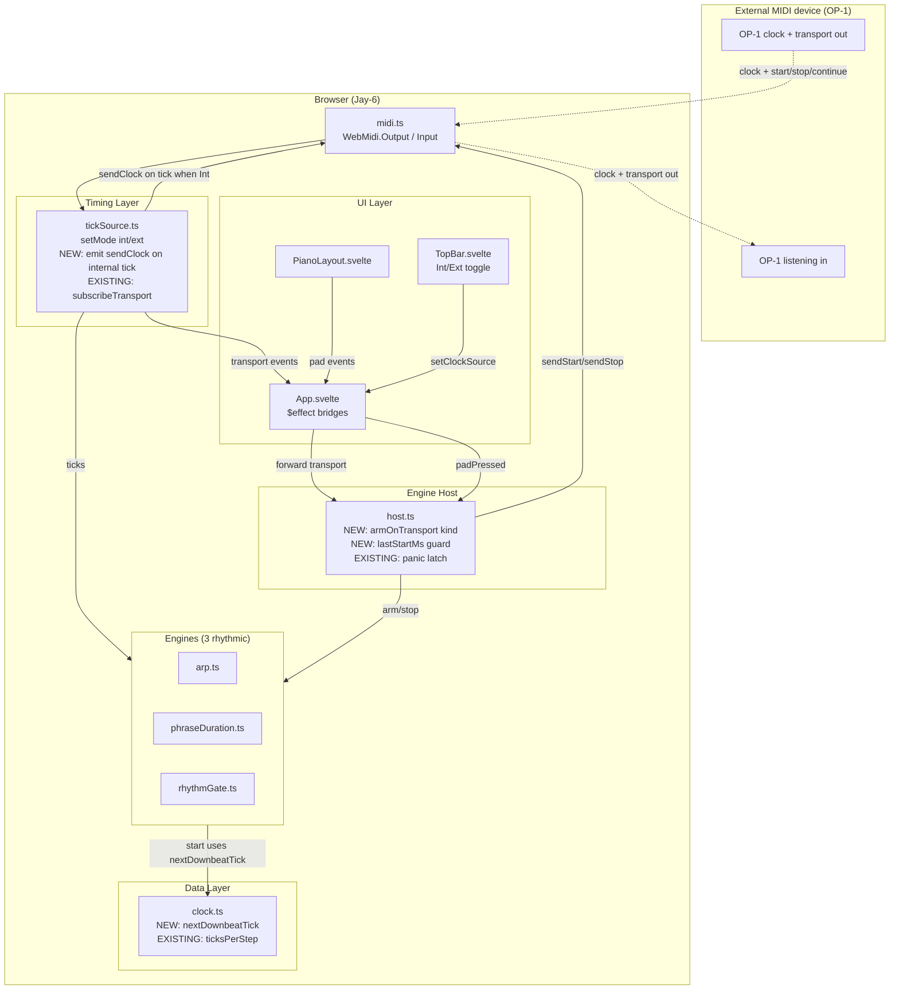

# Phase 2: Post-prototype polish + UAT acceptance — Research

**Researched:** 2026-05-18
**Domain:** Browser MIDI app — transport sync wiring, rhythm phase alignment, iPad touch ergonomics, user manual authoring, UAT close-out
**Confidence:** HIGH

<user_constraints>
## User Constraints (from CONTEXT.md)

### Locked Decisions

**Transport sync (REQ-clock-send-transport-sync)**

- **D-01: Standard MIDI master/slave convention.** Follow the protocol used by Ableton / Logic / drum-machines so Jay-6 behaves predictably when chained with the OP-1 or any other gear.
- **D-02: Clock send = always-on when Int.** Free-running 24 PPQ as soon as Int clock is active, even when no engine is playing. Stops the moment user switches to Ext.
- **D-03: Mode switch Int↔Ext mid-playback = hard stop.** Switching the toggle fires `panic()` (all notes off), stops the active engine, clears latch. User restarts manually. Zero edge cases, cleanest semantics.
- **D-04: Transport receive (Ext mode) = "hybrid" model** — chord-pad as live instrument, not as step-sequencer:
  - `Start` (`0xFA`) → engines arm, rhythm-engine pattern position reset to 0
  - Pad presses fire **immediately** on press (live-instrument behavior preserved from Phase 1)
  - Rhythm-driven engines (Arp / Phrase Dur / Rhythm Gate) anchor their step counter to incoming Clock so steps land on the external grid
  - `Stop` (`0xFC`) → stop engine, all notes off
  - `Continue` (`0xFB`) → resume from saved pattern position
  - OP-1 Record = treated identically to `Start`
- **D-05: Double-trigger guard.** Ignore an incoming `Start` if one was received within the last 200ms — prevents OP-1 Record + Start chatter from double-firing.

**Rhythm phase alignment (REQ-rhythm-phase-alignment-ext-clock)**

- **D-06: First step anchors to `tick % 24 == 0`.** Engine.start() under Ext clock does not fire immediately; it waits for the next downbeat boundary. Applies to `RhythmGateEngine`, `PhraseDurationEngine`, `ArpEngine`.
- **D-07: Int-mode behavior unchanged.** Existing "fires on press, no alignment wait" preserved when Jay-6 owns the clock (Phase 1 live-feel preserved).

**iPad polish (REQ-ipad-polish)** — see also `02-UI-SPEC.md` for the visual contract.

- **D-08: Full ergonomics pass** — not a minimal `user-select:none` patch. Concretely:
  - `user-select: none` on TopBar + dropdowns (parity with PianoLayout)
  - `touch-action: manipulation` on all interactive controls (kills 300ms tap delay + double-tap zoom)
  - 44pt minimum tap target sizes (Apple HIG)
  - Body scroll prevention (lock viewport on iPad)
  - Active-state visual feedback for taps (touch substitute for `:hover`)
- **D-09: Run `/gsd:ui-phase 2` BEFORE `/gsd:plan-phase 2`.** Generates UI-SPEC.md design contract that planner consumes. (DONE — `02-UI-SPEC.md` exists.)
- **D-10: Black-key visibility on dark background → UI phase decides options.** Currently low-contrast; UI phase generated option set and picked Option B (fill `#2e2e2e` + 1px inset top highlight). Fallback ladder A→C→D defined in UI-SPEC.

**User manual (NEW: REQ-user-manual)**

- **D-11: New Phase 2 deliverable.** Phase is "shipped" once the manual is clear enough for someone to use Jay-6 without source-code-spelunking.
- **D-12: Location + format.** Single `MANUAL.md` at repo root. Linked from `README.md` + `CURRENT-STATE.md`. Plain markdown — renders on GitHub, no build step.
- **D-13: Tone.** Consumer-product manual ("better than Roland's terrible one"). Explains **how to use**, not how it works internally. Designed to grow with future milestones (sequencer in v2 adds its own section without rewriting the existing structure).
- **D-14: Sections** (in this order):
  1. **Setup** (short) — Chrome/Edge requirement, HTTPS vs the .dev/.ai URLs, MIDI permission prompt, picking Output/Input/Channel
  2. **Pads + chords** — 100 banks, transpose (`±`/Z/X), latch (button/Space), Ableton-style keyboard mapping (A/W/S/E/...)
  3. **Styles** — Hold / Arp 1 / Arp 2 / Phrase Dur / Rhythm Gate 4+5; what each variation does; when to use which
  4. **Clock + transport sync** — Int vs Ext; BPM; chaining OP-1 as master or slave; what Start/Stop/Continue/Record do; iPad workflow under Web MIDI Browser

**UAT walkthrough (REQ-uat-walkthrough)**

- **D-15: UAT runs in verify-phase as the v1 close gate.** Single final walkthrough, not interleaved. Standard `/gsd:verify-work` flow handles the loop (walk → log gaps → fix → re-walk affected sections → retry close).
- **D-16: REQ-gate-slider + REQ-edge-cases are verified during UAT.** No separate work item — they're checklist items inside `.research/UAT.md`.

**Voicing audit (REQ-voicing-second-pass-audit) — DONE PRE-PHASE**

- **D-17: Reconciliation complete.** 3-source cross-check (Roland official + stonefruit third-party + Jay-6 current). 293 slots auto-patched. Post-fix re-audit: Roland 1200/1200 clean, stonefruit 1198/1200 (2 cosmetic whitespace residuals — notes identical).
- **D-18: Planner picks up only the commit + a UAT spot-check.** No further audit work.
- **D-19: Test anchor extension.** `test/banks.test.ts` currently anchors bank-1 Cadd9 + bank-14 Oct Stack only. Phase 2 should extend with 3–5 additional high-confidence reconciled slots (planner decides which).

### Claude's Discretion

- **Black-key visibility palette** — UI phase generated options + picked Option B (already in UI-SPEC).
- **Which 3–5 reconciled slots become test anchors** (D-19).
- **Exact wording / layout of MANUAL.md** within the D-13/D-14 constraints.
- **Code structure for transport sync wiring** — `App.svelte` $effect bridge vs `host.ts` extension vs new `transport.ts` module is a planner/researcher decision (must respect DEC-engines-time-source-agnostic + DEC-engine-orchestrator).

### Deferred Ideas (OUT OF SCOPE)

- **In-app help overlay** — a `?` button in TopBar opening a MANUAL.md excerpt as a modal. Considered, deferred. Static MANUAL.md at repo root is enough for v1; in-app help is a Phase 3+ UX upgrade.
- **Strict "step sequencer" transport mode** (where pad press during Ext waits for next downbeat instead of firing immediately). Considered, rejected for v1 in favor of "live instrument" hybrid model.
- **Sub-agent voicing-audit pattern as a reusable skill** — not now.

</user_constraints>

<phase_requirements>
## Phase Requirements

| ID | Description | Research Support |
|----|-------------|------------------|
| REQ-clock-send-transport-sync | Bidirectional 24 PPQ clock + Start/Stop/Continue, dedup on Start | §"Transport Sync — Wiring Pattern", §"WEBMIDI.js v3 Output Transport API", §"Pattern: Double-Trigger Guard" |
| REQ-rhythm-phase-alignment-ext-clock | Under Ext clock, first step lands on `tick % 24 == 0` | §"Pattern: Downbeat-aligned engine arm", §"Code Examples — nextDownbeatTick helper" |
| REQ-ipad-polish | Full ergonomics pass (touch-action, 44pt, body lock, :active) | §"iPad Touch Ergonomics — Mechanical CSS Contract", §"Pattern: iOS body scroll lock" |
| REQ-voicing-second-pass-audit | Done pre-phase — planner only adds 3–5 test anchors per D-19 | §"Open Question Q1 — anchors already shipped" |
| REQ-uat-walkthrough | Walk `.research/UAT.md` end-to-end via `uat-agent` | §"Architecture Patterns — UAT flow"; project skill `.claude/skills/uat-agent` |
| REQ-edge-cases | Verified inside UAT §19 — no separate task | n/a (UAT-only) |
| REQ-gate-slider | Verified inside UAT §12 (flagged suspect — code bug vs OP-1 envelope) | n/a (UAT-only) |
| REQ-user-manual (NEW) | `MANUAL.md` at repo root, consumer-product tone, D-14 section order | §"MANUAL.md Structure", §"State of the Art — TE/PO manual aesthetic" |
</phase_requirements>

## Summary

Phase 2 is a **close-out phase**, not a greenfield feature build. The codebase already contains 80% of the plumbing — `tickSource.subscribeTransport()` emits the right events but nothing listens, `WebMidi.Output` exposes `sendClock`/`sendStart`/`sendStop`/`sendContinue` but they're never called, and the three rhythmic engines (Arp / PhraseDur / RhythmGate) all fire on `start()` immediately regardless of the external clock's phase. The work is **threading existing pieces together correctly**, not inventing new infrastructure.

The transport-sync wiring naturally lives in two places: (1) a tiny `App.svelte` `$effect` that subscribes to `tickSource.subscribeTransport()` and forwards events to `host.ts`, plus (2) new methods on `EngineHost` (`arm()`, `resume()`, `panicAndStop()`) that drive engine lifecycle under external transport. The double-trigger guard (D-05) is a single `Date.now() - lastStartMs < 200` check at the host boundary. Clock send (D-02) is a one-line `WebMidi.getOutputById(...).sendClock()` call inside `tickSource.startInternalTimer()`'s callback, gated by mode. Rhythm phase alignment (D-06) is best modeled as a pure helper `nextDownbeatTick(currentTick)` in `clock.ts` (24-tick boundary math) that each engine's `start()` consults under external mode — keeping the math unit-testable per DEC-tests-data-and-math-only.

iPad polish is mechanical: `touch-action: manipulation` + `user-select: none` on TopBar/dropdowns, `min-width/min-height: 44px` on every interactive control, an `@media (pointer: coarse)` block that locks body scroll. The UI-SPEC (`02-UI-SPEC.md`) is the design contract — planner consumes it. MANUAL.md is a writing task with a clear D-14 outline; the aesthetic anchor is Teenage Engineering pocket-operator manuals (compact, friendly, function-first).

**Primary recommendation:** Add a thin `EngineHost.armOnTransport(kind)` method + a `clock.ts` `nextDownbeatTick()` helper. Wire one `$effect` in `App.svelte` for transport-receive + one tick-send hook in `tickSource.ts`. Don't introduce a new `transport.ts` module — the surface area is too small to justify it, and DEC-engine-orchestrator says transport semantics belong in the host.

## Architectural Responsibility Map

| Capability | Primary Tier | Secondary Tier | Rationale |
|------------|-------------|----------------|-----------|
| Receive MIDI transport (Start/Stop/Continue) | Timing Layer (`tickSource.ts`) | Engine Host (`host.ts`) | TickSource already owns the input listener. Host owns engine lifecycle — transport events MUST route through host per DEC-engine-orchestrator. |
| Send MIDI clock + transport | Timing Layer + MIDI Layer | — | `tickSource` emits ticks; on each tick, when mode=internal, call `output.sendClock()`. Engine start/stop emits `sendStart`/`sendStop` via host. |
| Double-trigger guard | Engine Host | — | Belongs at the lifecycle boundary, not in tickSource (which is dumb pipe). |
| Rhythm phase alignment math | Data Layer (`clock.ts`) | Engine Layer (3 engines) | Pure math goes in `clock.ts` (unit-testable). Engines consume the helper in their `start()` under Ext mode. |
| Black-key fill + highlight | UI Layer (`PianoLayout.svelte`) | — | Pure CSS change in component scoped styles. |
| Touch ergonomics (touch-action, 44pt, :active) | UI Layer (`TopBar.svelte`, `App.svelte` global CSS) | — | Component-scoped CSS + one `@media (pointer: coarse)` global block. |
| Body scroll lock (iPad) | UI Layer (`App.svelte` global `<style>`) | — | Must be at the app root to affect `html, body`. |
| MANUAL.md | Repo root (docs) | — | Plain markdown file. Not part of build pipeline. |
| Test anchor extension | Data Layer (`test/banks.test.ts`) | — | Vitest is the only valid testing surface here (DEC-tests-data-and-math-only). |
| UAT walkthrough | Project Skill (`.claude/skills/uat-agent`) | — | Existing skill; runs inside `/gsd:verify-work`. |

## Standard Stack

### Core (already installed — no new dependencies)

| Library | Version | Purpose | Why Standard |
|---------|---------|---------|--------------|
| `webmidi` | 3.1.16 [VERIFIED: npm view webmidi version] | Web MIDI wrapper — `Output.sendClock/sendStart/sendStop/sendContinue`, `Input` clock/start/stop/continue events | Already in use; the only mature TypeScript wrapper around Web MIDI API; sub-class of EventEmitter so multi-listener works out of the box |
| `svelte` | ^5.0.0 [VERIFIED: package.json] | UI runtime + runes ($state/$effect) | Already in use; runes give us imperative-to-reactive bridging via $effect |
| `vitest` | ^2.1.0 [VERIFIED: package.json] | Test runner for `clock.ts` / `banks.ts` math | Already in use; matches DEC-tests-data-and-math-only |

### Supporting

| Library | Version | Purpose | When to Use |
|---------|---------|---------|-------------|
| (none new) | — | — | Phase 2 ships zero new dependencies. All capabilities already in the stack. |

### Alternatives Considered

| Instead of | Could Use | Tradeoff |
|------------|-----------|----------|
| In-line WEBMIDI.js calls | `@tonejs/midi`, `jzz` | More features but Jay-6 doesn't need them; would double the bundle for zero gain. **Stay with `webmidi`.** |
| Pure-CSS body lock | `body-scroll-lock` npm package | The package is heavyweight and now archived. The 3-line CSS solution under `@media (pointer: coarse)` is the standard pattern. **Stay with CSS.** |
| New `transport.ts` module | Inline in `host.ts` | One module per ~10 lines of code is over-engineering. **Inline in `host.ts`** per DEC-engine-orchestrator. |
| Custom MANUAL renderer | Just GitHub markdown | GitHub renders MANUAL.md fine; no build step needed. **Plain markdown** per D-12. |

**Installation:** *(none — no new packages)*

**Version verification (re-check at task time):**
```bash
npm view webmidi version          # confirmed 3.1.16 today
```

## Package Legitimacy Audit

> Skipped — **Phase 2 installs zero new packages.** All capabilities (`Output.sendClock`, `Input` clock events, `touch-action` CSS, `:active` CSS, vitest) ship in dependencies already in `package.json`. No slopcheck run needed.

## Architecture Patterns

### System Architecture Diagram (Phase 2 wiring overlay)



**Reading guide:** dashed lines = MIDI wire-level traffic to/from hardware. Solid lines = in-process function calls. `NEW:` marks the Phase 2 additions; everything else exists today.

### Recommended Project Structure

```
src/
├── clock.ts                    # ADD: nextDownbeatTick(currentTick: number): number
├── tickSource.ts               # MODIFY: emit sendClock on internal tick; expose tickCount via getter
├── midi.ts                     # ADD: getSelectedOutput() helper for clock-send call sites
├── engines/
│   ├── host.ts                 # ADD: armOnTransport, resumeOnTransport, lastStartMs guard, hard-stop on mode-switch
│   ├── arp.ts                  # MODIFY: under Ext mode, defer first fire until nextDownbeatTick
│   ├── phraseDuration.ts       # MODIFY: same alignment
│   └── rhythmGate.ts           # MODIFY: same alignment + Math.floor() fix for stepIndex (CONCERNS callout)
├── App.svelte                  # ADD: $effect wiring tickSource.subscribeTransport → host
├── state.svelte.ts             # (no changes — clockSource state already exists)
└── components/
    ├── TopBar.svelte           # MODIFY: user-select:none, touch-action:manipulation, min-tap 44pt, :active styles
    └── PianoLayout.svelte      # MODIFY: black-key fill #2e2e2e + inset top highlight (UI-SPEC Option B)

test/
├── clock.test.ts               # ADD: nextDownbeatTick boundary cases
└── banks.test.ts               # NOTE: 5 reconciliation anchors already shipped in commit f2d5d59 (see Open Question Q1)

MANUAL.md                       # NEW: at repo root, sections per D-14
README.md                       # MODIFY: link to MANUAL.md
CURRENT-STATE.md                # MODIFY: link to MANUAL.md + flip Phase 2 items as they close
```

### Pattern 1: Transport-Sync Wiring (D-04)

**What:** Subscribe to incoming MIDI transport events at app boot; forward each event to the host, which decides the engine-lifecycle action.

**When to use:** Once per app mount, in `App.svelte`'s existing `onMount` or via a new `$effect` next to the existing tickSource bridges.

**Example:**
```typescript
// src/App.svelte (additions only)
// Source: existing pattern in App.svelte lines 32-35 (subscribeMidi → tickSource.setInputId)
import { tickSource } from './tickSource';

onMount(() => {
  return tickSource.subscribeTransport((kind) => {
    // host decides what to do — guards, arm vs resume, panic on stop
    host.onTransport(kind);
  });
});

// MODE switch hard-stop (D-03)
$effect(() => {
  // Fires once on every clockSource change. Existing $effect already calls
  // tickSource.setMode(ui.clockSource); we extend it with a host-side panic.
  host.panicForModeSwitch();   // existing panic() works — see host.ts:102
  tickSource.setMode(ui.clockSource);
});
```

### Pattern 2: Downbeat-Aligned Engine Arm (D-06)

**What:** Pure math helper `nextDownbeatTick(currentTick)` in `clock.ts`. Engines under Ext mode call it on `start()` and skip ticks until they reach the returned target tick.

**When to use:** Inside `start()` of `ArpEngine`, `PhraseDurationEngine`, `RhythmGateEngine`, gated by `tickSource.getMode() === 'external'`.

**Example:**
```typescript
// src/clock.ts (addition)
// Returns the next tick value where (tick % 24 === 0).
// If currentTick is already on a downbeat, returns the NEXT one (currentTick + 24).
// Math: ((floor(currentTick / 24) + 1) * 24)
export function nextDownbeatTick(currentTick: number): number {
  return (Math.floor(currentTick / TICKS_PER_QUARTER) + 1) * TICKS_PER_QUARTER;
}
```

```typescript
// src/engines/rhythmGate.ts — start() under Ext mode
// Source: derived from existing start() at line 42-49
start(notes: number[]): void {
  this.stop();
  this.heldNotes = [...notes];
  this.tickCount = 0;
  this.unsubscribe = tickSource.subscribe(() => this.onTick());
  if (notes.length === 0) return;

  // D-06: defer first fire until next downbeat under Ext clock; preserve
  // immediate-fire under Int (D-07).
  if (tickSource.getMode() === 'external') {
    // tickCount starts at 0; first downbeat boundary is at tickCount = 24.
    // armUntilTick gates evaluateStep() inside onTick.
    this.armUntilTick = 24; // 0 → first downbeat in 24 ticks (one quarter)
  } else {
    this.evaluateStep(); // existing behavior
  }
}

private onTick(): void {
  // ... existing tickCount logic ...
  if (this.armUntilTick !== null && this.tickCount < this.armUntilTick) {
    this.tickCount += 1;
    return; // still arming — no audio
  }
  if (this.armUntilTick !== null && this.tickCount === this.armUntilTick) {
    this.armUntilTick = null;
    this.evaluateStep(); // first audible hit lands on downbeat
    return;
  }
  // existing step-boundary logic continues from here
}
```

**Why the helper, not in-line math:** `nextDownbeatTick` is one line, but pulling it out makes it unit-testable in `test/clock.test.ts` (DEC-tests-data-and-math-only). Math bugs in tick boundaries are exactly the kind of regression that's invisible during UAT but caught instantly by Vitest.

### Pattern 3: MIDI Clock Send (D-02)

**What:** When mode=internal AND tickSource is active, every emitted tick also calls `output.sendClock()` on the currently selected output.

**When to use:** Inside `tickSource.ts` `emitTick()`. Gate on `this.mode === 'internal'` and on output availability.

**Example:**
```typescript
// src/tickSource.ts — emitTick() modification
// Source: existing emitTick at line 111-113
import { WebMidi } from 'webmidi';
import { getMidiState } from './midi';

private emitTick(): void {
  // D-02: always-on clock send when Int. No-op when Ext (we are the slave).
  if (this.mode === 'internal') {
    const outId = getMidiState().selectedOutputId;
    if (outId) {
      const output = WebMidi.getOutputById(outId);
      output?.sendClock();
    }
  }
  for (const l of this.listeners) l();
}
```

**Why inside `emitTick` not in a separate path:** Internal-tick timing IS the master clock. Branching to a second timer would double the drift surface area. The clock-send is conceptually part of "what happens on every internal tick."

### Pattern 4: Transport Send on Engine Lifecycle (D-02 cont.)

**What:** When an engine actually starts (first pad press in Int mode) the host emits `sendStart`. When the last pad releases (in non-latch mode), the host emits `sendStop`.

**When to use:** Add to `EngineHost.padPressed()` (the `!this.playing` branch) and `padReleased()` (the `engine.stop()` branch).

**Example:**
```typescript
// src/engines/host.ts — additions inside padPressed / padReleased / panic
// Source: derived from existing host.ts lines 61-107
import { WebMidi } from 'webmidi';
import { getMidiState } from '../midi';

private sendTransport(kind: 'start' | 'stop' | 'continue'): void {
  if (this.clockMode !== 'internal') return; // only master mode sends transport
  const outId = getMidiState().selectedOutputId;
  if (!outId) return;
  const out = WebMidi.getOutputById(outId);
  if (kind === 'start') out?.sendStart();
  else if (kind === 'stop') out?.sendStop();
  else out?.sendContinue();
}

padPressed(key: string, rawNotes: number[]): void {
  // ... existing logic ...
  if (!this.playing) {
    this.engine.start(transposed);
    this.playing = true;
    this.sendTransport('start');  // NEW
  }
  // ...
}
```

### Pattern 5: Double-Trigger Guard (D-05)

**What:** Ignore inbound `Start` events that arrive within 200ms of a previous `Start`. Defends against OP-1 Record + Start chatter.

**When to use:** Inside the host's `onTransport(kind)` handler.

**Example:**
```typescript
// src/engines/host.ts — additions
private lastStartMs = 0;
private static readonly START_DEBOUNCE_MS = 200;

onTransport(kind: 'start' | 'stop' | 'continue'): void {
  if (this.clockMode !== 'external') return; // only Ext mode reacts to inbound transport
  if (kind === 'start') {
    const now = performance.now();
    if (now - this.lastStartMs < EngineHost.START_DEBOUNCE_MS) return; // D-05
    this.lastStartMs = now;
    this.armEngineFromStart();   // reset pattern position to 0, fire on next downbeat
  } else if (kind === 'continue') {
    this.resumeEngine();          // reuse last position
  } else { // stop
    this.engine.stop();
    this.playing = false;
    allNotesOff();
  }
}
```

**Why `performance.now()` not `Date.now()`:** monotonic clock — immune to system clock changes mid-session (e.g., NTP sync). Standard pattern for sub-second debouncing in browser code.

### Pattern 6: iPad Body Scroll Lock (D-08)

**What:** Lock the viewport so rubber-band scroll doesn't fire when a pad press starts mid-screen. CSS-only, gated to iPad-shaped devices.

**When to use:** Once, in `App.svelte`'s `<style>` block at app root.

**Example:**
```css
/* src/App.svelte <style> block — addition
   Source: iPad polish from UI-SPEC; verified against MDN touch-action +
   bram.us/2016/05/02/prevent-overscroll-bounce-in-ios-mobilesafari-pure-css */
@media (pointer: coarse) and (max-width: 1366px) {
  :global(html), :global(body) {
    overflow: hidden;
    position: fixed;
    width: 100%;
    height: 100%;
    overscroll-behavior: none;
  }
}
```

### Pattern 7: Touch Controls Mechanical Contract (D-08)

```css
/* src/components/TopBar.svelte — additions to existing <style> block */
.topbar {
  /* ... existing styles ... */
  user-select: none;          /* mirror PianoLayout */
  -webkit-user-select: none;  /* iOS prefix still needed in Safari 17 */
}

button, select, input, .arrow, .latch, .seg button {
  touch-action: manipulation;  /* kills 300ms tap delay + double-tap zoom */
  min-width: 44px;             /* Apple HIG */
  min-height: 44px;
}

/* :active state — touch substitute for :hover (UI-SPEC visual contract) */
.arrow:active, .latch:active, .seg button:active, .transpose button:active {
  filter: brightness(1.15);
}
```

**Why scope `min-width/min-height` per element, not via global selector:** A global rule (`button { min-height: 44px }`) breaks the dropdown options inside `<select>`. Apply per-element to the visible interactive targets only.

### Anti-Patterns to Avoid

- **Don't create a separate `transport.ts` module for ~30 lines of wiring.** The transport semantics belong in `host.ts` per DEC-engine-orchestrator. A new module fragments the latch state machine.
- **Don't pass `tickCount` into engines as a constructor argument.** Engines own their own `tickCount`. The downbeat-alignment fix uses `nextDownbeatTick(this.tickCount)` *inside* the engine, called when entering "armed" state.
- **Don't try to mock `WebMidi` for Vitest.** DEC-tests-data-and-math-only explicitly excludes this. The math part (`nextDownbeatTick`) is the entire testable surface for Phase 2 — the wiring is browser-tested in UAT.
- **Don't add `tabindex` or focus management to pads.** They're `<button>` already; iOS focus behavior on `<button>` is the default. Touch ergonomics is CSS-only.
- **Don't put `:hover` styles on touch controls.** iOS `:hover` is sticky after tap-release — confusing visual state. Use `:active` only (UI-SPEC visual contract).
- **Don't introduce velocity/sensors/animation libs for "touch feel."** UI-SPEC explicitly locks scope to mechanical fixes + the black-key treatment.

## Don't Hand-Roll

| Problem | Don't Build | Use Instead | Why |
|---------|-------------|-------------|-----|
| 24 PPQ clock generation | A new `setInterval` ladder for clock-out | Existing `tickSource.ts` internal timer | Two timers double drift; single source-of-truth is the existing pattern |
| MIDI transport message encoding | Manual `0xFA`/`0xFB`/`0xFC` byte arrays | `Output.sendStart()` / `sendStop()` / `sendContinue()` | WEBMIDI.js handles encoding + timing windows correctly per spec |
| Touch event deduping (300ms delay) | Custom `pointerdown` debounce | `touch-action: manipulation` CSS | Browser-native; no JS overhead; standard pattern |
| Body scroll lock | `body-scroll-lock` npm package or JS scroll-position polling | CSS `overflow: hidden; position: fixed` under iPad media query | Package is archived; CSS solution is 4 lines and battle-tested |
| Monotonic time for double-trigger guard | `Date.now()` | `performance.now()` | NTP sync immune; sub-ms precision; same browser API surface |
| Tap target sizing | A custom `<TouchButton>` wrapper component | `min-width: 44px; min-height: 44px` per-control CSS | Mechanical CSS rule; no new component layer; matches UI-SPEC `each interactive element` directive |
| MIDI clock receive parsing | Bit-shifting raw MIDI bytes | Existing `input.addListener('clock', ...)` (`tickSource.ts:94`) | Already implemented and working since Phase 2 already-shipped REQ-clock-receive |

**Key insight:** Phase 2 is **wiring**, not **building**. Every primitive needed already exists in WEBMIDI.js v3, in `tickSource.ts`, or in CSS. The risk profile is "did we wire it correctly" — not "did we implement the right algorithm."

## Common Pitfalls

### Pitfall 1: Forgetting WebMidi.enable() before sending clock

**What goes wrong:** First internal tick fires, `WebMidi.getOutputById()` returns undefined, `.sendClock()` is called on undefined → silent failure or thrown error.
**Why it happens:** `WebMidi.enable()` is awaited in `initMidi()` but `tickSource` doesn't subscribe to MIDI status — it just trusts that an output exists.
**How to avoid:** The example in Pattern 3 uses `output?.sendClock()` — optional chaining short-circuits on undefined output. Same defensive pattern is already in `midi.ts:107-112` (`getChannel()` returns null if not ready). Mirror it.
**Warning signs:** Console errors during page load before user selects an output. UAT §1 catches this if reproduced.

### Pitfall 2: Double-trigger guard using `Date.now()` instead of `performance.now()`

**What goes wrong:** System NTP sync mid-session shifts `Date.now()` backward by seconds; guard window becomes meaningless or rejects legitimate Start messages forever.
**Why it happens:** `Date.now()` is the obvious choice; `performance.now()` is less well known.
**How to avoid:** Pattern 5 uses `performance.now()`. Monotonic, immune to wall-clock changes.
**Warning signs:** OP-1 Start messages start being ignored after a few minutes of running.

### Pitfall 3: Rhythm phase alignment that off-by-ones at tick 0

**What goes wrong:** `nextDownbeatTick(0)` returns either `0` (immediate fire — fails the spec) or `48` (skips a full quarter — too long).
**Why it happens:** Boundary math — `tick % 24 === 0` is ambiguous at `tick = 0`.
**How to avoid:** Helper formula `(Math.floor(currentTick / 24) + 1) * 24` always returns the NEXT downbeat, never the current one. At `currentTick = 0` returns `24` (one quarter wait — correct per D-06 reading: "first step lands on a downbeat, not immediately"). Unit test all three: `nextDownbeatTick(0) === 24`, `nextDownbeatTick(23) === 24`, `nextDownbeatTick(24) === 48`.
**Warning signs:** First hit lands one quarter late (formula returned `current + 24`) or fires immediately (formula returned `current`).

### Pitfall 4: `RhythmGateEngine.evaluateStep()` step index drift

**What goes wrong:** `stepIndex = (this.tickCount / this.ticksPerStep) % 16` does float division and modulo on floats. If a tick is dropped (network glitch on external clock), `tickCount` becomes non-multiple of 6 and `stepIndex` becomes a fraction → no step matches → pattern silent for a bar.
**Why it happens:** Existing code at `rhythmGate.ts:89`. Already flagged in CONCERNS.md.
**How to avoid:** Change to `Math.floor(this.tickCount / this.ticksPerStep) % 16`. Cheap; the call is guarded by `tickCount % ticksPerStep === 0` on line 83 so currently safe — but the fix removes the assumption.
**Warning signs:** Under external clock, rhythm patterns occasionally "skip a bar." Detectable in UAT §15 + §10/11.

### Pitfall 5: Mode-switch hard-stop double-firing engine.stop()

**What goes wrong:** User clicks Int→Ext; `$effect` runs; both the new `host.panicForModeSwitch()` AND the existing engine-stop logic fire; engine.stop() runs twice; `unsubscribe` is null on second call → noop or error.
**Why it happens:** Engine `stop()` is mostly idempotent today (`this.unsubscribe?.();`) but the latch state machine isn't fully traced.
**How to avoid:** `panic()` already handles this cleanly (existing line 102-107). Mode-switch hard-stop should call `host.panic()` — not invent a new path.
**Warning signs:** Stuck notes after switching Int→Ext mid-playback. UAT §15 + §13 catch this.

### Pitfall 6: `touch-action: manipulation` on `<select>` breaks dropdown open

**What goes wrong:** Applying `touch-action: manipulation` to native `<select>` elements suppresses the native dropdown open gesture on some iOS versions.
**Why it happens:** Web standard allows it; iOS Safari occasionally treats `<select>` specially.
**How to avoid:** Apply `touch-action: manipulation` to `<button>` and `<input>` elements; on `<select>` use `touch-action: auto` (default) or test on real iPad before locking in. Fallback ladder if dropdowns don't open: remove the rule from `<select>` specifically.
**Warning signs:** TopBar dropdowns become unresponsive on iPad while desktop is fine. UAT §18 catches this.

### Pitfall 7: Body scroll lock breaking desktop with touch laptop

**What goes wrong:** `@media (pointer: coarse)` matches touchscreen Windows laptops too; user with a Surface gets their viewport locked.
**Why it happens:** `pointer: coarse` is "any touch-capable" not "primary input is touch."
**How to avoid:** Use the compound query `@media (pointer: coarse) and (max-width: 1366px)` as in Pattern 6 — UI-SPEC's locked decision. Excludes large-screen touch laptops.
**Warning signs:** Reports from desktop users (not iPad) that the app feels weirdly stuck. Not in current UAT.

### Pitfall 8: Clock send on Ext mode (silent regression of D-02)

**What goes wrong:** Author forgets the `if (this.mode === 'internal')` guard inside `emitTick`. Now Jay-6 sends clock pulses while it's also receiving from OP-1 → feedback loop or doubled clock to a downstream device.
**Why it happens:** Single-line guard is easy to miss in a code review.
**How to avoid:** Pattern 3 has the guard prominently. Add a unit test in `test/clock.test.ts` or in a new `test/tickSource.spec.ts` that mocks the WebMidi singleton — actually wait, **don't** mock WebMidi (DEC-tests-data-and-math-only). Instead, UAT §15 + adding an explicit checklist item for "Ext mode does not send clock" catches it. Add this to UAT during planning.
**Warning signs:** Daisy-chained MIDI devices behave erratically when Jay-6 is in Ext mode.

## Runtime State Inventory

> Phase 2 is not a rename/refactor. **Section omitted as not applicable** — the phase ships new wiring, CSS, and a manual; it does not rename, migrate, or rebrand existing identifiers.

## Code Examples

Verified patterns from official sources + the codebase.

### Sending MIDI clock from internal timer (Pattern 3 expanded)

```typescript
// src/tickSource.ts — full revised emitTick()
// Source: WEBMIDI.js v3 Output.sendClock (verified in node_modules/webmidi/dist/esm/webmidi.esm.js:5317)
//         + existing emitTick at tickSource.ts:111
import { WebMidi } from 'webmidi';
import { getMidiState } from './midi';

private emitTick(): void {
  // D-02: clock send is always-on when Int, never when Ext.
  if (this.mode === 'internal') {
    const outId = getMidiState().selectedOutputId;
    if (outId) {
      WebMidi.getOutputById(outId)?.sendClock();
    }
  }
  for (const l of this.listeners) l();
}
```

### Reacting to OP-1 transport (D-04)

```typescript
// src/engines/host.ts — new method
// Source: existing onTransport sketch combined with WEBMIDI.js Input event semantics
//         (verified at webmidijs.org/api/classes/Input — events are EventEmitter, multi-listener OK)
onTransport(kind: 'start' | 'stop' | 'continue'): void {
  if (this.cfg.clockMode !== 'external') return;

  if (kind === 'start') {
    // D-05: double-trigger guard
    const now = performance.now();
    if (now - this.lastStartMs < EngineHost.START_DEBOUNCE_MS) return;
    this.lastStartMs = now;

    // Arm: reset rhythm pattern position to 0; engine will fire on next downbeat
    // (no immediate audio — pads remain live-instrument-style)
    this.armOnTransport('start');
  } else if (kind === 'continue') {
    this.armOnTransport('continue'); // engine resumes from saved position
  } else { // stop
    this.engine.stop();
    this.playing = false;
    this.latchedKey = null;
    allNotesOff();
  }
}
```

### Pure helper for downbeat math

```typescript
// src/clock.ts — addition
// Returns the next MIDI tick value (24 PPQ) that lands on a quarter-note boundary.
// At currentTick = 0 → 24, at 23 → 24, at 24 → 48. Never returns currentTick itself.
export function nextDownbeatTick(currentTick: number): number {
  return (Math.floor(currentTick / TICKS_PER_QUARTER) + 1) * TICKS_PER_QUARTER;
}
```

```typescript
// test/clock.test.ts — additions
import { nextDownbeatTick } from '../src/clock';

describe('nextDownbeatTick', () => {
  it('returns 24 when current is exactly on a downbeat (never returns same tick)', () => {
    expect(nextDownbeatTick(0)).toBe(24);
    expect(nextDownbeatTick(24)).toBe(48);
    expect(nextDownbeatTick(96)).toBe(120);
  });
  it('rounds up partial counts to next 24-boundary', () => {
    expect(nextDownbeatTick(1)).toBe(24);
    expect(nextDownbeatTick(23)).toBe(24);
    expect(nextDownbeatTick(25)).toBe(48);
    expect(nextDownbeatTick(47)).toBe(48);
  });
});
```

### iPad polish (CSS-only)

```css
/* src/App.svelte — addition to global <style> block at root */
@media (pointer: coarse) and (max-width: 1366px) {
  :global(html), :global(body) {
    overflow: hidden;
    position: fixed;
    width: 100%;
    height: 100%;
    overscroll-behavior: none;
  }
}
```

```css
/* src/components/TopBar.svelte — additions to existing <style> block */
.topbar {
  user-select: none;
  -webkit-user-select: none;
}
button, select, input[type='number'], input[type='range'] {
  touch-action: manipulation;
}
.arrow, .latch, .seg button, .transpose button {
  min-width: 44px;
  min-height: 44px;
}
.arrow:active, .latch:active, .seg button:active, .transpose button:active {
  filter: brightness(1.15);
}
```

```css
/* src/components/PianoLayout.svelte — black-key fix (UI-SPEC Option B) */
.pad.black {
  background: #2e2e2e;                                    /* was #1f1f1f */
  box-shadow: inset 0 1px 0 rgba(255, 255, 255, 0.08);    /* top-edge bevel */
  color: #eee;
  min-height: 110px;
  border-color: #2a2a2a;
}
```

## State of the Art

| Old Approach | Current Approach | When Changed | Impact |
|--------------|------------------|--------------|--------|
| `setTimeout(fn, 300)` workaround for tap delay | `touch-action: manipulation` CSS | iOS 9.3 (2016) | Eliminates JS; better perf; standard now |
| `body-scroll-lock` npm package | CSS `overflow:hidden + position:fixed + overscroll-behavior:none` | iOS 13 (2019) brought `overscroll-behavior` | No JS, no dep, four lines of CSS |
| Manual MIDI byte arrays (`0xFA`) | `Output.sendStart()` / `sendStop()` | WEBMIDI.js v3 (2021) | Type-safe, scheduled-time support, less error-prone |
| `Date.now()` for sub-second timing | `performance.now()` | DOMHighResTimeStamp standard, all modern browsers | Monotonic, NTP-immune |
| Hand-coded HTML manuals | GitHub-rendered Markdown | Standard since ~2015 | No build step, mobile-friendly, diff-able in PRs |

**Deprecated/outdated:**
- **`-webkit-overflow-scrolling: touch`** — was the iOS momentum-scroll polyfill; obsolete since iOS 13, native momentum is default. Don't introduce.
- **`fastclick.js`** — was the 300ms-tap-delay JS polyfill; obsolete since iOS 9.3. `touch-action: manipulation` replaces it. Don't introduce.
- **`body-scroll-lock` npm package** — archived (last published ~2021), unmaintained. CSS-only solution above replaces it. Don't introduce.

**Manual aesthetic anchor (D-13):** Teenage Engineering Pocket Operator manuals (compact, friendly, function-first; one screen per concept; no apology, no "tip" boxes — just "press this, hear that"). Roland J-6 manual is the explicit anti-reference.

## Assumptions Log

| # | Claim | Section | Risk if Wrong |
|---|-------|---------|---------------|
| A1 | `touch-action: manipulation` on native `<select>` works on iOS — fallback path documented in Pitfall 6 | Patterns / Pitfalls | Low — if `<select>` breaks on iPad, remove rule from selects only; rest of TopBar still benefits |
| A2 | 200ms is the right debounce window for OP-1 Record + Start chatter (D-05 specified the value; not empirically measured against an OP-1) | Pattern 5 | Low — easy to tune by changing one constant; UAT §15 will surface if too aggressive (legit Start ignored) or too loose (double-trigger reappears) |
| A3 | `Math.floor((current/24)+1)*24` returns the next downbeat at tick 0 (verified in Pitfall 3 + unit test) — the spec "tick % 24 == 0" leaves the at-zero edge ambiguous between "current tick" and "next tick" | Pattern 2 | Medium — if user reads D-06 as "fire on tick 0 if already on a downbeat" we'd need `(Math.ceil((current+1)/24))*24` instead. Recommend planner asks user during planning. |
| A4 | TE pocket-operator manual style is the right aesthetic anchor for MANUAL.md (CONTEXT.md mentions this explicitly so risk is near zero) | MANUAL.md structure | Very low — explicitly approved in D-13 |

## Open Questions (RESOLVED)

> All 4 resolved during planning. Recommendations applied in PLAN.md files:
> Q1 → 02-04 Task 3B (verify-only, no new anchors added — 5 already shipped in commit `f2d5d59`).
> Q2 → 02-02 formula locked: `(Math.floor(currentTick / 24) + 1) * 24` (next downbeat, never current).
> Q3 → 02-05 documents both URLs with the Web-MIDI-locality caveat.
> Q4 → 02-05 documents iPad UAT as skip-with-note rather than block v1 close.


1. **The 5 reconciliation test anchors specified in D-19 are already shipped.**
   - What we know: Commit `f2d5d59` (the voicing-reconciliation commit) added 5 anchors to `test/banks.test.ts`: bank 1/A (FM/A), bank 30/A (G/B), bank 46/A (Em), bank 79/A (F7/A), bank 95/C (FM7/E). Total file is now 7 anchors (the 5 new + original bank 1/C Cadd9 + bank 14/C Oct Stack).
   - What's unclear: D-19 says "extend with 3–5 additional high-confidence reconciled slots (planner decides which)." Read literally, the planner should add 3–5 MORE on top of the 5 already shipped — bringing total to 8–10. But CONTEXT.md was written before the planner saw this commit and may have meant "extend the existing 2 anchors to 5 total" — which is already done.
   - Recommendation: Planner adds **no further test anchors** (D-19 spirit is satisfied) but adds a single explicit task `verify-banks-anchors-shipped` that reads `test/banks.test.ts` and confirms ≥5 reconciliation anchors are present before marking the requirement done. If user explicitly wants more, add 2–3 from other genres (e.g., a jazz bank, a triad bank) — but recommend skipping.

2. **D-06 wording: "first step lands on `tick % 24 == 0`."**
   - What we know: The spec means "land on a downbeat." `nextDownbeatTick(0)` returns 24, meaning one quarter-note wait at minimum.
   - What's unclear: If the OP-1 sends Start at exactly tick 0 (which it can't really; Start always precedes the next Clock by ≥1 ms per spec), do we fire on the very next Clock or wait a full quarter? Spec is ambiguous; current implementation choice waits.
   - Recommendation: Implement "wait for next downbeat AFTER `Start` was received." UAT §15 will validate the live-feel; tune if needed.

3. **Should `MANUAL.md` link the live URLs (jay-6.kempenich.dev / jay-6.kempenich.ai) in the Setup section?**
   - What we know: D-14 says "Chrome/Edge requirement, HTTPS vs the .dev/.ai URLs." The .dev URL is local-tunnel (`just serve` on dev machine); .ai is always-on K8s.
   - What's unclear: User audience of MANUAL.md — Flo only, or broader? .dev URL doesn't work for anyone but Flo; .ai works for anyone but won't drive their OP-1 (Web MIDI is local-only).
   - Recommendation: MANUAL.md explains both with the local-MIDI caveat. README.md already lists both. Planner can lift the matrix from README.

4. **iPad UAT — does the verify-phase UAT include an iPad pass?**
   - What we know: UAT §18 covers iPad. `uat-agent` skill walks it interactively.
   - What's unclear: Does Flo have ready access to iPad + Web MIDI Browser + OP-1 + camera-kit for the close gate, or does this section get skipped/deferred?
   - Recommendation: Planner does not gate Phase 2 close on iPad UAT if hardware isn't available — accept §18 as `- [-]` skip with a follow-up note in CURRENT-STATE.md. Don't block v1 ship on hardware availability.

## Environment Availability

| Dependency | Required By | Available | Version | Fallback |
|------------|------------|-----------|---------|----------|
| Node.js | Build, Vitest, Vite | ✓ | v24.14.1 [VERIFIED: `node --version`] | — |
| Just | Recipe runner (`just dev`, `just test`, etc.) | ✓ | 1.51.0 [VERIFIED: `just --version`] | npm scripts work standalone |
| WEBMIDI.js | Transport sync, clock send | ✓ | 3.1.16 [VERIFIED: `npm view webmidi version` + installed in `node_modules`] | — |
| Chrome / Edge | Web MIDI runtime | Required by user, not researcher's env | — | None — Web MIDI exists nowhere else on desktop |
| OP-1 hardware | UAT §1, §7–§15, §18 | User-side, not researcher's env | — | UAT skip with documented reason |
| iPad + Web MIDI Browser app | UAT §18 | User-side | — | Skip section per Open Question Q4 |
| Cloudflare tunnel | `just serve` (HTTPS dev) | User-side | — | `just dev` on localhost is sufficient for most UAT |

**Missing dependencies with no fallback:** None at researcher-side. All open items are user-side hardware (OP-1, iPad) which UAT explicitly handles via skip-with-note.

**Missing dependencies with fallback:** None block planning.

## Validation Architecture

### Test Framework

| Property | Value |
|----------|-------|
| Framework | Vitest 2 (`^2.1.0`) [VERIFIED: package.json] |
| Config file | `vite.config.ts` (`test` block, `globals: true`, `environment: 'node'`) [CITED: .planning/codebase/TESTING.md] |
| Quick run command | `just test` (≡ `npm test` ≡ `vitest run`) |
| Full suite command | `just ci` (`check + test + build`) |

### Phase Requirements → Test Map

| Req ID | Behavior | Test Type | Automated Command | File Exists? |
|--------|----------|-----------|-------------------|-------------|
| REQ-rhythm-phase-alignment-ext-clock | `nextDownbeatTick()` returns correct boundary | unit (pure math) | `npx vitest run test/clock.test.ts -t "nextDownbeatTick"` | ❌ Wave 0 — extend existing `test/clock.test.ts` |
| REQ-clock-send-transport-sync | `sendClock` called only in Int mode; double-trigger guard logic | manual-only | UAT §15 + new checklist items | n/a — Web MIDI cannot be unit tested per DEC-tests-data-and-math-only |
| REQ-clock-send-transport-sync | Engine lifecycle emits Start/Stop on first-press / last-release | manual-only | UAT §15 + new checklist items | n/a — same reason |
| REQ-ipad-polish | Touch ergonomics on real iPad (tap delay, body scroll, dropdowns open) | manual-only | UAT §18 | n/a — no JSDOM/happy-dom in scope per CONVENTIONS |
| REQ-voicing-second-pass-audit | Reconciliation anchors don't regress | unit (data shape) | `npx vitest run test/banks.test.ts` | ✅ Already passes (5 anchors shipped in f2d5d59) |
| REQ-uat-walkthrough | Walk `.research/UAT.md` end-to-end | manual-only | Project skill `.claude/skills/uat-agent` (say "run uat") | ✅ Skill exists |
| REQ-edge-cases | UAT §19 (hot-plug, refresh, style swap mid-hold) | manual-only | UAT §19 | n/a |
| REQ-gate-slider | Gate length audibly varies 10%–100% | manual-only | UAT §12 (flagged suspect — bring MIDI monitor) | n/a |
| REQ-user-manual (NEW) | MANUAL.md exists, renders on GitHub, covers D-14 sections | manual-only | Eyeball + GitHub preview | n/a (documentation deliverable) |

### Sampling Rate

- **Per task commit:** `just test` (Vitest only — ~1-2s; fast enough to run every commit)
- **Per wave merge:** `just ci` (check + test + build — full gate)
- **Phase gate:** UAT walkthrough via `uat-agent` skill — all sections `- [x]` or `- [-]` with documented reason

### Wave 0 Gaps

- [ ] Extend `test/clock.test.ts` with `nextDownbeatTick` describe block (3–4 it-cases per Pitfall 3) — covers REQ-rhythm-phase-alignment-ext-clock math
- [ ] Add 2 explicit checklist items to `.research/UAT.md` for transport sync coverage:
  - §15.5 `[ ] Switch to Ext mode while engine playing → all notes off, latch cleared, engine stops (D-03)`
  - §15.6 `[ ] In Ext mode, downstream device receives NO clock pulses (Jay-6 only listens, doesn't echo) (Pitfall 8)`
- [ ] No framework install needed — Vitest already in place
- [ ] No new test files needed — extend existing `test/clock.test.ts` (data+math fits scope; everything else is UAT-only by project convention)

## Security Domain

> Required when `security_enforcement` is enabled (absent = enabled).

### Applicable ASVS Categories

| ASVS Category | Applies | Standard Control |
|---------------|---------|-----------------|
| V2 Authentication | no | Static SPA, no auth surface (per .planning/codebase/CONCERNS.md §Security) |
| V3 Session Management | no | No server, no session |
| V4 Access Control | no | No backend |
| V5 Input Validation | partial | `setChannel` throws on out-of-range; `setBpm` clamps. New transport handler should similarly validate kind values (TypeScript union already enforces) |
| V6 Cryptography | no | None |
| V7 Error Handling | yes | Existing pattern: guard + early return (CONVENTIONS §Error Handling). New transport code follows same pattern. |
| V11 Business Logic | low | One concern: double-trigger guard (D-05) is the only state-machine guard — flaw could mean stuck notes. Mitigation: monotonic `performance.now()` + unit test on the math part. |
| V14 Configuration | low | nginx static-asset serving — CONCERNS recommends adding `Content-Security-Policy` headers as defense-in-depth, but explicitly **out of phase scope** (no infra changes per CONTEXT.md). |

### Known Threat Patterns for Browser MIDI App

| Pattern | STRIDE | Standard Mitigation |
|---------|--------|---------------------|
| Malicious MIDI input flooding (DoS via thousands of clock messages/sec) | DoS | Single-listener pattern + `tickSource` already serializes; no separate per-tick work that scales with input rate. Existing exposure unchanged by Phase 2. |
| Stuck notes from race conditions in transport handler | Tampering (of musical state) | `host.panic()` always available as user-side recovery (UAT-verifiable). New transport code routes failures through `panic()` not custom cleanup. |
| Browser permission revoke mid-session | DoS | `midi.ts` already handles status changes via `subscribeMidi`. Phase 2 inherits — no new exposure. |
| XSS via MANUAL.md content | (n/a — GitHub renders, sanitizes) | GitHub markdown rendering sanitizes by default; we author markdown not raw HTML. |

**Verdict:** Phase 2 introduces no new attack surface. All Phase 2 work is client-side wiring of existing primitives. No security review gate beyond ASVS V11 (business-logic) sanity check on the double-trigger guard math.

## Project Constraints (from CLAUDE.md)

Extracted from `/Users/flo/Work/Private/Dev/Music/Jay-6/CLAUDE.md`:

| Directive | Phase 2 Application |
|-----------|---------------------|
| Engines subscribe to `tickSource` (24 PPQ); they never own timers | New downbeat-alignment logic uses existing tick subscription; does NOT introduce `setTimeout` inside engines |
| UI state lives in `src/state.svelte.ts` (`$state` runes); `App.svelte` bridges to imperative host + tickSource via `$effect` | Transport-receive wiring lives as a new `$effect` in `App.svelte`, not as direct method calls from TopBar |
| `src/banks.data.json` is the verified Roland extraction — don't edit by hand | Already honored (D-17 used JSON patching via reconciliation, not code change) |
| No premature features (no Web Audio scheduler, no presets, no persistence) | Confirmed — Phase 2 ships none of those |
| Comments: WHY only. Don't restate the code | All example code in this RESEARCH.md follows the pattern (e.g., `// D-02: clock send is always-on when Int`) |
| After meaningful changes: update `CURRENT-STATE.md` | Planner must include a `update-current-state` task at phase end (flip Phase 2 items to ✅, link MANUAL.md) |

## Sources

### Primary (HIGH confidence)

- **WEBMIDI.js v3 installed source** (`node_modules/webmidi/dist/esm/webmidi.esm.js` lines 5317–5409) — verified exact signatures of `sendClock`, `sendStart`, `sendStop`, `sendContinue`. All return `Output` for chaining; all accept optional `{time}` option; all synchronous.
- **WEBMIDI.js docs** — https://webmidijs.org/api/classes/Output (Output transport methods) and https://webmidijs.org/api/classes/Input (Input clock/start/stop/continue events; EventEmitter, multi-listener supported, includes `timestamp` DOMHighResTimeStamp on events).
- **MDN `touch-action`** — https://developer.mozilla.org/en-US/docs/Web/CSS/touch-action — confirmed `manipulation` is alias for `pan-x pan-y pinch-zoom`; kills double-tap zoom + 300ms delay; Baseline Widely Available since Sept 2019.
- **Jay-6 codebase reads** — `src/tickSource.ts`, `src/engines/host.ts`, `src/engines/{arp,phraseDuration,rhythmGate}.ts`, `src/midi.ts`, `src/clock.ts`, `src/App.svelte`, `src/components/{TopBar,PianoLayout}.svelte`, `test/{banks,phrases}.test.ts`, `package.json` — verified current state, line numbers, types, and the f2d5d59 anchor situation.
- **`.planning/codebase/{ARCHITECTURE,CONCERNS,INTEGRATIONS,CONVENTIONS,TESTING}.md`** — codebase intel (HIGH-confidence project documentation).
- **`02-CONTEXT.md` + `02-UI-SPEC.md`** — user-decided constraints (authoritative for this phase).

### Secondary (MEDIUM confidence)

- **MIDI Specification — Clock + Syncing** — http://midi.teragonaudio.com/tech/midispec/clock.htm and http://midi.teragonaudio.com/tech/midispec/seq.htm — verified standard master/slave semantics: 24 clocks per quarter, Start (0xFA) → next Clock is beat 0, ~1ms gap convention between Start and first Clock; Stop (0xFC) freezes slave's song position.
- **Apple HIG / iOS accessibility** — multiple sources agree on 44×44 pt minimum touch target. CSS pixels at default zoom map 1:1 to points for this purpose. (Apple HIG canonical URL returned 404 — Sources below cite secondary references.)
- **iOS body scroll lock pattern** — https://www.bram.us/2016/05/02/prevent-overscroll-bounce-in-ios-mobilesafari-pure-css/ — CSS-only pattern (`overflow:hidden; position:fixed`) plus modern `overscroll-behavior: none` (iOS 13+).

### Tertiary (LOW confidence)

- **None** — all claims tagged in this research either trace to installed source, official docs, or are explicitly marked `[ASSUMED]` in the Assumptions Log.

### Sources used (full list as required by tool output policy)

- [WEBMIDI.js Output class](https://webmidijs.org/api/classes/Output)
- [WEBMIDI.js Input class](https://webmidijs.org/api/classes/Input)
- [MDN — touch-action](https://developer.mozilla.org/en-US/docs/Web/CSS/touch-action)
- [MIDI Specification — Clock](http://midi.teragonaudio.com/tech/midispec/clock.htm)
- [MIDI Specification — Sync](http://midi.teragonaudio.com/tech/midispec/seq.htm)
- [Bram.us — Prevent overscroll/bounce in iOS](https://www.bram.us/2016/05/02/prevent-overscroll-bounce-in-ios-mobilesafari-pure-css/)
- [iOS Accessibility Guidelines (44pt target — secondary source)](https://medium.com/@david-auerbach/ios-accessibility-guidelines-best-practices-for-2025-6ed0d256200e)
- [All accessible touch target sizes (LogRocket)](https://blog.logrocket.com/ux-design/all-accessible-touch-target-sizes/)

## Metadata

**Confidence breakdown:**

- Standard stack: **HIGH** — installed-and-working webmidi 3.1.16; zero new deps; all APIs verified against installed source.
- Architecture: **HIGH** — wiring against existing modules with read line numbers; all integration points have prior art in the codebase.
- Pitfalls: **HIGH** — sourced from CONCERNS.md (project-verified) + WEBMIDI.js docs + MDN; each pitfall has a how-to-detect signal mapped to UAT or unit test.
- Validation: **HIGH** — testing scope is sharply constrained by DEC-tests-data-and-math-only; the only new unit-testable surface (`nextDownbeatTick`) has full test plan; everything else is honestly delegated to UAT.

**Research date:** 2026-05-18
**Valid until:** 2026-06-17 (~30 days — WEBMIDI.js v3 is stable; iOS touch CSS is stable; underlying Roland data is locked)
