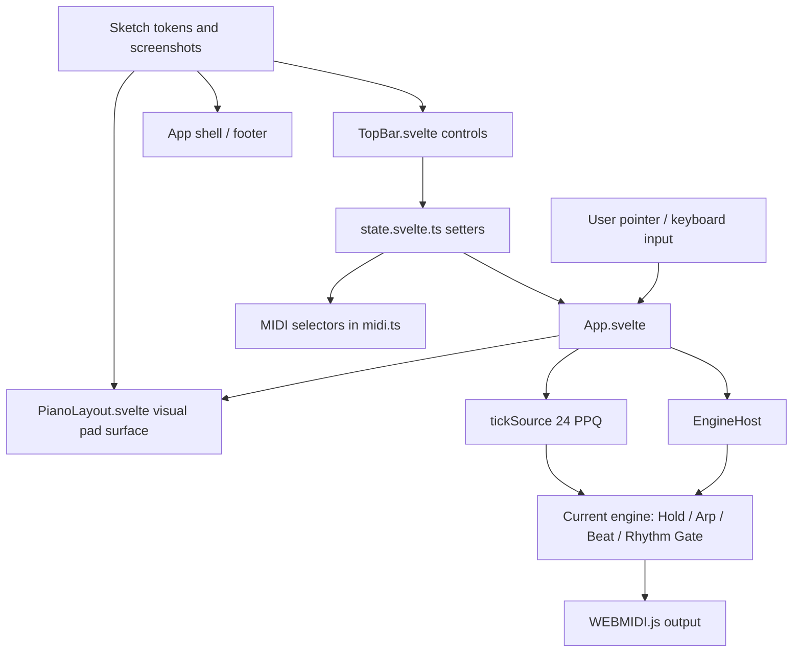

# Phase 02.1: Visual Redesign Adoption - Research

**Researched:** 2026-07-06  
**Domain:** Svelte 5 visual refactor / browser instrument UI  
**Confidence:** HIGH for codebase/design scope, MEDIUM for framework-doc claims

<user_constraints>
## User Constraints (from CONTEXT.md)

The following constraints are copied from `.planning/phases/02.1-visual-redesign-adoption/02.1-CONTEXT.md`. [VERIFIED: CONTEXT.md]

### Locked Decisions

### Visual Token Adoption

- **D-01: Planner discretion on token structure.** Flo defers to the frontend
  implementer on whether tokens become a small shared CSS layer or stay local to
  the touched components.
- **D-02: Preferred implementation shape.** Use the existing sketch theme as a
  small shared token source where it reduces duplication, then keep component
  styles scoped to the current Svelte components. Do not create a heavy design
  system or add a UI library for this phase.
- **D-03: Semantic color rules are strict.** Orange remains reserved for
  currently sounding or latched pads. Muted steel remains the future queued,
  pending, armed, or next-state accent. Because queued/toast/progression states
  are out of scope, steel may appear only where it supports existing secondary
  system status.

### TopBar Setup Pill And Popover

- **D-04: Use TopBar C2 as the locked direction.** Routing and BPM collapse into
  one performance-first status pill; tapping the pill opens setup controls for
  output, input, channel, clock source, and BPM.
- **D-05: No separate open-popover mock is required.** The sketch package does
  not include an open-popover screenshot. Implement the open state using the same
  visual language as the rest of the redesign: dark instrument chrome, compact
  radii, 8px grid, mono readouts for instrument data, and clear grouping.
- **D-06: Mobile behavior follows responsive usability, not pixel matching an
  absent mock.** iPad uses the two-row stacked TopBar direction from the sketch.
  iPhone landscape must keep the pill and setup controls reachable, avoid
  overlap/clipping, and preserve pad playability. Use browser screenshots and
  smoke checks to validate this.
- **D-07: External clock BPM state is locked.** BPM stays visible in the pill and
  setup surface, but becomes read-only when clock is external.

### Variation Picker Fidelity

- **D-08: Use the full sketch variation language.** Do not ship a simplified raw
  number selector as the planned result.
- **D-09: Arp controls are composed selectors.** Direction, octave range, and
  feel are primary controls; the V-number is derived confirmation.
- **D-10: Beat controls use the grid language.** Note value x straight/triplet
  is the visible model for existing Style 3 variation indices.
- **D-11: Rhythm Gate controls use pattern tiles.** The glyph is the score:
  visible hit/rest/hold notation, not text-first variation numbers.
- **D-12: Mapping must remain exact.** All pickers write through the existing
  `ui.variation` path and map exactly to the current 1..12 variation indices.
  They must not introduce queued application, countdown, or new playback timing.

### Visual Baselines

- **D-13: Treat sketch screenshots as the visual baseline.** The planner should
  use the committed screenshots in `.planning/sketches/001-jay-6-visual-redesign/`
  as the source of visual truth.
- **D-14: Baseline screenshots for this phase.** Use TopBar C2, Arp composed
  selector, full mock v2 recommended, Beat grid, and Rhythm Gate tiles as direct
  references. Use toast and progression screenshots only as future-scope
  references, not implementation targets.
- **D-15: The source HTML remains useful.** The standalone sketch HTML may be
  consulted for spacing, component relationships, and preserved variants, but
  scope comes from `02.1-SPEC.md` and this CONTEXT file.

### the agent's Discretion

- Choose the exact CSS organization that keeps the implementation readable and
  close to existing Svelte patterns.
- Choose the exact popover dismissal mechanics, focus handling, and responsive
  layout details, provided every existing control remains reachable and the
  browser checks pass.
- Choose whether to extract variation-picker helper components if doing so
  reduces real duplication. Avoid abstraction for its own sake.

### Deferred Ideas (OUT OF SCOPE)

- Progression rail display and progression authoring remain future milestone
  work.
- Sequencer UI and behavior remain future milestone work.
- Bottom-center queued/countdown toast remains future polish because the current
  app has no queued variation state or countdown behavior.
- Host-owned play/latch single source of truth remains v2 architecture work, not
  part of this visual adoption pass.
- Transport-reset / record-sync remains v2 engine work, not part of this visual
  adoption pass.
</user_constraints>

## Summary

Phase 02.1 should be planned as a narrow visual refactor of the existing Svelte components: shared visual tokens, a restructured `TopBar.svelte`, a restyled `PianoLayout.svelte`, and UI-only variation-picker helpers that continue to call `setStyle()` and `setVariation()`. [VERIFIED: SPEC.md] [VERIFIED: codebase grep]

The highest-risk planning area is not CSS; it is accidentally changing playback semantics while reshaping controls. Existing behavior flows through `state.svelte.ts`, `App.svelte`, `EngineHost`, and `tickSource`; the plan should keep engine timing, latch behavior, MIDI routing, and variation immediacy untouched. [VERIFIED: PROJECT.md] [VERIFIED: src/App.svelte] [VERIFIED: src/engines/host.ts]

**Primary recommendation:** Use the current locked stack and scoped Svelte CSS, add only small UI/helper components where duplication is real, and gate completion with `just ci` plus browser screenshots/smoke at desktop, iPad-sized, and iPhone-landscape viewports. [VERIFIED: package.json] [VERIFIED: Justfile] [VERIFIED: SPEC.md]

No phase requirement IDs were provided, and `.planning/REQUIREMENTS.md` is absent in this repo; `02.1-SPEC.md` is the active source for the six locked phase requirements. [VERIFIED: init.phase-op] [VERIFIED: filesystem probe] [VERIFIED: SPEC.md]

## Architectural Responsibility Map

| Capability | Primary Tier | Secondary Tier | Rationale |
|------------|--------------|----------------|-----------|
| Visual tokens and app chrome | Browser / Client | — | Static Svelte/CSS surfaces own visual presentation in this SPA. [VERIFIED: src/App.svelte] |
| TopBar C2 layout and setup popover | Browser / Client | — | All controls already render in `TopBar.svelte`; setup popover should only reorganize existing setters and MIDI selectors. [VERIFIED: src/components/TopBar.svelte] |
| Variation picker mapping | Browser / Client | API / Backend: none | Pickers should translate UI gestures into existing `ui.variation` 1..12 indices; there is no backend tier. [VERIFIED: src/state.svelte.ts] [VERIFIED: src/phrases.ts] |
| Pad visual treatment | Browser / Client | EngineHost projection | `PianoLayout.svelte` owns pad DOM and pointer capture; `App.svelte` passes held/latched projection. [VERIFIED: src/components/PianoLayout.svelte] [VERIFIED: src/App.svelte] |
| Playback, latch, MIDI timing | API / Backend equivalent: local engine host | Browser / Client display | The local imperative host owns playback semantics; the redesign must not move these responsibilities into visual components. [VERIFIED: src/engines/host.ts] |
| Browser smoke verification | Browser / Client | Build tooling | Layout and interaction risks require real-browser checks; `just ci` covers type/test/build only. [VERIFIED: TESTING.md] [VERIFIED: SPEC.md] |

## Project Constraints (from AGENTS.md)

- Use Vite 6 + Svelte 5 runes + TypeScript strict + Vitest + WEBMIDI.js v3. [VERIFIED: AGENTS.md]
- Use `just` recipes for orchestration: `just dev`, `just test`, `just check`, `just ci`. [VERIFIED: AGENTS.md] [VERIFIED: Justfile]
- Engines subscribe to `tickSource` at 24 PPQ and never own timers. [VERIFIED: AGENTS.md] [VERIFIED: PROJECT.md]
- UI state belongs in `src/state.svelte.ts`; `App.svelte` bridges to imperative host and `tickSource` via `$effect`. [VERIFIED: AGENTS.md] [VERIFIED: src/App.svelte]
- `src/banks.data.json` is verified Roland extraction and must not be hand-edited. [VERIFIED: AGENTS.md]
- Comments should explain WHY only. [VERIFIED: AGENTS.md]
- Sketch findings for Jay-6 are canonical for this phase. [VERIFIED: AGENTS.md] [VERIFIED: sketch-findings-jay-6/SKILL.md]

## Standard Stack

### Core

| Library | Version | Purpose | Why Standard |
|---------|---------|---------|--------------|
| `svelte` | Installed 5.55.7; latest 5.56.4 from registry check | Component framework and Svelte 5 runes | Existing app uses Svelte components and runes; docs confirm `$state`, `$derived`, `$effect`, event attributes, and scoped styles are current Svelte 5 patterns. [VERIFIED: npm registry] [CITED: github.com/sveltejs/svelte documentation] |
| `vite` | Installed 6.4.2; latest 8.1.3 from registry check | Dev server and production build | Existing project is a plain Vite SPA; Vite docs confirm `vite`, `vite build`, and `vite preview` as standard scripts. [VERIFIED: npm registry] [CITED: https://v6.vite.dev/guide] |
| `@sveltejs/vite-plugin-svelte` | Installed 5.1.1; latest 7.1.2 from registry check | Svelte integration for Vite | Existing Vite config uses `svelte()` plugin. [VERIFIED: npm registry] [VERIFIED: vite.config.ts] |
| `webmidi` | Installed 3.1.16; latest 3.1.16 from registry check | Web MIDI wrapper | Existing MIDI and clock code depend on WEBMIDI.js v3; do not alter in this visual phase. [VERIFIED: npm registry] [VERIFIED: src/midi.ts] |

### Supporting

| Library | Version | Purpose | When to Use |
|---------|---------|---------|-------------|
| `vitest` | Installed 2.1.9; latest 4.1.10 from registry check | Unit tests for pure TS/data | Keep existing pure tests; add mapping-helper tests only if helpers become non-trivial pure TS. [VERIFIED: npm registry] [VERIFIED: vite.config.ts] |
| `svelte-check` | Installed 4.4.8 | Type and accessibility checks | Required through `just check` and `just ci`. [VERIFIED: npm registry] [VERIFIED: package.json] |
| `typescript` | Installed 5.9.3 | Strict typing | Existing config uses strict mode and unused checks; keep helper types explicit. [VERIFIED: npm registry] [VERIFIED: tsconfig.json] |

### Alternatives Considered

| Instead of | Could Use | Tradeoff |
|------------|-----------|----------|
| Scoped Svelte CSS plus small shared tokens | Component library | Rejected by SPEC and CONTEXT; this is custom hardware-instrument UI, not generic UI kit work. [VERIFIED: SPEC.md] |
| Existing Vitest + browser smoke | Adding Playwright/Vitest browser packages | Not needed for this phase; no new packages are required and browser smoke can be manual or tool-assisted. [VERIFIED: SPEC.md] [VERIFIED: package.json] |
| Exact `ui.variation` indices | New queued variation state | Rejected by scope; queued/countdown behavior is future polish. [VERIFIED: CONTEXT.md] |

**Installation:**

No new install is recommended. Use the existing lockfile and run `npm install` only if `node_modules` is absent. [VERIFIED: package-lock.json] [VERIFIED: package.json]

**Version verification:** `npm list ... --depth=0` confirmed installed versions; `npm view ... version` confirmed current registry versions. [VERIFIED: npm registry]

## Package Legitimacy Audit

No external packages should be added in this phase, so the install-gate audit is not required for implementation. [VERIFIED: SPEC.md]

| Package | Registry | Age | Downloads | Source Repo | Verdict | Disposition |
|---------|----------|-----|-----------|-------------|---------|-------------|
| Existing locked stack | npm | Existing lockfile | N/A | Existing package metadata | N/A | Keep; do not upgrade during visual redesign. [VERIFIED: package-lock.json] |

**Packages removed due to [SLOP] verdict:** none. [VERIFIED: package-legitimacy seam]  
**Packages flagged as suspicious [SUS]:** latest `svelte`, `vite`, `vitest`, and `svelte-check` releases were flagged `too-new` by the seam; this reinforces not upgrading during the phase. [VERIFIED: package-legitimacy seam]

## Architecture Patterns

### System Architecture Diagram



### Recommended Project Structure

```text
src/
├── App.svelte                    # Shell, keyboard handling, host/tickSource bridge
├── state.svelte.ts               # Existing UI state and setters; keep variation contract here
├── phrases.ts                    # Existing source of structured variation metadata
├── styles/
│   └── tokens.css                # Optional small shared token layer if planner chooses extraction
└── components/
    ├── TopBar.svelte             # C2 layout, setup pill/popover, performance controls
    ├── PianoLayout.svelte        # Lifted hardware pad restyle, no behavior rewrite
    └── VariationPicker.svelte    # Optional helper only if it reduces real duplication
```

### Pattern 1: UI-Only Mapping Helpers

**What:** Derive visual picker options from `src/phrases.ts`, then call `setVariation(index)` with the existing 1..12 value. [VERIFIED: src/phrases.ts] [VERIFIED: src/state.svelte.ts]

**When to use:** Use this for Arp composed selectors, Beat grid cells, and Rhythm Gate tiles. [VERIFIED: SPEC.md]

**Example:**

```typescript
// Source: src/phrases.ts + src/state.svelte.ts
const option = style4.find((v) => v.index === 12);
if (option) setVariation(option.index);
```

### Pattern 2: Component-Local UI State

**What:** Use Svelte component-local runes for popover open/closed state, while global instrument state remains in `state.svelte.ts`. [CITED: github.com/sveltejs/svelte documentation] [VERIFIED: CONVENTIONS.md]

**When to use:** Use for setup popover visibility and possibly temporary focus/dismiss state. [VERIFIED: CONTEXT.md]

**Example:**

```svelte
<!-- Source: Svelte 5 docs + current TopBar pattern -->
<script lang="ts">
  let setupOpen = $state(false);
</script>

<button onclick={() => (setupOpen = !setupOpen)}>Setup</button>
{#if setupOpen}
  <div class="setup-popover">...</div>
{/if}
```

### Pattern 3: Visual Restyle Without Event Rewrite

**What:** Preserve `PianoLayout.svelte` pointer capture, `onpointerup`, `onpointercancel`, and `onlostpointercapture` paths; change classes/CSS only unless a layout wrapper is necessary. [VERIFIED: src/components/PianoLayout.svelte]

**When to use:** Use for lifted bevel pads and hardware row spacing. [VERIFIED: sketch-findings-jay-6/references/pads-and-feedback.md]

### Anti-Patterns to Avoid

- **Raw numeric variation selector:** Violates the locked visual language. [VERIFIED: CONTEXT.md]
- **Orange selected-state styling:** Violates semantic color rules; orange is active sounding/latched only. [VERIFIED: SPEC.md]
- **Engine or MIDI changes hidden inside visual work:** Violates behavior preservation. [VERIFIED: SPEC.md]
- **Progression rail or queued toast:** Explicitly future scope. [VERIFIED: CONTEXT.md]
- **Heavy design-system extraction:** Contradicts planner discretion and phase size. [VERIFIED: CONTEXT.md]

## Don't Hand-Roll

| Problem | Don't Build | Use Instead | Why |
|---------|-------------|-------------|-----|
| Reactive app state | Custom store or duplicate local state | Existing `ui` object and setters | Prevents split-brain style/variation/latch state. [VERIFIED: src/state.svelte.ts] |
| Playback timing | Timers inside UI components | Existing `tickSource` and `EngineHost` | Engines are already time-source agnostic. [VERIFIED: PROJECT.md] |
| Variation truth | New hardcoded variation tables | Existing `style1`..`style5` arrays | Current phrase metadata already encodes exact 1..12 mappings. [VERIFIED: src/phrases.ts] |
| MIDI routing | New MIDI abstraction | Existing `midi.ts` selectors | Existing Web MIDI behavior is accepted and out of scope for redesign. [VERIFIED: src/midi.ts] |
| Browser test framework | New package install | Manual/tool-assisted browser smoke | Phase needs screenshots and smoke; no install is required. [VERIFIED: SPEC.md] |

**Key insight:** Custom visual controls are fine; custom playback, state, MIDI, or timing paths are not. [VERIFIED: SPEC.md]

## Runtime State Inventory

| Category | Items Found | Action Required |
|----------|-------------|-----------------|
| Stored data | None; app has no persistence, backend, or database in current scope. [VERIFIED: PROJECT.md] | None. |
| Live service config | None for visual redesign; deployed URLs exist but UI code is static assets. [VERIFIED: PROJECT.md] | None unless shipping deployment is requested later. |
| OS-registered state | None found; no launchd/systemd/pm2 state is part of this SPA phase. [VERIFIED: codebase grep] | None. |
| Secrets/env vars | None for app runtime; no `.env` required by current stack. [VERIFIED: STACK.md] | None. |
| Build artifacts | `dist/` exists and will be stale after visual edits. [VERIFIED: ls] | `just ci` runs build and refreshes local production artifact. [VERIFIED: Justfile] |

## Common Pitfalls

### Pitfall 1: Styling Changes Become Behavior Changes

**What goes wrong:** The TopBar rewrite accidentally changes style/variation immediacy, latch behavior, MIDI routing, or clock behavior. [VERIFIED: SPEC.md]

**How to avoid:** Keep controls wired to existing setters and selectors; do not touch `EngineHost`, engines, `tickSource`, or `midi.ts` unless a compile error forces a narrow adapter. [VERIFIED: src/components/TopBar.svelte]

**Warning signs:** Diffs in `src/engines/`, `src/tickSource.ts`, or `src/midi.ts` without a direct compile reason. [VERIFIED: codebase grep]

### Pitfall 2: Orange Used As Generic Selection

**What goes wrong:** Variation tiles or latch controls use orange as a selected/accent state, making non-sounding controls read like active pads. [VERIFIED: SPEC.md]

**How to avoid:** Reserve orange for `.pad.held`; use quieter chrome/steel/border treatments for setup status and selected picker cells. [VERIFIED: sketch-findings-jay-6/references/tokens.md]

### Pitfall 3: Variation Mapping Drift

**What goes wrong:** Composed Arp axes or grid/tile order produce a nice UI but write the wrong index. [VERIFIED: SPEC.md]

**How to avoid:** Derive from `style1`..`style5` metadata and test 1, 6, 7, 12 equivalents per style. [VERIFIED: src/phrases.ts] [VERIFIED: SPEC.md]

### Pitfall 4: Popover Accessibility and Reachability

**What goes wrong:** Setup controls move into a popover but become clipped, unreachable, or impossible to dismiss on iPad/iPhone landscape. [VERIFIED: SPEC.md]

**How to avoid:** Plan explicit desktop, iPad, and iPhone-landscape smoke for open and closed TopBar states. [VERIFIED: CONTEXT.md]

### Pitfall 5: Losing Existing Pointer Safety

**What goes wrong:** Pad refactor drops pointer capture or lost-capture handling, reintroducing stuck notes. [VERIFIED: src/components/PianoLayout.svelte]

**How to avoid:** Keep event handlers intact and limit pad work to DOM shape/CSS unless there is a direct visual need. [VERIFIED: src/components/PianoLayout.svelte]

## Code Examples

Verified patterns from project and official docs:

### Existing State Path For Variation

```typescript
// Source: src/state.svelte.ts
export function setVariation(n: number): void {
  const max = STYLE_VARIATION_COUNT[ui.style];
  if (max === 0) return;
  ui.variation = Math.max(1, Math.min(max, n));
}
```

### Existing App Bridge To Host

```svelte
<!-- Source: src/App.svelte -->
$effect(() => { host.setStyle(ui.style, ui.variation); });
```

### Svelte 5 Local UI State For Popover

```svelte
<!-- Source: Context7 Svelte docs pattern -->
<script lang="ts">
  let open = $state(false);
</script>

<button onclick={() => (open = !open)}>Setup</button>
```

## State of the Art

| Old Approach | Current Approach | When Changed | Impact |
|--------------|------------------|--------------|--------|
| Prototype TopBar with every control visible | C2 performance-first bar with routing/BPM pill and setup popover | Locked by 2026-07-06 sketch wrap-up | Plan structural TopBar rewrite, not cosmetic spacing only. [VERIFIED: WRAP-UP-SUMMARY.md] |
| Universal raw variation dropdown | Per-style controls with derived V-number/readout | Locked by 2026-07-06 sketch wrap-up | Planner must allocate mapping and smoke work for each style family. [VERIFIED: sketch-findings-jay-6/references/variations.md] |
| Flat pad styling | Lifted bevel hardware rows | Locked by 2026-07-06 sketch wrap-up | Pad task should preserve event contract while changing tactile styling. [VERIFIED: sketch-findings-jay-6/references/pads-and-feedback.md] |

**Deprecated/outdated:**

- Raw numeric variation selector as primary UI: replaced by per-style picker language for this phase. [VERIFIED: CONTEXT.md]
- Real-piano overlap layout: explicitly avoided; keep separate J-6 rows. [VERIFIED: sketch-findings-jay-6/references/pads-and-feedback.md]

## Assumptions Log

| # | Claim | Section | Risk if Wrong |
|---|-------|---------|---------------|
| — | No `[ASSUMED]` claims used. | All | No user confirmation needed for research claims. |

## Open Questions

1. **Should browser smoke be automated or manual for this phase?**
   - What we know: Chrome is installed at `/Applications/Google Chrome.app`; project has no Playwright dependency or browser test config. [VERIFIED: find /Applications] [VERIFIED: package.json]
   - What's unclear: Whether the planner should add a one-off script, use the available Playwright skill, or require manual screenshot capture.
   - Recommendation: Do not add packages; plan manual/tool-assisted browser smoke with exact viewport sizes and screenshot checkpoints. [VERIFIED: SPEC.md]

## Environment Availability

| Dependency | Required By | Available | Version | Fallback |
|------------|-------------|-----------|---------|----------|
| Node.js | Vite, Vitest, svelte-check | yes | v24.18.0 | Use installed runtime. [VERIFIED: node --version] |
| npm | Package scripts | yes | 11.16.0 | Use `just` wrappers. [VERIFIED: npm --version] |
| just | Project commands | yes | 1.51.0 | Use npm scripts directly if needed. [VERIFIED: just --version] |
| Google Chrome | Browser visual/smoke checks | yes | App bundle present | Use installed Chrome manually/tool-assisted. [VERIFIED: find /Applications] |
| Playwright package/CLI | Optional browser automation | no | — | Manual Chrome smoke or available browser tooling. [VERIFIED: package.json] [VERIFIED: command -v playwright] |

**Missing dependencies with no fallback:**

- None. [VERIFIED: environment probes]

**Missing dependencies with fallback:**

- Playwright CLI/package is absent; fallback is manual or tool-assisted Chrome browser smoke. [VERIFIED: environment probes]

## Validation Architecture

### Test Framework

| Property | Value |
|----------|-------|
| Framework | Vitest 2.1.9 plus `svelte-check` 4.4.8. [VERIFIED: npm list] |
| Config file | `vite.config.ts`. [VERIFIED: vite.config.ts] |
| Quick run command | `just check` for Svelte/TS/a11y during UI work. [VERIFIED: Justfile] |
| Full suite command | `just ci`. [VERIFIED: Justfile] |

### Phase Requirements To Test Map

| Req ID | Behavior | Test Type | Automated Command | File Exists? |
|--------|----------|-----------|-------------------|--------------|
| R1 | Visual token adoption across app shell, TopBar, pads, and variation controls | browser visual | Manual/tool-assisted screenshots at desktop/iPad/iPhone landscape | no automated file; Wave 0 browser checklist needed. [VERIFIED: SPEC.md] |
| R2 | TopBar C2 exposes existing routing/tempo/performance controls | browser smoke | `just check` plus browser interaction smoke | source exists: `src/components/TopBar.svelte`. [VERIFIED: SPEC.md] |
| R3 | Pad layout preserves press/release/latched highlight behavior | browser smoke | `just check` plus browser pointer/keyboard smoke | source exists: `src/components/PianoLayout.svelte`. [VERIFIED: SPEC.md] |
| R4 | Per-style variation pickers map exactly to 1..12 | unit if helpers extracted; browser smoke always | `just test` if pure helpers added; browser smoke for UI | existing `test/phrases.test.ts`; new helper test only if helper module exists. [VERIFIED: test/phrases.test.ts] |
| R5 | Responsive desktop/iPad/iPhone-landscape usability | browser visual | Manual/tool-assisted screenshots | no automated file; Wave 0 browser checklist needed. [VERIFIED: SPEC.md] |
| R6 | Existing instrument behavior preserved | regression | `just ci` plus browser smoke | existing pure tests and source. [VERIFIED: Justfile] |

### Sampling Rate

- **Per task commit:** `just check` after Svelte template/style changes; `just test` after pure helper changes. [VERIFIED: Justfile]
- **Per wave merge:** `just ci`. [VERIFIED: Justfile]
- **Phase gate:** `just ci` plus desktop/iPad/iPhone-landscape browser smoke with no clipped controls, unreadable labels, inaccessible pads, or out-of-scope surfaces. [VERIFIED: SPEC.md]

### Wave 0 Gaps

- [ ] Browser smoke checklist for desktop, iPad-sized, and iPhone-landscape viewports. [VERIFIED: SPEC.md]
- [ ] Optional pure helper tests if variation mapping moves into a TypeScript helper. [VERIFIED: TESTING.md]
- [ ] No new test framework install. [VERIFIED: package.json]

## Security Domain

### Applicable ASVS Categories

| ASVS Category | Applies | Standard Control |
|---------------|---------|------------------|
| V2 Authentication | no | Static solo SPA; no accounts. [VERIFIED: PROJECT.md] |
| V3 Session Management | no | No sessions or persistence. [VERIFIED: PROJECT.md] |
| V4 Access Control | no | No backend authorization tier. [VERIFIED: PROJECT.md] |
| V5 Input Validation | yes | Existing setters clamp BPM, bank, transpose, gate, and variation; preserve these paths. [VERIFIED: src/state.svelte.ts] |
| V6 Cryptography | no | No app cryptography; do not add any. [VERIFIED: PROJECT.md] |

### Known Threat Patterns for Svelte Static Web MIDI SPA

| Pattern | STRIDE | Standard Mitigation |
|---------|--------|---------------------|
| Untrusted MIDI port names rendered in UI | Tampering / XSS | Keep Svelte text interpolation; do not use raw HTML for device names. [VERIFIED: src/components/TopBar.svelte] |
| Permission-denied Web MIDI state | Denial of Service | Preserve existing denied/error status display; do not hide it inside visual redesign. [VERIFIED: src/midi.ts] [VERIFIED: src/components/TopBar.svelte] |
| Out-of-range numeric input | Tampering | Continue routing through clamped setters. [VERIFIED: src/state.svelte.ts] |
| Static asset deployment drift | Integrity | `just ci` build gate before shipping. [VERIFIED: Justfile] |

## Sources

### Primary (HIGH confidence)

- `.planning/phases/02.1-visual-redesign-adoption/02.1-SPEC.md` - locked scope, requirements, prohibitions, acceptance criteria.
- `.planning/phases/02.1-visual-redesign-adoption/02.1-CONTEXT.md` - implementation decisions and deferred scope.
- `.codex/skills/sketch-findings-jay-6/` - validated visual tokens, TopBar, pads, variations, and progression caution.
- `src/App.svelte`, `src/components/TopBar.svelte`, `src/components/PianoLayout.svelte`, `src/state.svelte.ts`, `src/phrases.ts`, `src/engines/host.ts` - current implementation contracts.
- `package.json`, `vite.config.ts`, `Justfile`, `.planning/codebase/*.md` - stack and validation configuration.

### Secondary (MEDIUM confidence)

- Context7 `/sveltejs/svelte` - Svelte 5 runes, event attributes, scoped style patterns.
- Context7 `/websites/v6_vite_dev` - Vite 6 scripts and production build/preview workflow.
- Context7 `/vitest-dev/vitest` - Vitest node-environment and include/project patterns.
- npm registry queries - installed/latest package version checks.

### Tertiary (LOW confidence)

- None.

## Metadata

**Confidence breakdown:**

- Standard stack: HIGH for installed versions; MEDIUM for current docs because Context7 confidence seam returns MEDIUM. [VERIFIED: npm list] [CITED: Context7]
- Architecture: HIGH because it is derived from current source files and GSD codebase maps. [VERIFIED: codebase grep]
- Pitfalls: HIGH for scope/behavior risks from SPEC and source; MEDIUM for framework best-practice phrasing from Context7. [VERIFIED: SPEC.md] [CITED: Context7]

**Research date:** 2026-07-06  
**Valid until:** 2026-07-13 for registry/framework currency; design/codebase findings valid until the next UI architecture change.
