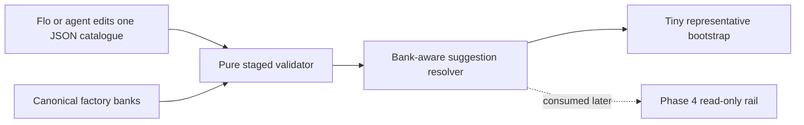

# Phase 3: Catalogue Mechanism & Bootstrap - Context

**Gathered:** 2026-08-07
**Status:** Ready for planning

<domain>
## Phase Boundary

Phase 3 delivers the trustworthy data mechanism for bank-aware suggestions:

- One plain catalogue maintained without application-code changes.
- Validation and deterministic lookup against canonical factory-bank data.
- Deliberately tiny bootstrap content that proves the supported states.

Phase 3 does not render suggestions, build a curation workflow, or expand catalogue coverage. The rail remains Phase 4. Future content growth remains direct agent-assisted data editing.

</domain>

<decisions>
## Implementation Decisions

### Catalogue authoring contract

- **D-01:** Store suggestions as one flat JSON array optimized for direct agent edits and native Vite/TypeScript loading.
- **D-02:** Each record contains only `id`, `bankIndex`, `label`, `kind`, and ordered `steps`.
  - `kind` is `progression` or `movement`.
  - `steps` contains canonical pad keys only.
- **D-03:** Use numeric `bankIndex` in the canonical `1..100` range as bank identity.
  - Do not duplicate bank names or chord names in the catalogue.
  - Resolve display names from canonical bank data.
- **D-04:** Array order is deterministic suggestion order.
  - Do not add an `order` field.
- **D-05:** Omit speculative metadata such as feel, bar length, formula, descriptions, or timing.
  - Phase 4 may establish a real need later.

### Validation and repair boundary

- **D-06:** Validation is pure and never mutates catalogue data.
- **D-07:** Validate in stages and return every independent problem in deterministic order.
  - Validate record shape and fields first.
  - Run duplicate and cross-entry checks only across structurally valid records.
  - Avoid cascading noise from malformed entries.
- **D-08:** Diagnostics are actionable.
  - Include the catalogue location.
  - Include entry ID and bank when available.
  - Include the offending value and expected rule.
  - Include both entry locations for duplicate IDs or same-bank duplicate sequences.
- **D-09:** An editing agent fixes mechanically unambiguous problems and reruns validation without asking Flo for permission.
  - Examples include JSON formatting and obvious casing or whitespace mistakes.
  - Escalate only when existing curated entries conflict or a repair would destructively reinterpret established work.
  - Musical research and reversible curation choices are part of the agent's assignment, not validation escalations.

### Tiny bootstrap

- **D-10:** Bundle exactly three deliberately simple records across two populated banks.
- **D-11:** Bank 1, `Pop`, contains two progressions in this order:
  1. `C → A → B → C`
     - Resolves to `Cadd9 → FM/A → G/B → Cadd9`.
  2. `C → D → F → C`
     - Resolves to `Cadd9 → Dm7 → FM9 → Cadd9`.
- **D-12:** Bank 14, `Oct Stack`, contains one movement:
  - `C → D → E → D`.
  - Canonical chord names are intentionally blank, proving the existing fallback-label path for Phase 4.
- **D-13:** The other 98 banks resolve cleanly to an empty suggestion list.
- **D-14:** Bootstrap entries are mechanism fixtures, not comprehensive or authoritative musical curation.

### The agent's Discretion

- Exact catalogue filename, module boundaries, resolver API, and TypeScript type organization.
- Exact stable IDs and short labels for the three bootstrap records.
- Internal diagnostic record shape and validator implementation.
- Test-file decomposition, provided all Phase 3 validation and lookup requirements remain explicit.

### Folded Todos

- **Per-bank common chord-progression authoring system**
  - Original problem: expose useful bank-specific progressions from a plain, agent-editable source.
  - Folded into Phase 3: the authoring data contract, validation, canonical resolution, and lookup mechanism.
  - Retained for Phase 4: visual rendering of suggestions beneath the pads.

</decisions>

<canonical_refs>
## Canonical References

**Downstream agents MUST read these before planning or implementing.**

### Milestone scope and requirements

- `.planning/ROADMAP.md` § Phase 3
  - Defines the fixed phase boundary, goal, success criteria, and Phase 4 dependency.
- `.planning/REQUIREMENTS.md` § Progression Catalogue and Minimal Bootstrap
  - Defines `PROG-01` through `PROG-07` and `BOOT-01`.
- `.planning/PROJECT.md` § Constraints and Key Decisions
  - Defines canonical bank data, stack, test scope, state boundaries, and milestone exclusions.
- `.planning/intel/decisions.md`
  - Records canonical JSON data, bank-label fallback, structured static data, and data-test conventions.

### Feature origin and validated design context

- `.planning/todos/pending/2026-05-23-per-bank-common-chord-progression-authoring-system.md`
  - Origin of the agent-editable per-bank suggestion mechanism.
  - Its display portion remains Phase 4.
- `.codex/skills/sketch-findings-jay-6/references/progressions.md`
  - Validates pad-key-to-canonical-chord resolution and the later chip-rail direction.
  - Its older timing metadata proposal is superseded by D-05 for Phase 3.

### Codebase maps

- `.planning/codebase/ARCHITECTURE.md`
  - Defines the static data layer and separation from state, engines, timing, and MIDI.
- `.planning/codebase/STACK.md`
  - Defines strict TypeScript, Vite JSON loading, and Vitest constraints.
- `.planning/codebase/INTEGRATIONS.md`
  - Confirms Jay-6 has no backend or runtime storage and identifies the Roland source data boundary.

</canonical_refs>

<code_context>
## Existing Code Insights

### Reusable Assets

- `src/banks.ts`
  - Reuse `KEYS`, `Key`, `Bank`, `getBank()`, and `labelFor()` for key validation, bank resolution, and canonical chord labels.
- `src/banks.data.ts`
  - Existing thin JSON-to-typed-data loader pattern for static data.
- `src/banks.data.json`
  - Canonical factory-bank source of truth.
  - Suggestion code may read it through existing bank APIs but must never duplicate or alter its chord names.
- `test/banks.test.ts`
  - Existing Vitest pattern for exhaustive static-data invariants and anchored canonical values.

### Established Patterns

- Static data stays in plain files and is typed at the module boundary.
- Invalid static data fails loudly through pure validation and automated tests.
- Tests cover data and math without mounting Svelte or mocking Web MIDI.
- Comments explain why only.
- UI state and imperative engine orchestration are unrelated to this phase and remain untouched.

### Integration Points

- Add the catalogue and its typed loader/resolver alongside the existing `src/banks*` data layer.
- Resolve each entry through canonical bank APIs and preserve source-array order when filtering by bank.
- Add focused Vitest coverage under `test/` for catalogue integrity, resolution, lookup order, supported kinds, duplicates, and empty results.
- Expose a read-only lookup surface that Phase 4 can consume without importing MIDI, engine, clock, or mutable UI state.

</code_context>

<specifics>
## Specific Ideas

- Keep the bundled examples easy and obvious.
  - Their purpose is to prove the system works.
  - Real curation happens afterwards.
- Future curation is bank-first:
  1. Flo asks an agent to curate ideas for a selected bank.
  2. The agent inspects that bank's canonical chords.
  3. The agent researches suitable progressions or movements.
  4. Flo and the agent iterate on the proposals.
  5. The agent writes approved entries and validates the catalogue.

</specifics>

<deferred>
## Deferred Ideas

- **Catalogue expansion and curation**
  - Direct agent-assisted data work after Phase 3.
  - No comprehensive coverage target or runtime authoring tool.
- **Suggestion rendering**
  - The chord-chip rail, empty state, browsing, and responsive treatment remain Phase 4.

### Reviewed Todos (not folded)

- **Variation change applies on next hit toast**
  - Phase 5.
- **Cycle variations with Up/Down keyboard shortcuts**
  - Phase 5.
- **Design touch-oriented Bank and Channel selectors**
  - Outside the v2.0 companion scope.
- **Measure and display external MIDI-clock BPM**
  - Phase 6.
- **Transport reset / record sync for OP-1 Start/Continue**
  - Outside the v2.0 companion scope.

</deferred>

---

*Phase: 03-catalogue-mechanism-bootstrap*
*Context gathered: 2026-08-07*
