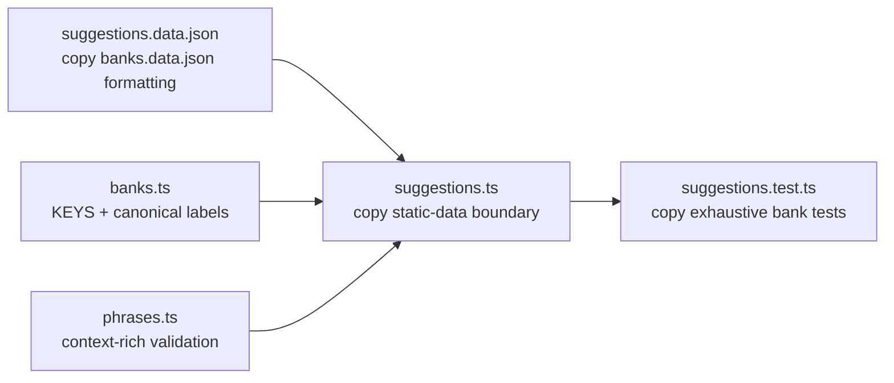

# Phase 3: Catalogue Mechanism & Bootstrap - Pattern Map

**Mapped:** 2026-08-18
**Files analyzed:** 3 new files
**Analogs found:** 3 / 3



## File Classification

| New/Modified File | Role | Data Flow | Closest Analog | Match Quality |
|---|---|---|---|---|
| `src/suggestions.data.json` | config | batch | `src/banks.data.json` | exact |
| `src/suggestions.ts` | service | transform, request-response | `src/banks.ts` with `src/banks.data.ts` and `src/phrases.ts` | role-match |
| `test/suggestions.test.ts` | test | batch, transform | `test/banks.test.ts` with `test/phrases.test.ts` | exact |

## Pattern Assignments

### `src/suggestions.data.json` (config, batch)

**Analog:** `src/banks.data.json`

**JSON formatting pattern** (`src/banks.data.json` lines 1-16):

```json
{
  "banks": [
    {
      "index": 1,
      "name": "Pop",
      "chords": [
        {
          "key": "C",
          "name": "Cadd9",
          "notes": [
            48,
            55,
            62,
            64
          ]
        }
```

Copy the two-space indentation, one object per record, and expanded arrays. Do not copy the `banks` envelope. Phase 3 requires one flat top-level array.

**Canonical bootstrap anchors** (`src/banks.data.json` lines 97-125):

```json
{
  "key": "A",
  "name": "FM/A",
  "notes": [
    45,
    57,
    60,
    65
  ]
},
{
  "key": "A#",
  "name": "Gm/A#",
  "notes": [
    46,
    58,
    62,
    67
  ]
},
{
  "key": "B",
  "name": "G/B",
  "notes": [
    47,
    59,
    62,
    67
  ]
}
```

- Store only pad keys in `steps`.
- Do not copy canonical bank names, chord names, or MIDI notes into the catalogue.
- Preserve record order exactly. Bank 1's two records must appear in the locked order.
- Ship exactly the three prescribed records across banks 1 and 14.

**Blank-name fixture** (`src/banks.data.json` lines 1641-1683):

```json
{
  "index": 14,
  "name": "Oct Stack",
  "chords": [
    {
      "key": "C",
      "name": "",
      "notes": [
        60,
        72
      ]
    },
    {
      "key": "C#",
      "name": "",
      "notes": [
        61,
        73
      ]
    },
    {
      "key": "D",
      "name": "",
      "notes": [
        62,
        74
      ]
    },
    {
      "key": "D#",
      "name": "",
      "notes": [
        63,
        75
      ]
    },
    {
      "key": "E",
      "name": "",
      "notes": [
        64,
        76
      ]
    }
```

Bank 14's catalogue record still needs a nonblank suggestion `label`. Its canonical chord names remain blank so `labelFor()` proves the fallback path.

---

### `src/suggestions.ts` (service, transform and request-response)

**Primary analog:** `src/banks.ts`

**Supporting analogs:** `src/banks.data.ts`, `src/phrases.ts`

**Static JSON import pattern** (`src/banks.data.ts` lines 14-15):

```typescript
import banksJson from './banks.data.json';
import type { Bank, Key } from './banks';
```

Adapt this to import the catalogue JSON plus `banks`, `KEYS`, `Key`, and `labelFor` from `./banks`. Keep relative imports and `import type` for type-only dependencies.

**Canonical allowlist and domain-type pattern** (`src/banks.ts` lines 7-22):

```typescript
export const KEYS = [
  'C', 'C#', 'D', 'D#', 'E', 'F', 'F#', 'G', 'G#', 'A', 'A#', 'B',
] as const;
export type Key = (typeof KEYS)[number];

export interface Chord {
  key: Key;
  name: string;     // empty string for banks without published chord names (e.g. Oct Stack)
  notes: number[];  // MIDI note numbers, usually 4, sometimes fewer
}

export interface Bank {
  index: number;    // 1..100
  name: string;
  chords: Chord[];  // length 12, chromatic order C..B
}
```

- Derive `SuggestionKind` from an `as const` allowlist, matching the `KEYS` pattern.
- Reuse `Key`. Do not introduce a second pad-key union.
- Prefer readonly public catalogue and resolved-view fields. The existing bank types are mutable legacy types, not the target for new output.

**Typed projection at the static-data boundary** (`src/banks.data.ts` lines 31-41):

```typescript
const raw = banksJson as RawData;

export const BANKS_DATA: Bank[] = raw.banks.map((b) => ({
  index: b.index,
  name: b.name,
  chords: b.chords.map((c) => ({
    key: c.key,
    name: c.name,
    notes: [...c.notes],
  })),
}));
```

Copy the explicit projection into fresh typed objects. Do **not** copy line 31's unchecked cast. Phase 3 must treat the imported JSON as `unknown`, validate it, and project only known fields after validation.

**Canonical lookup and fallback pattern** (`src/banks.ts` lines 24-35):

```typescript
export const banks: Bank[] = BANKS_DATA;

export function getBank(index: number): Bank {
  const wrapped = ((index - 1 + 100) % 100) + 1;
  return banks[wrapped - 1]!;
}

// Some banks (Oct Stack, Power Chord with no thirds, etc.) don't publish chord names.
// In that case the UI label is `"${key} ${bankName}"` — e.g. "C Oct Stack".
export function labelFor(bank: Bank, chord: Chord): string {
  return chord.name && chord.name.length > 0 ? chord.name : `${chord.key} ${bank.name}`;
}
```

- Resolve with `banks[bankIndex - 1]`, then locate each chord by key and call `labelFor(bank, chord)`.
- Do not call `getBank()` for validation or resolution. It intentionally wraps `0` and `101`.
- Project `bankName`, raw `chordName`, and fallback-aware `displayLabel` into new read-only view objects.
- Filter the validated source array and map it. Do not sort or round-trip through a keyed object.

**Context-rich validation pattern** (`src/phrases.ts` lines 124-150):

```typescript
export function parseRhythmPattern(pattern: string): RhythmStep[] {
  if (pattern.length !== 16) {
    throw new Error(`pattern must be 16 chars, got ${pattern.length}: "${pattern}"`);
  }
  const steps: RhythmStep[] = [];
  let current: RhythmStep | null = null;
  for (let i = 0; i < pattern.length; i++) {
    const ch = pattern[i];
    if (ch === 'o') {
      if (current) steps.push(current);
      current = { startStep: i, durationSteps: 1 };
    } else if (ch === '~') {
      if (!current) {
        throw new Error(`dangling ~ at position ${i} in "${pattern}"`);
      }
      current.durationSteps += 1;
    } else if (ch === '_') {
      if (current) {
        steps.push(current);
        current = null;
      }
    } else {
      throw new Error(`bad char '${ch}' at position ${i} in "${pattern}"`);
    }
  }
  if (current) steps.push(current);
  return steps;
}
```

Copy the stable scan order and diagnostics that include the offending value and location. Change the control flow:

- `validateSuggestionCatalogue(input)` is pure and returns every independent issue.
- Validate top-level shape, then record fields in the fixed phase order.
- Admit only fully valid records to duplicate-ID and same-bank-sequence checks.
- The import-time loader may format all returned issues into one thrown error.
- Never trim, case-fold, sort, or mutate the caller's input.

**Error handling:** no local module accumulates structured errors. Use the discriminated validation result and diagnostic record from `03-RESEARCH.md`, then keep the project fail-fast behavior only at the validated static-data export boundary.

**Authentication/guard:** none. Jay-6 is a local, public client-only app.

---

### `test/suggestions.test.ts` (test, batch and transform)

**Primary analog:** `test/banks.test.ts`

**Supporting analog:** `test/phrases.test.ts`

**Import and suite pattern** (`test/banks.test.ts` lines 1-4):

```typescript
import { describe, expect, it } from 'vitest';
import { banks, getBank, labelFor, KEYS } from '../src/banks';

describe('banks data', () => {
```

Keep direct Vitest imports and relative source imports. Split the new file into focused `describe` blocks for validation, production catalogue, canonical resolution, and lookup.

**Exhaustive invariant pattern** (`test/banks.test.ts` lines 5-18):

```typescript
it('has exactly 100 banks indexed 1..100', () => {
  expect(banks).toHaveLength(100);
  for (let i = 0; i < 100; i++) {
    expect(banks[i]!.index).toBe(i + 1);
  }
});

it('every bank has 12 chords in chromatic order C..B', () => {
  for (const b of banks) {
    expect(b.chords).toHaveLength(12);
    const keys = b.chords.map((c) => c.key);
    expect(keys).toEqual([...KEYS]);
  }
});
```

Copy the direct loops and exact order assertions. For Phase 3, exhaustively check all banks except 1 and 14 return `[]`; do not sample a few empty banks.

**Canonical anchor and fallback pattern** (`test/banks.test.ts` lines 44-63):

```typescript
it('labelFor falls back to "<key> <bankName>" when chord name is empty', () => {
  const fakeBank = { ...banks[0]!, name: 'Stub Bank' };
  expect(labelFor(fakeBank, { key: 'C', name: '', notes: [60] })).toBe('C Stub Bank');
  expect(labelFor(fakeBank, { key: 'C', name: 'Cmaj7', notes: [60] })).toBe('Cmaj7');
});

// PLAN.md sanity checks — anchor to known Roland values.
it('bank 1 / C is Cadd9 → [48, 55, 62, 64]', () => {
  const c = banks[0]!.chords.find((c) => c.key === 'C')!;
  expect(c.name).toBe('Cadd9');
  expect(c.notes).toEqual([48, 55, 62, 64]);
});

it('bank 14 (Oct Stack) / C is the two-note dyad [60, 72]', () => {
  const bank = banks[13]!;
  expect(bank.name).toBe('Oct Stack');
  const c = bank.chords.find((c) => c.key === 'C')!;
  expect(c.name).toBe('');
  expect(c.notes).toEqual([60, 72]);
});
```

Anchor both raw canonical names and `displayLabel` results. Bank 1 should resolve the two exact locked sequences; Bank 14 should retain blank `chordName` values while producing `C Oct Stack`, `D Oct Stack`, and `E Oct Stack` display labels.

**Malformed-input pattern** (`test/phrases.test.ts` lines 55-61):

```typescript
it('rejects wrong length', () => {
  expect(() => parseRhythmPattern('oooo')).toThrow();
});

it('rejects dangling ~', () => {
  expect(() => parseRhythmPattern('~ooo_ooo_ooo_ooo')).toThrow();
});
```

Adapt these into synthetic `unknown` fixtures passed directly to `validateSuggestionCatalogue()`. Because the new validator returns structured results, assert the complete object with `toEqual`, including issue order, codes, paths, offending values, expectations, and related paths.

**Required test-builder boundary:** keep any reusable valid-entry builder inside `test/suggestions.test.ts`. No shared fixture module exists in the repository, and the phase does not justify one.

## Shared Patterns

### Canonical Data Ownership

**Source:** `src/banks.ts` lines 7-10 and 24-35

**Apply to:** `src/suggestions.ts`, `test/suggestions.test.ts`

- `KEYS` is the runtime allowlist and `Key` is the compile-time vocabulary.
- `banks` is the 100-bank canonical source.
- `labelFor()` is the only fallback-label policy.
- `src/banks.data.json` remains untouched.

### Static Data Boundary

**Source:** `src/banks.data.ts` lines 14-15 and 33-41

**Apply to:** `src/suggestions.ts`

- Import JSON directly through Vite.
- Validate before exposing typed data.
- Project fresh objects instead of returning raw imported records.
- Fail during module initialization if bundled data is invalid.

### Validation and Error Handling

**Source:** `src/phrases.ts` lines 124-150, extended by the locked staged-validation contract

**Apply to:** `src/suggestions.ts`, `test/suggestions.test.ts`

- Scan in deterministic source order.
- Include offending values and exact catalogue paths.
- Return all independent validator issues.
- Throw only in the loader assertion or for an invalid public bank lookup.
- No logging layer or central error wrapper exists.

### Test Structure

**Source:** `test/banks.test.ts` lines 1-63 and `test/phrases.test.ts` lines 55-76

**Apply to:** `test/suggestions.test.ts`

- Vitest only. No Svelte mounting and no Web MIDI mocks.
- Use exact arrays and objects for order-sensitive contracts.
- Loop exhaustively for global invariants and empty-bank coverage.
- Test the pure validator independently from the production JSON import.
- Verify input deep equality before and after validation to prove purity.

### Comments

**Source:** project convention and `src/banks.ts` lines 31-32

**Apply to:** all TypeScript files

- Comments explain why a boundary or non-obvious choice exists.
- Identifiers and tests carry the what.

## No Analog Found

No whole planned file lacks a useful analog.

| Capability | Planned File | Reason | Planner Fallback |
|---|---|---|---|
| Pure staged validator that accumulates structured multi-entry diagnostics | `src/suggestions.ts` | Existing validators throw on the first issue and no module performs cross-record duplicate checks | Use `03-RESEARCH.md` patterns 1 and 2, while retaining local scan and diagnostic-string style from `src/phrases.ts` |

## Metadata

**Analog search scope:** `src/`, `test/`, canonical Phase 3 references, and the progression sketch reference

**Files scanned:** 30 source/test files

**Strong analog groups read:** 5

- `src/banks.data.json` with `src/banks.data.ts`
- `src/banks.ts`
- `src/phrases.ts`
- `test/banks.test.ts`
- `test/phrases.test.ts`

**Pattern extraction date:** 2026-08-18
