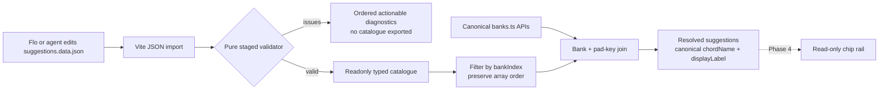

# Phase 3: Catalogue Mechanism & Bootstrap - Research

**Researched:** 2026-08-18  
**Domain:** Static JSON catalogue validation and canonical bank-aware resolution  
**Confidence:** HIGH

<user_constraints>
## User Constraints (from CONTEXT.md)

### Locked Decisions

#### Catalogue authoring contract

- **D-01:** Store suggestions as one flat JSON array optimized for direct agent edits and native Vite/TypeScript loading.
- **D-02:** Each record contains only `id`, `bankIndex`, `label`, `kind`, and ordered `steps`.
  - `kind` is `progression` or `movement`.
  - `steps` contains canonical pad keys only.
- **D-03:** Use numeric `bankIndex` in the canonical `1..100` range as bank identity.
  - Do not duplicate bank names or chord names in the catalogue.
  - Resolve display names from canonical bank data.
- **D-04:** Array order is deterministic suggestion order.
  - Do not add an `order` field.
- **D-05:** Omit speculative metadata such as feel, bar length, formula, descriptions, or timing.
  - Phase 4 may establish a real need later.

#### Validation and repair boundary

- **D-06:** Validation is pure and never mutates catalogue data.
- **D-07:** Validate in stages and return every independent problem in deterministic order.
  - Validate record shape and fields first.
  - Run duplicate and cross-entry checks only across structurally valid records.
  - Avoid cascading noise from malformed entries.
- **D-08:** Diagnostics are actionable.
  - Include the catalogue location.
  - Include entry ID and bank when available.
  - Include the offending value and expected rule.
  - Include both entry locations for duplicate IDs or same-bank duplicate sequences.
- **D-09:** An editing agent fixes mechanically unambiguous problems and reruns validation without asking Flo for permission.
  - Examples include JSON formatting and obvious casing or whitespace mistakes.
  - Escalate only when existing curated entries conflict or a repair would destructively reinterpret established work.
  - Musical research and reversible curation choices are part of the agent's assignment, not validation escalations.

#### Tiny bootstrap

- **D-10:** Bundle exactly three deliberately simple records across two populated banks.
- **D-11:** Bank 1, `Pop`, contains two progressions in this order:
  1. `C → A → B → C`
     - Resolves to `Cadd9 → FM/A → G/B → Cadd9`.
  2. `C → D → F → C`
     - Resolves to `Cadd9 → Dm7 → FM9 → Cadd9`.
- **D-12:** Bank 14, `Oct Stack`, contains one movement:
  - `C → D → E → D`.
  - Canonical chord names are intentionally blank, proving the existing fallback-label path for Phase 4.
- **D-13:** The other 98 banks resolve cleanly to an empty suggestion list.
- **D-14:** Bootstrap entries are mechanism fixtures, not comprehensive or authoritative musical curation.

### the agent's Discretion

- Exact catalogue filename, module boundaries, resolver API, and TypeScript type organization.
- Exact stable IDs and short labels for the three bootstrap records.
- Internal diagnostic record shape and validator implementation.
- Test-file decomposition, provided all Phase 3 validation and lookup requirements remain explicit.

### Deferred Ideas (OUT OF SCOPE)

- **Catalogue expansion and curation**
  - Direct agent-assisted data work after Phase 3.
  - No comprehensive coverage target or runtime authoring tool.
- **Suggestion rendering**
  - The chord-chip rail, empty state, browsing, and responsive treatment remain Phase 4.

#### Reviewed Todos (not folded)

- **Variation change applies on next hit toast**
  - Phase 5.
- **Cycle variations with Up/Down keyboard shortcuts**
  - Phase 5.
- **Design touch-oriented Bank and Channel selectors**
  - Outside the v2.0 companion scope.
- **Measure and display external MIDI-clock BPM**
  - Phase 6.
- **Transport reset / record sync for OP-1 Start/Continue**
  - Outside the v2.0 companion scope.
</user_constraints>

<phase_requirements>
## Phase Requirements

| ID | Description | Research Support |
|----|-------------|------------------|
| PROG-01 | One plain, agent-editable catalogue; no application-code edits for content changes. | Flat `src/suggestions.data.json` loaded and validated at the module boundary. [VERIFIED: CONTEXT.md D-01] |
| PROG-02 | Every entry identifies a factory bank and ordered valid pad keys. | Exact runtime checks for integer `bankIndex` and ordered `steps` members from `KEYS`. [VERIFIED: codebase + CONTEXT.md D-02/D-03] |
| PROG-03 | Reject invalid banks, pad keys, duplicate IDs, same-bank duplicate sequences, blank labels, and malformed entries. | Two-stage pure validator with deterministic structured diagnostics. [VERIFIED: CONTEXT.md D-06/D-08] |
| PROG-04 | Resolve chord names from canonical bank data. | Resolver joins validated keys to `banks` and calls `labelFor()`; catalogue stores neither bank nor chord names. [VERIFIED: src/banks.ts + CONTEXT.md D-03] |
| PROG-05 | Resolve zero, one, or many suggestions in catalogue order. | `filter()` over the validated source array; no sort or secondary order field. [VERIFIED: CONTEXT.md D-04] |
| PROG-06 | Distinguish `progression` from `movement`. | Narrow `SuggestionKind` union and runtime allowlist. [VERIFIED: CONTEXT.md D-02] |
| PROG-07 | Automate integrity, resolution, order, kinds, and empty-bank checks. | Focused Vitest suite plus `just ci` phase gate. [VERIFIED: codebase + REQUIREMENTS.md] |
| BOOT-01 | Ship only a tiny representative set and honest empty results elsewhere. | Exactly three entries at banks 1 and 14; exhaustive assertion that the other 98 banks return `[]`. [VERIFIED: CONTEXT.md D-10/D-13] |
</phase_requirements>

## Summary

- Build one small static-data subsystem beside `src/banks*`. [VERIFIED: codebase + CONTEXT.md]
  - `src/suggestions.data.json`: authoring source.
  - `src/suggestions.ts`: runtime boundary, types, validator, validated catalogue, resolver.
  - `test/suggestions.test.ts`: invalid fixture matrix and bundled-data contract.
- Treat imported JSON as `unknown` until it passes the pure validator. [CITED: https://github.com/microsoft/TypeScript/blob/v5.9.3/src/compiler/transformers/ts.ts]
  - `as`, `satisfies`, and imported JSON inference do not perform runtime validation.
  - Return either a typed immutable catalogue or the complete ordered diagnostic list.
- Preserve source-array order by filtering only. [VERIFIED: CONTEXT.md D-04]
  - Do not sort.
  - Do not build a keyed object whose iteration order becomes an accidental contract.
- Resolve every step against the canonical `Bank` and `Chord` records. [VERIFIED: src/banks.ts]
  - Expose the raw canonical `chordName` and the fallback-aware `displayLabel` from `labelFor()`.
  - Do not expose MIDI notes to the Phase 4 rail API.
- No new package is justified. [VERIFIED: codebase + official Vite/TypeScript/Vitest documentation]
  - The schema is five fields with two cross-entry rules.
  - Existing TypeScript and Vitest cover it clearly without a schema dependency.

**Primary recommendation:** Add a strict `unknown → validate → readonly catalogue → canonical resolver` boundary, then lock it with exact diagnostic and exhaustive empty-bank tests. [VERIFIED: CONTEXT.md D-01/D-14]

## Architectural Responsibility Map

| Capability | Primary Tier | Secondary Tier | Rationale |
|------------|--------------|----------------|-----------|
| Catalogue authoring | Static data | Build tool | JSON is edited directly and bundled by Vite. [VERIFIED: CONTEXT.md D-01] |
| Runtime validation | Data/domain module | Build/test | Validation executes at import in app/tests and fails before consumers receive invalid records. [VERIFIED: existing `banks.data.ts` boundary + recommendation] |
| Bank lookup | Data/domain module | Canonical bank data | The resolver filters catalogue entries, then joins pad keys to canonical chords. [VERIFIED: src/banks.ts + CONTEXT.md D-03] |
| Suggestion ordering | Data/domain module | JSON source | Source-array order is the public order contract. [VERIFIED: CONTEXT.md D-04] |
| Phase 4 consumption | Browser/client UI | Data/domain module | Phase 4 reads resolved labels only; it must not touch MIDI, engines, state, or timing. [VERIFIED: CONTEXT.md phase boundary] |

## Project Constraints (from AGENTS.md)

- Keep this artifact in `.planning/phases/`; `.research/` is only a non-GSD scratchpad. [VERIFIED: AGENTS.md]
- Use the locked Vite 6 + Svelte 5 + strict TypeScript + Vitest + WEBMIDI.js stack. [VERIFIED: AGENTS.md]
- Use `just test`, `just check`, and `just ci` as the project orchestration surface. [VERIFIED: AGENTS.md]
- Never hand-edit `src/banks.data.json`; it is the verified Roland extraction. [VERIFIED: AGENTS.md]
- Engines must subscribe to `tickSource` and never own timers. [VERIFIED: AGENTS.md]
  - Phase 3 does not touch engines or timing.
- UI state remains in `src/state.svelte.ts`; `App.svelte` remains the imperative bridge. [VERIFIED: AGENTS.md]
  - Phase 3 adds no UI or reactive state.
- Comments explain WHY only. [VERIFIED: AGENTS.md]
- The progression sketch skill confirms pad-key-to-canonical-label resolution but its UI and timing metadata proposals are outside this phase. [VERIFIED: project skill + CONTEXT.md D-05]

## Standard Stack

### Core

| Library | Version | Published | Purpose | Why Standard |
|---------|---------|-----------|---------|--------------|
| TypeScript | 5.9.3 | 2025-09-30 | Strict domain types and `unknown` narrowing. | Installed and locked; `strict`, `resolveJsonModule`, and `isolatedModules` are enabled. [VERIFIED: npm registry + tsconfig.json] |
| Vite | 6.4.2 | 2026-04-06 | Import the JSON catalogue into the static bundle. | Vite 6 officially supports direct JSON imports. [VERIFIED: npm registry] [CITED: https://v6.vite.dev/guide/features#json] |
| Vitest | 2.1.9 | 2025-02-03 | Pure validator and resolver tests. | Installed test runner; exact deep equality and table tests fit deterministic diagnostics. [VERIFIED: npm registry] [CITED: https://vitest.dev/api/assert.html] |

### Supporting

| Library/API | Version | Purpose | When to Use |
|-------------|---------|---------|-------------|
| `KEYS`, `Key` | repository API | Canonical pad-key allowlist and type. | Runtime step checks and public catalogue types. [VERIFIED: src/banks.ts] |
| `banks`, `Bank`, `Chord` | repository API | Canonical 100-bank lookup. | Resolve validated bank and step references. [VERIFIED: src/banks.ts] |
| `labelFor()` | repository API | Fallback-aware display labels. | Convert an unnamed stack pad into `"<key> <bankName>"`. [VERIFIED: src/banks.ts] |
| Native `Map` / `Set` | ES runtime | Duplicate detection. | Track first valid ID and first valid bank+sequence signature. [VERIFIED: TypeScript target ESNext] |

### Alternatives Considered

| Instead of | Could Use | Tradeoff |
|------------|-----------|----------|
| Small explicit validator | Zod or JSON Schema validator | Adds package/config surface for five fixed fields; no dynamic import or external interchange requires it. Use a schema library only if later catalogue formats grow materially. [VERIFIED: current phase scope] |
| Flat array filtering | Precomputed bank index map | Faster lookup but adds derived state and ordering risk for a three-entry catalogue. Introduce only if measured catalogue growth justifies it. [VERIFIED: CONTEXT.md D-10/D-13] |
| Canonical `labelFor()` | Catalogue-authored chord labels | Duplicates the Roland source and permits drift. Forbidden by D-03. [VERIFIED: CONTEXT.md D-03] |

**Installation:** None. Use the locked dependencies already in `package-lock.json`. [VERIFIED: package.json + package-lock.json]

### Prescribed Bootstrap Records

| ID | Bank | Label | Kind | Steps |
|----|------|-------|------|-------|
| `pop-homeward` | 1 | `Homeward` | `progression` | `C, A, B, C` [VERIFIED: CONTEXT.md D-11] |
| `pop-step-up` | 1 | `Step up` | `progression` | `C, D, F, C` [VERIFIED: CONTEXT.md D-11] |
| `oct-stack-rise-fall` | 14 | `Rise and fall` | `movement` | `C, D, E, D` [VERIFIED: CONTEXT.md D-12] |

IDs and labels use the discretion granted by CONTEXT.md; they are deliberately short and make no authority claim about musical theory. [VERIFIED: CONTEXT.md D-14 + discretion]

## Package Legitimacy Audit

- No external package is added by this phase, so the package-legitimacy gate is not triggered. [VERIFIED: recommended stack]
- Packages removed due to `[SLOP]` verdict: none. [VERIFIED: no package candidates]
- Packages flagged as suspicious `[SUS]`: none. [VERIFIED: no package candidates]

## Architecture Patterns

### System Architecture Diagram



The failure branch must stop invalid catalogue data before it reaches application consumers. [VERIFIED: CONTEXT.md D-06/D-08]

### Recommended Project Structure

```text
src/
├── banks.data.json          # Canonical Roland data; untouched
├── banks.ts                 # Existing bank/key/label APIs
├── suggestions.data.json    # New flat authoring catalogue
└── suggestions.ts           # Types, validation, loader, resolver
test/
├── banks.test.ts            # Existing canonical anchors
└── suggestions.test.ts      # New validation + resolution contract
```

This is the smallest module boundary that mirrors the current static-data layer without creating a circular data-loader pair. [VERIFIED: codebase architecture]

### Pattern 1: Staged `unknown` Validation

**What:** Scan the top-level array and each record in source order, accumulating independent field diagnostics. Admit only completely valid records to duplicate checks. [VERIFIED: CONTEXT.md D-06/D-08]

**Required stage order:** [VERIFIED: CONTEXT.md D-07]

1. Top-level array check.
2. Per-entry object and exact-field checks, in array order.
3. Field checks in fixed order: `id`, `bankIndex`, `label`, `kind`, `steps`, unexpected fields.
4. Per-step checks in step order.
5. Cross-entry checks over valid records only, in source order.
   - Duplicate ID first.
   - Same-bank duplicate sequence second.

**Why:** A malformed entry cannot generate meaningful duplicate evidence; excluding it prevents cascading diagnostics. [VERIFIED: CONTEXT.md D-07]

### Pattern 2: Structured Diagnostics Before Throwing

**What:** Keep `validateSuggestionCatalogue(input)` pure and return a discriminated result. Add a tiny loader assertion that formats all issues into one thrown error for import-time failure. [VERIFIED: CONTEXT.md D-06/D-08]

**Recommended diagnostic record:** [VERIFIED: CONTEXT.md D-08 + implementation recommendation]

```yaml
code: duplicate-sequence
path: "$[2].steps"
entryId: oct-stack-walk
bankIndex: 14
value: [C, D, E, D]
expected: unique ordered step sequence within bank 14
relatedPath: "$[0].steps"
```

Keep machine-stable `code` and `path` fields separate from human-readable formatting. [VERIFIED: diagnostic testing requirement]

### Pattern 3: Canonical Projection

**What:** Resolve a validated record by locating the canonical bank, then locating each chord by `key`. Produce new read-only view objects. [VERIFIED: src/banks.ts + CONTEXT.md D-03]

**Output boundary:** [VERIFIED: phase boundary]

- Keep `id`, `bankIndex`, suggestion `label`, `kind`, and ordered steps.
- Add canonical `bankName` at resolution time.
- For each step add:
  - `key`
  - raw canonical `chordName`
  - fallback-aware `displayLabel = labelFor(bank, chord)`
- Do not expose notes, playback callbacks, progression position, or mutable state.

### Pattern 4: Order by Construction

**What:** `getSuggestionsForBank(index)` validates its requested index, filters the already validated catalogue, and maps to resolved views. [VERIFIED: CONTEXT.md D-04]

**Do not sort:** Source order is the contract. A test must show Bank 1 returns the two records in JSON order. [VERIFIED: CONTEXT.md D-11]

### Anti-Patterns to Avoid

- **Using `getBank()` to validate catalogue bank indexes:** It wraps `0 → 100` and `101 → 1`; validate integer `1..100` before canonical lookup. [VERIFIED: src/banks.ts + test/banks.test.ts]
- **Casting imported JSON directly:** `as Suggestion[]` is erased and accepts malformed runtime data. [CITED: https://github.com/microsoft/TypeScript/blob/v5.9.3/src/compiler/transformers/ts.ts]
- **Throwing on the first bad field:** It violates the complete-diagnostic decision. [VERIFIED: CONTEXT.md D-07]
- **Cross-checking malformed records:** It generates misleading duplicate noise. [VERIFIED: CONTEXT.md D-07]
- **Normalizing during validation:** Trimming, case-folding, sorting, or rewriting steps mutates meaning and hides catalogue defects. [VERIFIED: CONTEXT.md D-06/D-09]
- **Joining duplicate signatures ambiguously:** Use a structured signature such as `JSON.stringify([bankIndex, steps])`; do not concatenate pad keys without delimiters. [VERIFIED: key set includes sharp names]
- **Returning canonical mutable objects:** Project the minimal read-only display view so Phase 4 cannot accidentally mutate bank data or couple to notes. [VERIFIED: Phase 4 read-only boundary]
- **Adding coverage content:** Three fixtures only; more musical curation is deferred. [VERIFIED: CONTEXT.md D-10/D-14]

## Don't Hand-Roll

| Problem | Don't Build | Use Instead | Why |
|---------|-------------|-------------|-----|
| JSON parsing | Custom parser, YAML dialect, Markdown parser | Native JSON import through Vite | Syntax errors fail in the toolchain; the format is locked. [CITED: https://v6.vite.dev/guide/features#json] |
| Pad-key vocabulary | Second key list | `KEYS` and `Key` from `src/banks.ts` | Prevents catalogue vocabulary drift. [VERIFIED: src/banks.ts] |
| Bank/chord naming | Copied bank names, chord dictionary, music-theory inference | `banks` plus `labelFor()` | Canonical names and fallback already exist. [VERIFIED: src/banks.ts] |
| Suggestion order | `order` property or sorting policy | JSON array order | The order contract is locked. [VERIFIED: CONTEXT.md D-04] |
| Duplicate search | Pairwise nested comparisons | `Map` keyed by ID and serialized bank+steps | Retains first location and deterministic later-duplicate diagnostics. [VERIFIED: implementation recommendation] |
| Assertion library | Bespoke test harness | Existing Vitest `expect`, `toEqual`, `test.each` | The repository already uses these patterns. [VERIFIED: test/*.test.ts] [CITED: https://vitest.dev/api/] |

**Key insight:** The only custom logic should express Jay-6-specific catalogue rules; parsing, canonical naming, ordering primitives, and test assertions already exist. [VERIFIED: codebase + phase scope]

## Common Pitfalls

### Pitfall 1: Wrapped Invalid Banks

- **What goes wrong:** Entry bank `0` silently resolves to bank 100; `101` silently resolves to bank 1. [VERIFIED: src/banks.ts]
- **Why it happens:** `getBank()` is a UI-navigation helper with modulo wrapping. [VERIFIED: test/banks.test.ts]
- **How to avoid:** Check `Number.isInteger(bankIndex)` and `1 <= bankIndex <= 100` before indexing `banks[bankIndex - 1]`. [VERIFIED: CONTEXT.md D-03]
- **Warning signs:** Invalid-bank fixtures unexpectedly resolve successfully.

### Pitfall 2: Compile-Time Types Masquerading as Runtime Validation

- **What goes wrong:** Invalid JSON values reach consumers even though TypeScript compiles. [CITED: https://github.com/microsoft/TypeScript/blob/v5.9.3/src/compiler/transformers/ts.ts]
- **Why it happens:** Type assertions and `satisfies` are erased from emitted JavaScript. [CITED: same source]
- **How to avoid:** Treat the import as `unknown`; narrow every field before constructing typed values.
- **Warning signs:** The loader contains only `const raw = json as RawCatalogue`.

### Pitfall 3: Cascading Duplicate Noise

- **What goes wrong:** A record with a bad `steps` value also reports a duplicate sequence or crashes serialization. [VERIFIED: CONTEXT.md D-07]
- **Why it happens:** Cross-entry indexes are populated before field validation finishes.
- **How to avoid:** Build a `validEntries` list during stage one; cross-check only that list.
- **Warning signs:** One malformed fixture produces unrelated diagnostics.

### Pitfall 4: Losing Source Order

- **What goes wrong:** The two Pop suggestions appear alphabetically or by ID instead of the locked order. [VERIFIED: CONTEXT.md D-04/D-11]
- **Why it happens:** A resolver sorts or round-trips through a keyed object.
- **How to avoid:** Filter the original validated array and map in place.
- **Warning signs:** Tests assert sets rather than exact arrays.

### Pitfall 5: Testing Only the Bundled Happy Path

- **What goes wrong:** The three valid entries pass while malformed content produces poor or unstable diagnostics. [VERIFIED: PROG-03/PROG-07]
- **Why it happens:** Data integrity tests import only the production file.
- **How to avoid:** Export the pure validator and feed synthetic `unknown` fixtures for every rule.
- **Warning signs:** No test calls the validator directly.

### Pitfall 6: Treating Oct Stack as Missing Data

- **What goes wrong:** Blank canonical names are rejected or replaced inside the catalogue. [VERIFIED: CONTEXT.md D-12]
- **Why it happens:** Catalogue label validation is confused with canonical chord-name validation.
- **How to avoid:** Require the suggestion's own `label`; allow canonical chord names to remain blank and expose `labelFor()` output separately.
- **Warning signs:** Bank 14 bootstrap data copies `"C Oct Stack"` into JSON.

## Code Examples

Verified patterns adapted to this repository. Type assertions alone are not runtime validators. [CITED: https://github.com/microsoft/TypeScript/blob/v5.9.3/src/compiler/transformers/ts.ts]

### Domain Types and Result Boundary

```typescript
export const SUGGESTION_KINDS = ['progression', 'movement'] as const;
export type SuggestionKind = (typeof SUGGESTION_KINDS)[number];

export interface Suggestion {
  readonly id: string;
  readonly bankIndex: number;
  readonly label: string;
  readonly kind: SuggestionKind;
  readonly steps: readonly Key[];
}

export interface CatalogueIssue {
  readonly code: string;
  readonly path: string;
  readonly entryId?: string;
  readonly bankIndex?: number;
  readonly value: unknown;
  readonly expected: string;
  readonly relatedPath?: string;
}

export type ValidationResult =
  | { readonly ok: true; readonly value: readonly Suggestion[] }
  | { readonly ok: false; readonly issues: readonly CatalogueIssue[] };
```

### Exact Shape Gate

```typescript
const FIELDS = ['id', 'bankIndex', 'label', 'kind', 'steps'] as const;

function isRecord(value: unknown): value is Record<string, unknown> {
  return typeof value === 'object' && value !== null && !Array.isArray(value);
}

function hasOnlyCatalogueFields(value: Record<string, unknown>): boolean {
  const keys = Object.keys(value);
  return keys.length === FIELDS.length && FIELDS.every((field) => field in value);
}
```

Rejecting extra fields enforces D-02 and catches misspellings such as `bankIdex` instead of silently discarding them. [VERIFIED: CONTEXT.md D-02/D-08]

### Duplicate Checks Over Valid Records

```typescript
const firstIdPath = new Map<string, string>();
const firstSequencePath = new Map<string, string>();

for (const entry of validEntries) {
  const idPath = `$[${entry.sourceIndex}].id`;
  const stepsPath = `$[${entry.sourceIndex}].steps`;
  const sequenceKey = JSON.stringify([entry.value.bankIndex, entry.value.steps]);

  // Emit a diagnostic containing both the current path and the saved first path.
  firstIdPath.set(entry.value.id, firstIdPath.get(entry.value.id) ?? idPath);
  firstSequencePath.set(sequenceKey, firstSequencePath.get(sequenceKey) ?? stepsPath);
}
```

The implementation should emit on the later occurrence, preserve the first path, and process ID before sequence for each record. [VERIFIED: CONTEXT.md D-07/D-08]

### Canonical Resolver

```typescript
export function getSuggestionsForBank(bankIndex: number): readonly ResolvedSuggestion[] {
  if (!Number.isInteger(bankIndex) || bankIndex < 1 || bankIndex > banks.length) {
    throw new RangeError(`bankIndex must be an integer in 1..${banks.length}: ${bankIndex}`);
  }

  const bank = banks[bankIndex - 1]!;
  return catalogue
    .filter((entry) => entry.bankIndex === bankIndex)
    .map((entry) => ({
      ...entry,
      bankName: bank.name,
      steps: entry.steps.map((key) => {
        const chord = bank.chords.find((candidate) => candidate.key === key)!;
        return { key, chordName: chord.name, displayLabel: labelFor(bank, chord) };
      }),
    }));
}
```

This deliberately validates instead of calling wrapping `getBank()` and preserves catalogue order through `filter().map()`. [VERIFIED: src/banks.ts + CONTEXT.md D-04]

### Deterministic Diagnostic Assertion

```typescript
it('reports independent issues in deterministic stage order', () => {
  const result = validateSuggestionCatalogue(malformedFixture);
  expect(result).toEqual({
    ok: false,
    issues: expectedIssues,
  });
});
```

Vitest exact deep equality is appropriate because issue ordering is part of the contract. [CITED: https://vitest.dev/api/expect.html#toequal]

## State of the Art

| Old Approach | Current Approach | When Changed | Impact |
|--------------|------------------|--------------|--------|
| Cast JSON to a TypeScript interface | Validate `unknown` before constructing typed values | TypeScript assertions have always been compile-time only | Prevents malformed bundled data from reaching consumers. [CITED: https://github.com/microsoft/TypeScript/blob/v5.9.3/src/compiler/transformers/ts.ts] |
| Vite JSON whole-object import only | Whole-object and named JSON imports are supported | Vite 6 | Use the whole-object default import because the catalogue must preserve array order. [CITED: https://v6.vite.dev/guide/features#json] |
| ASVS V5 named “Validation, Sanitization and Encoding” | ASVS 5.0 places input validation in V2 “Validation and Business Logic” | ASVS 5.0.0, May 2025 | Cite `v5.0.0-2.2.1` for positive structural and allowlist validation. [CITED: https://github.com/OWASP/ASVS/blob/master/5.0/docs_en/OWASP_Application_Security_Verification_Standard_5.0.0_en.json] |

**Deprecated/outdated:**

- Treating `as CatalogueEntry[]` as a data-safety boundary is invalid; assertions are erased. [CITED: TypeScript source above]
- Referring to input validation as ASVS V5 is version-4 numbering; current ASVS 5.0 uses V2. [CITED: OWASP ASVS 5.0 JSON above]

## Assumptions Log

| # | Claim | Section | Risk if Wrong |
|---|-------|---------|---------------|
| — | None. All implementation claims are grounded in locked context, repository inspection, registry checks, or official documentation. | — | — |

## Open Questions

No planning blocker remains. [VERIFIED: CONTEXT.md]

- `steps` should reject an empty array because it cannot represent an ordered suggestion. [VERIFIED: PROG-02 semantics]
- Do not invent a stricter musical minimum in Phase 3; the locked contract does not require one. [VERIFIED: CONTEXT.md D-02/D-05]
- Stable IDs and labels are discretionary. Use short kebab-case IDs and concise labels, then validate IDs and labels as nonblank trimmed strings. [VERIFIED: CONTEXT.md discretion + D-09]

## Environment Availability

| Dependency | Required By | Available | Version | Fallback |
|------------|-------------|-----------|---------|----------|
| Node.js | Type checking, tests, build | ✓ | 26.5.0 local; Node 20 container builder | Locked project runtime/toolchain. [VERIFIED: environment + Dockerfile project stack] |
| npm | Dependency scripts | ✓ | 11.17.0 | Use `just` recipes as the normal entry point. [VERIFIED: environment + AGENTS.md] |
| Just | Project orchestration | ✓ | 1.58.0 | Direct `npm` scripts exist, but plans should use `just`. [VERIFIED: environment + Justfile] |
| TypeScript | Strict checks | ✓ | 5.9.3 | None needed. [VERIFIED: npm list] |
| Vite | JSON loading/build | ✓ | 6.4.2 | None needed. [VERIFIED: npm list] |
| Vitest | Automated validation | ✓ | 2.1.9 | None needed. [VERIFIED: npm list] |

**Missing dependencies with no fallback:** none. [VERIFIED: environment audit]

**Missing dependencies with fallback:** none. [VERIFIED: environment audit]

**Baseline health:** `npm test -- test/banks.test.ts` passes 13/13; `npm run check` reports zero errors and warnings. [VERIFIED: commands run 2026-08-18]

## Validation Architecture

### Test Framework

| Property | Value |
|----------|-------|
| Framework | Vitest 2.1.9 [VERIFIED: npm list] |
| Config file | `vite.config.ts` [VERIFIED: codebase] |
| Quick run command | `npm test -- test/suggestions.test.ts` [VERIFIED: package.json] |
| Full suite command | `just ci` [VERIFIED: Justfile] |

### Phase Requirements → Test Map

| Req ID | Behavior | Test Type | Automated Command | File Exists? |
|--------|----------|-----------|-------------------|-------------|
| PROG-01 | Production data is one JSON array and loader accepts direct content edits. | integration | `npm test -- test/suggestions.test.ts` | ❌ Wave 0 |
| PROG-02 | Bank indexes and every ordered pad key are canonical and valid. | unit | `npm test -- test/suggestions.test.ts` | ❌ Wave 0 |
| PROG-03 | Every malformed/duplicate/blank case returns exact actionable diagnostics. | unit, table-driven | `npm test -- test/suggestions.test.ts` | ❌ Wave 0 |
| PROG-04 | Pop names and Oct Stack fallbacks come only from canonical bank APIs. | integration | `npm test -- test/suggestions.test.ts` | ❌ Wave 0 |
| PROG-05 | Bank lookup returns 0/1/2 entries and preserves source order. | unit | `npm test -- test/suggestions.test.ts` | ❌ Wave 0 |
| PROG-06 | Both supported kinds pass; any other value fails. | unit, table-driven | `npm test -- test/suggestions.test.ts` | ❌ Wave 0 |
| PROG-07 | Full catalogue contract remains automated. | suite gate | `just ci` | ❌ Wave 0 |
| BOOT-01 | Exactly 3 entries exist at banks 1 and 14; all other 98 banks return `[]`. | exhaustive integration | `npm test -- test/suggestions.test.ts` | ❌ Wave 0 |

### Required Test Cases

- Production catalogue: [VERIFIED: CONTEXT.md D-10/D-13]
  - Exactly three records.
  - Bank distribution exactly `{ 1: 2, 14: 1 }`.
  - IDs unique; labels nonblank; kinds include both supported values.
- Canonical resolution: [VERIFIED: src/banks.data.json + CONTEXT.md D-11/D-12]
  - Bank 1 sequence one resolves `Cadd9, FM/A, G/B, Cadd9`.
  - Bank 1 sequence two resolves `Cadd9, Dm7, FM9, Cadd9`.
  - Bank 14 raw chord names remain blank.
  - Bank 14 display labels resolve `C Oct Stack, D Oct Stack, E Oct Stack, D Oct Stack`.
- Validation matrix: [VERIFIED: PROG-03 + CONTEXT.md D-07/D-08]
  - Non-array top level.
  - `null`, array, primitive, missing field, and unexpected field entries.
  - Nonblank trimmed `id`; nonblank trimmed `label`.
  - Integer bank bounds: `0`, `101`, fractional, string.
  - `kind`: both allowed and an unsupported value.
  - `steps`: non-array, empty, invalid/case-mismatched key, mixed valid/invalid values.
  - Global duplicate ID with both paths.
  - Same-bank exact ordered sequence duplicate with both paths.
  - Same sequence in different banks accepted.
  - Different order in same bank accepted.
  - Malformed records excluded from duplicate checks.
  - Multiple independent problems emitted in exact deterministic order.
  - Input unchanged after validation.
- Lookup: [VERIFIED: PROG-05/BOOT-01]
  - Bank 1 returns two in JSON order.
  - Bank 14 returns one movement.
  - Exhaustively loop all banks except 1 and 14 and expect `[]`.
  - Invalid lookup indexes throw instead of wrapping.

### Sampling Rate

- **Per task commit:** `npm test -- test/suggestions.test.ts`
- **Per wave merge:** `just test`
- **Phase gate:** `just ci` green before `$gsd-verify-work`

### Wave 0 Gaps

- [ ] `test/suggestions.test.ts`: create the validator/resolver contract before implementation. [VERIFIED: file absent]
- [ ] Reusable test builders inside that file for valid entries and raw malformed fixtures. [VERIFIED: no shared catalogue fixtures exist]
- No framework install or config change is required. [VERIFIED: existing Vitest config]

## Security Domain

OWASP ASVS 5.0.0 moved input validation to V2 “Validation and Business Logic”; the older V2/V3/V4/V5/V6 labels below are retained only to satisfy the GSD compatibility checklist. [CITED: https://github.com/OWASP/ASVS/blob/master/5.0/en/0x05-For-Users-Of-4.0.md]

### Applicable ASVS Categories

| Compatibility Category | Applies | Standard Control |
|------------------------|---------|------------------|
| V2 Authentication | no | No identity or login exists in this public SPA. [VERIFIED: .planning/codebase/INTEGRATIONS.md] |
| V3 Session Management | no | No sessions, cookies, or persistence exist. [VERIFIED: .planning/codebase/INTEGRATIONS.md] |
| V4 Access Control | no | No protected resources, roles, or backend exist. [VERIFIED: .planning/codebase/INTEGRATIONS.md] |
| V5 Input Validation | yes | Current equivalent: ASVS 5.0 `v5.0.0-2.2.1`; positive type, allowlist, range, shape, and contextual validation. [CITED: OWASP ASVS 5.0 JSON] |
| V6 Cryptography | no | This phase stores no secrets and performs no cryptographic operation. [VERIFIED: codebase + phase scope] |

### Known Threat Patterns for Static TypeScript Catalogue Data

| Pattern | STRIDE | Standard Mitigation |
|---------|--------|---------------------|
| Malformed or unexpected record shape | Tampering | Treat import as `unknown`; allowlist exact fields and values before use. [CITED: OWASP ASVS v5.0.0-2.2.1] |
| Silent bank remapping through modulo wrap | Tampering | Validate integer range before canonical lookup. [VERIFIED: src/banks.ts] |
| Duplicate identity or bank sequence | Tampering | Cross-entry uniqueness checks with both source locations. [VERIFIED: PROG-03] |
| Catalogue text later placed into active HTML | Elevation of privilege / XSS | Phase 4 must use normal Svelte text interpolation; never `{@html}` for catalogue labels. [CITED: https://owasp.org/www-project-application-security-verification-standard/] |

### Security Boundary

- The catalogue is local bundled data, not network or user input. [VERIFIED: project architecture]
- Runtime validation still protects against accidental or agent-authored corruption before build/deploy. [VERIFIED: phase goal]
- Copy only validated known fields into output objects; do not spread raw objects. [CITED: OWASP ASVS v5.0.0-2.2.1]
- Diagnostics may include offending catalogue values because the catalogue contains no secrets. [VERIFIED: project integration audit]

## Sources

### Primary (HIGH confidence)

- Repository: `src/banks.ts`, `src/banks.data.ts`, `src/banks.data.json`, `test/banks.test.ts`, `tsconfig.json`, `vite.config.ts`, `package.json`, `Justfile`. [VERIFIED: codebase]
- Phase decisions: `.planning/phases/03-catalogue-mechanism-bootstrap/03-CONTEXT.md`. [VERIFIED: project source]
- Requirements: `.planning/REQUIREMENTS.md`. [VERIFIED: project source]
- Project constraints: `AGENTS.md`, `.planning/PROJECT.md`, `.planning/codebase/*`. [VERIFIED: project source]
- npm registry: installed package versions and release dates checked 2026-08-18. [VERIFIED: npm registry]

### Secondary (MEDIUM confidence)

- [Vite 6 JSON imports](https://v6.vite.dev/guide/features#json): direct JSON module behavior. [CITED: official Vite docs]
- [TypeScript 5.9 transformer](https://github.com/microsoft/TypeScript/blob/v5.9.3/src/compiler/transformers/ts.ts): type assertions and `satisfies` are erased. [CITED: official TypeScript source]
- [Vitest API](https://vitest.dev/api/): exact equality and table-driven test patterns. [CITED: official Vitest docs]
- [OWASP ASVS 5.0.0 JSON](https://github.com/OWASP/ASVS/blob/master/5.0/docs_en/OWASP_Application_Security_Verification_Standard_5.0.0_en.json): current validation category and allowlist control. [CITED: official OWASP source]
- [OWASP ASVS 4-to-5 guide](https://github.com/OWASP/ASVS/blob/master/5.0/en/0x05-For-Users-Of-4.0.md): category renumbering. [CITED: official OWASP source]

### Tertiary (LOW confidence)

- None.

## Metadata

**Confidence breakdown:**

- Standard stack: HIGH
  - Locked installed versions and current registry metadata were verified. [VERIFIED: npm registry + codebase]
- Architecture: HIGH
  - The phase is a direct extension of the existing static bank-data layer under locked decisions. [VERIFIED: codebase + CONTEXT.md]
- Pitfalls: HIGH
  - The wrapping-bank trap and current unsafe-cast pattern were directly inspected; staged-diagnostic constraints are locked. [VERIFIED: src/banks.ts + src/banks.data.ts + CONTEXT.md]
- Security: MEDIUM
  - Current ASVS 5.0 guidance is authoritative; applicability is scoped by the verified client-only architecture. [CITED: OWASP ASVS 5.0] [VERIFIED: codebase]

**Research date:** 2026-08-18  
**Valid until:** 2026-09-17
