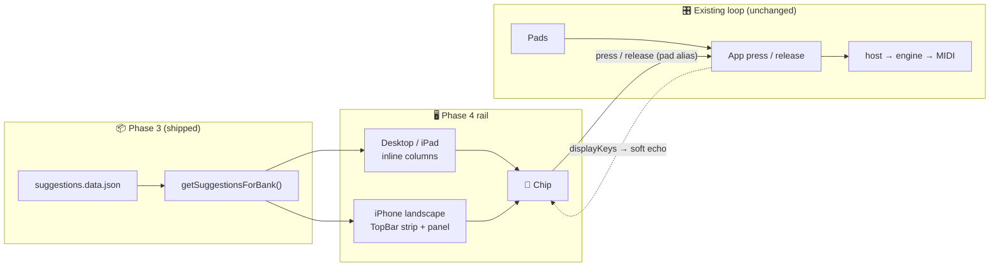

# Phase 4: Read-Only Suggestion Rail - Context

**Gathered:** 2026-09-25
**Status:** Ready for planning

<domain>
## Phase Boundary

Phase 4 renders Phase 3's bank-aware suggestions and makes their chips playable pad aliases:

- Selecting a bank shows its curated suggestions, or an honest empty state.
- Browsing (open, page, close) is silent: no MIDI, no latch, engine, transport, or clock change.
- A chip press follows the same press/release path as its pad. Nothing else sounds.
- Read-only = no editing or authoring. The rail never tracks, scores, advances with, or corrects the player.

Not in scope:

- More than 6 suggestions per bank (follow-up todo)
- Catalogue content growth
- Sequencing, autoplay, or step position

</domain>

<decisions>
## Implementation Decisions

### 🏷️ Suggestion identity (locked, from checkpoint)
- **D-01:** Label-led header.
  - Authored label leads.
  - `progression` / `movement` = quiet borderless steel metadata (`--system`, 11px), never a badge.

### 📏 Long chord sequences (locked, from checkpoint)
- **D-02:** Balanced wrapping, no horizontal scroll, never truncate.
  - Desktop/iPad: ≤6 chips per row. Longer → two balanced ordered rows (7→4+3, 8→4+4).
  - Narrower containers may split earlier (cap 4).
  - Slash chords may break before the bass only (`Cadd9` / `/E`).

### 🎹 Chips are playable pad aliases (locked, DEC-rail-chips-playable)
- **D-03:** Chip press/release goes through the same path as its pad (App `press` / `release` → `host.padPressed` / `padReleased`).
  - Pressed chip = full orange, and its pad lights.
  - Only the pressed chip gets full orange. Echo never overrides it.
- **D-04:** Per-key hold safety: releasing a chip never silences a pad still held, and vice versa.
- **D-05:** Soft echo both ways: every *other* chip whose key is lit shows echo (`rgb(255 122 26 / .18)` fill + `--accent` border).
- **D-06:** Echo follows `displayKeys`, the same set the pads render as lit, **including a latched-but-released key**.
  - Chips mirror pads exactly. Orange = sounding.
- **D-07:** A held chip that unmounts releases its key immediately (idempotent).
  - Triggers: bank change, iPhone panel close via × / strip / Esc, paging away.
  - Intentionally differs from pads, which persist across bank change. Chosen for simplicity and to guarantee no hanging notes.
- **D-08:** Browsing is silent. Open, page, close, and bank-driven re-render emit no MIDI and touch no latch, engine, transport, or clock state (the D-07 release of a held chip is the only exception).

### 🖥️ Desktop / iPad layout (locked, sketch 003)
- **D-09:** Inline columns under the pads.
  - `SUGGESTIONS · N` eyebrow (steel, uppercase, 11px).
  - `grid-template-columns: repeat(auto-fill, minmax(280px, 1fr))` → 3 across on iPad landscape.
  - Rail stays subordinate to the pads.

### 📱 iPhone landscape (locked, sketch 002)
- **D-10:** `Suggestions · N` strip in TopBar's empty middle slot on row 1.
  - `grid-template-areas: 'pill sugg transpose' 'bank style latch'` at `max-height: 480px`
  - 44px tall, zero added height
- **D-11:** Open → nonmodal panel anchored over the top bar only.
  - Max-height = space above the pads. Never covers a pad.
- **D-12:** One suggestion at a time.
  - Header: label + kind, `‹ 1 of N ›`, ×.
  - Close via ×, the strip label in the panel header, or Escape. No backdrop dismissal.
  - Accepted trade-off: bank / style / latch are hidden while the panel is open.
- **D-13:** Panel page memory.
  - Keep the current page across close/reopen while the bank is unchanged.
  - Bank change → reset to `1 of N`.
- **D-14:** One chip component everywhere. Panel chips are playable with soft echo.

### 🫥 Empty bank (locked, sketch 002/003)
- **D-15:** Quiet muted line `No curated suggestions for this bank yet`.
  - `--fg-2`, 13px on desktop/iPad; 12px centred in the iPhone top bar.
  - No count, button, icon, or orange.

### 🛡️ Catalogue cap
- **D-16:** Max 6 suggestions per bank is an accepted Phase 4 limitation. iPad locks body scroll and 3×2 fills the viewport.
- **D-17:** The catalogue validator rejects banks with more than 6 suggestions.
  - Use a new issue code in the Phase 3 staged, deterministic, actionable diagnostic style.
  - Invalid catalogue fails loudly in tests and the build.
  - Lifting the cap belongs to the pending follow-up todo.

### Claude's Discretion
- **Same key pressed twice** (chip + pad, or keyboard + mouse): take the simplest implementation.
  - Hard invariant: never a hanging note, stuck latch, or stuck lit pad/chip.
  - Candidates: per-key hold count in App, where host sees first press + last release (second press = no-op); or retrigger.
  - Flo: "shouldn't behave as a bug, but how it behaves, I don't care too much."
  - Note: `host.padPressed` today re-runs `engine.start` + transport `start` on a re-press of an already-held key.
- Chip element semantics, focus, and a11y: match pads (`button`, `pointerdown` `preventDefault` so focus never steals computer-keyboard pad shortcuts).
- Component decomposition, where rail state lives (`state.svelte.ts` vs component-local), exact breakpoints beyond the sketch values.
- Escape handling integration with the existing window `keydown` listener.

</decisions>

<canonical_refs>
## Canonical References

**Downstream agents MUST read these before planning or implementing.**

### Scope and requirements
- `.planning/ROADMAP.md` § Phase 4: goal, success criteria 1–5
- `.planning/REQUIREMENTS.md` § RAIL-01..RAIL-08: rail requirements (RAIL-03/04/08 updated for playable chips)
- `.planning/PROJECT.md` § Key Decisions: `DEC-rail-chips-playable`

### Validated design (sketches 002/003)
- `.agents/skills/sketch-findings-jay-6/references/progressions.md`: **primary rail spec**, covering chips, echo, layouts, empty state, CSS patterns, and what to avoid
- `.agents/skills/sketch-findings-jay-6/references/tokens.md`: palette, 8px grid, orange = sounding, steel = metadata
- `.agents/skills/sketch-findings-jay-6/references/topbar.md`: TopBar structure the iPhone strip slots into
- `.agents/skills/sketch-findings-jay-6/sources/002-iphone-suggestion-rail/`: iPhone sketch HTML + screenshots
- `.agents/skills/sketch-findings-jay-6/sources/003-desktop-suggestion-rail/`: desktop/iPad sketch HTML + screenshots
- `.agents/skills/sketch-findings-jay-6/sources/themes/default.css`: extracted theme

### Data mechanism (Phase 3)
- `.planning/phases/03-catalogue-mechanism-bootstrap/03-CONTEXT.md`: catalogue contract, validator style, bootstrap fixtures (Bank 1 Pop ×2, Bank 14 Oct Stack unnamed-chord movement)

### Follow-ups
- `.planning/todos/pending/2026-09-25-suggestion-rail-more-than-six-per-bank.md`: >6 design; D-17 answers its validator question
- `.planning/todos/pending/2026-05-23-per-bank-common-chord-progression-authoring-system.md`: origin of the feature; display portion lands here

### Codebase maps
- `.planning/codebase/ARCHITECTURE.md`, `.planning/codebase/CONVENTIONS.md`, `.planning/codebase/TESTING.md`

</canonical_refs>

<code_context>
## Existing Code Insights

### Reusable Assets
- `src/suggestions.ts`
  - `getSuggestionsForBank(bankIndex)` → `ResolvedSuggestion[]` with `steps[].key` / `chordName` / `displayLabel` (fallback already applied via `labelFor`).
  - `validateSuggestionCatalogue()` is where D-17 lands.
- `src/components/PianoLayout.svelte`
  - Pointer-capture press model: `setPointerCapture`, idempotent `endPress` on up/cancel/lostpointercapture, `preventDefault` on pointerdown.
  - `chordName` snippet splits at `/`.
  - Chips should reuse the same model.
- `src/App.svelte`: `press(key, notes)` / `release(key)`, `heldKeys`, `latchedKey`, `displayKeys` (D-06 echo source), `clearAllHighlights` via `host.setOnPanic`.

### Established Patterns
- `heldKeys` is a `Set<Key>` (not a count), and `host.heldPads` is a `Set`.
  - A second press on a held key reaches host as a re-press. The discretion item above lives here.
- `isEditableOrControlTarget` skips pad shortcuts when a button is focused, so chips must not take focus on press.
- iPad body scroll lock: `App.svelte` `@media (pointer: coarse) and (max-width: 1366px)` is the reason for D-16.
- TopBar already uses `grid-template-areas` per breakpoint (`TopBar.svelte` ~L1038, ~L1069). The iPhone strip adds a `sugg` area.
- Tests are pure-data Vitest (no Svelte mount). Browser verification is manual/Playwright per RAIL-07.

### Integration Points
- Rail mounts in `App.svelte` `<main>` under `<PianoLayout>` (desktop/iPad) and inside `TopBar` (iPhone).
- Chips call the same `press` / `release` passed to `PianoLayout`.
- `ui.bankIndex` drives both suggestion lookup and D-13 page reset.

</code_context>

<specifics>
## Specific Ideas

- Key-colour hint = cream outline on naturals only (`rgb(244 241 234 / .6)`). Accidentals keep the default edge.
- Avoid: key-cap tab hint, mini-pad chips, black-filled chips, a bottom sheet on iPhone, an inline rail on iPhone, a rows layout on iPad, and current/next step state.
- Verification (RAIL-08): browsing emits nothing on the MIDI monitor, and a chip press emits exactly what its pad would.
  - Includes chip + pad held together and release order in both directions.

</specifics>

<deferred>
## Deferred Ideas

- More than 6 suggestions per bank: existing todo `2026-09-25-suggestion-rail-more-than-six-per-bank.md`
- Showing bank/style/latch while the iPhone panel is open: accepted trade-off for now

</deferred>

---

*Phase: 04-read-only-suggestion-rail*
*Context gathered: 2026-09-25*
