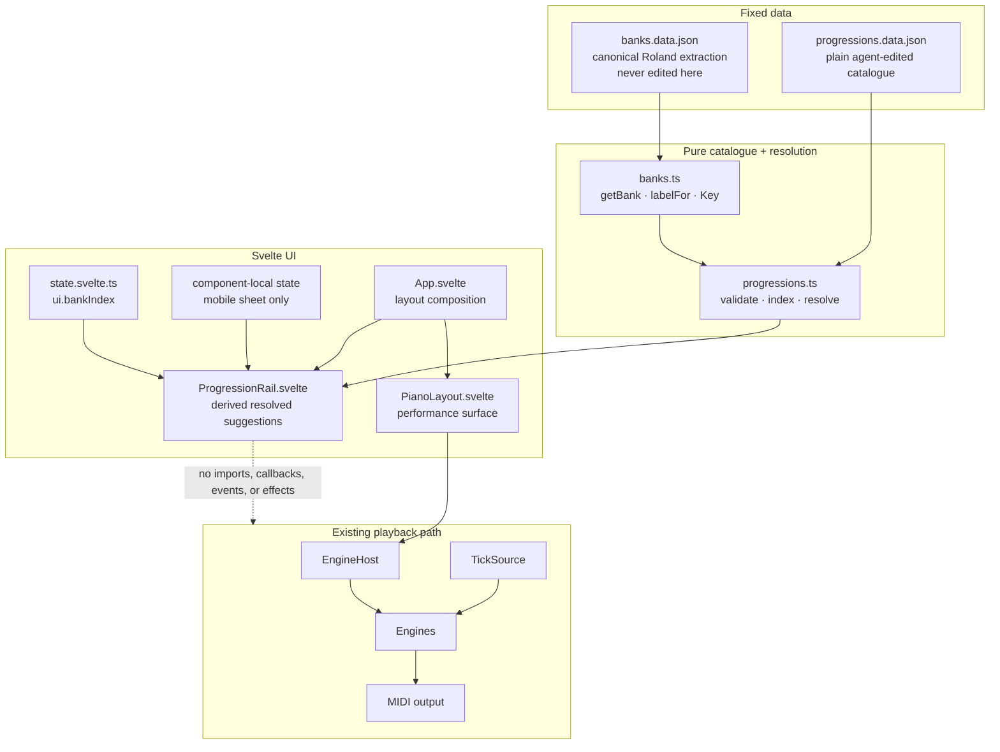
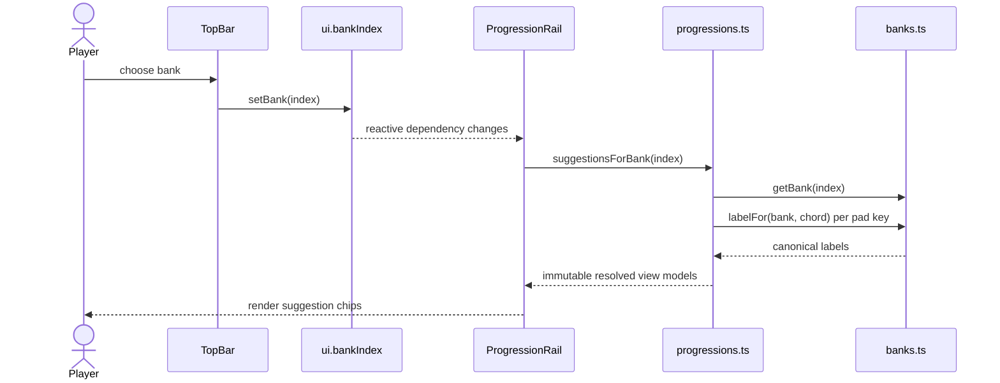

# Architecture Research

**Domain:** Bank-aware chord suggestions inside an existing browser MIDI instrument  
**Researched:** 2026-07-29  
**Confidence:** HIGH for code boundaries; MEDIUM for unresolved interaction details

## 🗺️ Recommended Architecture



**Decision**

- Add a second static data path beside the canonical bank path.
  - Catalogue stores bank numbers, metadata, and pad keys only.
  - Resolver obtains chord names from `getBank()` + `labelFor()`.
  - No chord name, MIDI note, tempo, duration, or playback state is duplicated.

- Keep the rail a pure projection of `ui.bankIndex`.
  - Svelte `$derived` recalculates the view model when the selected bank changes.
  - No new `App.svelte` `$effect`.
  - No global progression transport state.

- Keep the rail read-only in this milestone.
  - Chips explain which physical pads to press.
  - Chips do not call `press()`, `EngineHost`, an engine, MIDI, or `TickSource`.
  - “Current step” and “next step” are not modelled until their meaning is explicitly designed.

## 🧱 Component Boundaries

| Component | Owns | Reads | Must not know about |
|---|---|---|---|
| `progressions.data.json` | Authored bank-to-suggestion records and stable file order | Nothing | Chord names, MIDI notes, Svelte, playback |
| `progressions.ts` | Types, validation, indexing, deterministic resolution | Catalogue, `banks.ts` | `ui`, DOM, host, engines, timing |
| `ProgressionRail.svelte` | Desktop rail and presentation-only mobile state | `ui.bankIndex`, resolved view models | Notes, `EngineHost`, `TickSource`, MIDI |
| `state.svelte.ts` | Existing selected bank | Nothing new initially | Catalogue and resolution logic |
| `App.svelte` | Places rail directly after pads | Component only | Progression state/effects |
| `banks.ts` | Canonical `Key`, bank lookup, chord-label fallback | `banks.data.json` through existing loader | Progression metadata |

### New Files

```text
src/
├── progressions.data.json          # Plain catalogue; deterministic source order
├── progressions.ts                 # Validation + pure bank-aware resolver
└── components/
    └── ProgressionRail.svelte      # Read-only desktop rail + mobile sheet shell
test/
└── progressions.test.ts            # Contract, resolution, order, coverage tests
```

### Modified Files

| File | Change |
|---|---|
| `src/App.svelte` | Import and render `ProgressionRail` immediately after `PianoLayout` and before the footer |
| `src/styles/tokens.css` | Only if a missing quiet category tint/token is proven; reuse current steel/system and neutral tokens first |

### Explicitly Unchanged

- `src/banks.data.json`
- `src/banks.data.ts`
- `src/banks.ts` unless a genuinely reusable lookup helper is needed
- `src/state.svelte.ts` unless a later UX decision introduces persistent/global rail selection
- `src/components/PianoLayout.svelte` and its pointer-capture/release paths
- `src/engines/**`
- `src/tickSource.ts`
- `src/midi.ts`
- `src/clock.ts`

## 📚 Catalogue Contract

Use JSON.

- Already supported by the current Vite/TypeScript configuration.
- Matches the project’s existing static-data loading pattern.
- Adds no YAML parser, custom Vite loader, or runtime fetch.
- Remains easy for an agent to inspect, validate, and edit.

Example record shape:

```json
{
  "version": 1,
  "banks": [
    {
      "bankIndex": 1,
      "suggestions": [
        {
          "id": "bank-01-axis",
          "name": "Axis",
          "feel": "pop",
          "lengthBars": 4,
          "steps": ["C", "G", "A", "F"]
        }
      ]
    }
  ]
}
```

### Store

- `bankIndex`
  - Exact factory bank association.

- `id`
  - Stable and globally unique.

- `name`, `feel`, `lengthBars`
  - Display metadata only.

- `steps`
  - Ordered pad keys using the canonical `Key` vocabulary.
  - Repeated keys express repeated chords.

### Derive

- Bank name.
- Resolved chord label for each step.
- Compact formula preview.
- Suggestion order from catalogue order.
- Empty/non-empty state for the selected bank.

### Never Store

- Chord names.
- MIDI notes or voicings.
- Transposed notes.
- BPM, beat offsets, gates, velocity, or scheduling instructions.
- Current/queued step.

`lengthBars` is descriptive metadata. It is not a timing contract.

## 🔄 Data Flow



No message crosses from this flow into the playback flow.

## 🧠 Svelte State Integration

- `ui.bankIndex`
  - Remains the only global source needed by the feature.
  - `ProgressionRail.svelte` may import `ui` directly, matching `PianoLayout.svelte`.

- Resolved suggestions
  - Use `$derived.by(() => suggestionsForBank(ui.bankIndex))`.
  - Keep the resolver side-effect-free and return fresh, read-only view models.

- Mobile sheet state
  - Keep `isOpen` and any selected suggestion ID as component-local `$state`.
  - Compute a valid selected suggestion with `$derived` fallback to the first item.
  - A bank change must never require a data-sync `$effect`.

- `App.svelte`
  - Adds markup composition only.
  - Do not add a progression-to-host `$effect`, callback, or event bridge.

This follows the existing split:

- Reactive UI describes what is visible.
- `App.svelte` bridges only real performance controls to imperative subsystems.
- Suggestions never become imperative controls.

## ✅ Validation Contract

Validate once when the catalogue module loads, then unit-test the same rules.

### Structural Validation

- Root `version` is supported.
- `banks` is an array.
- Each `bankIndex` is an integer in `1..100`.
- Bank entries are unique.
- Each suggestion has:
  - globally unique, non-empty `id`
  - non-empty `name` and `feel`
  - positive integer `lengthBars`
  - non-empty `steps`
- Every step is a member of `KEYS`.
- Unknown fields are rejected or deliberately ignored by one documented policy.
- Errors identify the bank, suggestion ID/index, and failing field.

### Resolution Validation

- Every key resolves to exactly one chord in its target bank.
- Labels always use `labelFor()`.
  - Preserves the fallback for banks with unpublished chord names.
- Resolver preserves catalogue order.
- Resolver is deterministic across repeated calls.
- Catalogue data remains unmodified after resolution.

### Content Coverage Validation

- Produce a test-readable list of uncovered factory banks.
- Turn “all 100 banks must have content” into a hard test only if product scope explicitly requires full coverage.
- Until then, the UI needs a deliberate empty-bank policy.

### Regression Validation

- `just test`
- `just check`
- `just build` or `just ci`
- Browser verification at desktop, iPad-sized, and iPhone-landscape viewports.
- Confirm pad press/release, latch highlight, keyboard bank switching, and MIDI output remain unchanged.

## 🪜 Dependency-Aware Build Order

1. **Catalogue contract**
   - Add the JSON shape, validator, and small fixture-quality initial records.
   - Lock identifiers, ordering, and failure messages with tests.

2. **Pure bank-aware resolver**
   - Resolve pad keys through `getBank()` and `labelFor()`.
   - Test named chords, fallback labels, repeated steps, bank switches, and stable order.

3. **Content population**
   - Author useful catalogue entries against the validated contract.
   - Run coverage reporting before UI work relies on availability.

4. **Neutral desktop rail**
   - Render beneath pads with quiet metadata and non-interactive chips.
   - No active/queued state.

5. **Mobile containment**
   - Implement the approved one-progression sheet behavior.
   - Verify against the existing coarse-pointer body lock and short-landscape scroll override.

6. **Root integration + regression**
   - Add the component to `App.svelte`.
   - Run static gates, viewport checks, and playback regression checks.

This order prevents UI code from inventing a data contract and prevents content work from targeting an unstable schema.

## 🚧 Anti-Patterns

### Duplicating Bank Truth

- Wrong
  - Store `"Cadd9"` or `[48, 55, 62, 64]` in the progression catalogue.

- Consequence
  - Catalogue drifts from the verified Roland extraction.

- Correct
  - Store `"C"` and resolve through `banks.ts`.

### Treating Suggestions as a Lightweight Sequencer

- Wrong
  - Add playhead, countdown, automatic advance, bar callbacks, or tick subscriptions.

- Consequence
  - Creates a second playback state machine and violates milestone scope.

- Correct
  - Render ordered, read-only pad guidance.

### Sending Chip Clicks Through `App.press()`

- Wrong
  - Make progression chips alternate pad controls.

- Consequence
  - Couples content display to the fragile held/latch projection and engine host.

- Correct
  - Chips are labels, not buttons.

### Adding Global State for Derived Data

- Wrong
  - Copy resolved suggestions into `ui` and synchronize them on bank changes.

- Consequence
  - Introduces dual truth and unnecessary effects.

- Correct
  - Derive from `ui.bankIndex` + immutable catalogue data.

### Reusing Orange for Suggestion Focus

- Wrong
  - Apply the sketch’s orange “current step” treatment without playback semantics.

- Consequence
  - Conflicts with the shipped contract that orange means a currently sounding/latched pad.

- Correct
  - Use neutral/steel presentation until selection semantics are explicitly approved.

## ⚠️ UX Decisions Requiring Explicit Direction

These cannot be chosen safely by architecture alone.

1. **What “current” and “next” mean**
   - The design reference shows orange current and dashed-steel next.
   - A read-only suggestion has no playhead.
   - Recommendation for the first implementation:
     - omit both states
     - revisit only with a manually controlled, non-timed interaction contract

2. **Mobile sheet affordance**
   - The locked direction says collapsed sheet and one progression at a time.
   - Still open:
     - trigger placement
     - default open/closed state
     - swipe/arrows versus a picker
     - focus, dismissal, and accessibility behavior

3. **Catalogue coverage and empty banks**
   - Decide whether useful initial content means:
     - every one of 100 banks
     - a named initial subset with a quiet empty state
   - This decision changes the hard validation gate and UI empty state.

4. **How many desktop rows remain subordinate**
   - The sketch shows several rows, including a long 12-bar example.
   - Set a visible-row and overflow policy after testing real content at the three supported viewport classes.

## 📏 Scaling Considerations

| Concern | Recommended approach |
|---|---|
| 100 banks / hundreds of suggestions | Pre-index by bank once in `progressions.ts`; no backend or async loading |
| Long progressions | Derive a compact preview; use deliberate overflow rather than shrinking chips into illegibility |
| Catalogue growth | Keep schema versioned and validation strict; split files only when one JSON file becomes difficult to review |
| More authors | Add a schema/documentation check before adding an authoring UI |
| Future sequencer | Build separately with an explicit transport model; it may read the catalogue but must not retrofit timing into this read-only resolver |

## 🔌 Integration Boundary Matrix

| Boundary | Communication | Allowed |
|---|---|---|
| Catalogue → resolver | Static JSON import | Definitions only |
| `banks.ts` → resolver | Pure function/type imports | Bank/chord resolution |
| `ui.bankIndex` → rail | Svelte reactive read | Selected bank only |
| Resolver → rail | Pure function return | Read-only view models |
| Rail → `App.svelte` | Child rendering | No callbacks required |
| Rail → host/engines | None | Forbidden |
| Rail → `TickSource` | None | Forbidden |
| Rail → MIDI | None | Forbidden |
| Rail → `PianoLayout` | None | Forbidden |

## 📎 Sources

### Direct project evidence

- `.planning/PROJECT.md`
  - Milestone scope, suggestion-only boundary, canonical data constraint.
- `.planning/codebase/ARCHITECTURE.md`
  - Existing reactive-to-imperative split and `App.svelte` bridge.
- `.planning/codebase/STRUCTURE.md`
  - File conventions and extension points.
- `src/state.svelte.ts`
  - Current global state and setter pattern.
- `src/App.svelte`
  - Current engine/timing effects and root composition.
- `src/banks.ts`
  - Canonical `Key`, `getBank()`, and `labelFor()`.
- `src/components/PianoLayout.svelte`
  - Existing direct reactive bank projection and fragile pointer-release paths.
- `src/styles/tokens.css`
  - Orange reserved for active sound; steel/system semantics.
- `.codex/skills/sketch-findings-jay-6/references/progressions.md`
  - Locked chord-chip rail, subordinate hierarchy, and mobile sheet direction.
- `.codex/skills/sketch-findings-jay-6/sources/001-jay-6-visual-redesign/03-progressions-chip-rail.png`
  - Visual reference; interaction copy treated as non-binding because milestone scope is stricter.

### Official framework reference

- [Svelte `$derived`](https://svelte.dev/docs/svelte/%24derived)
  - Side-effect-free derived state and dependency tracking.
- [Svelte `$state`](https://svelte.dev/docs/svelte/%24state)
  - Reactive state behavior.

## 🎯 Confidence

| Area | Confidence | Reason |
|---|---|---|
| Existing integration boundaries | HIGH | Directly verified against current source |
| Catalogue/resolver separation | HIGH | Follows canonical bank ownership and requires no playback changes |
| Svelte derivation model | HIGH | Matches current code and official Svelte documentation |
| Responsive/mobile implementation | MEDIUM | Direction is locked; exact interaction and viewport containment are not |
| Content coverage rules | MEDIUM | “Useful initial content” has no explicit all-banks acceptance threshold yet |

---

*Architecture research for: Jay-6 v2.0 Musical Companion*  
*Researched: 2026-07-29*
