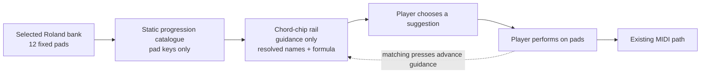
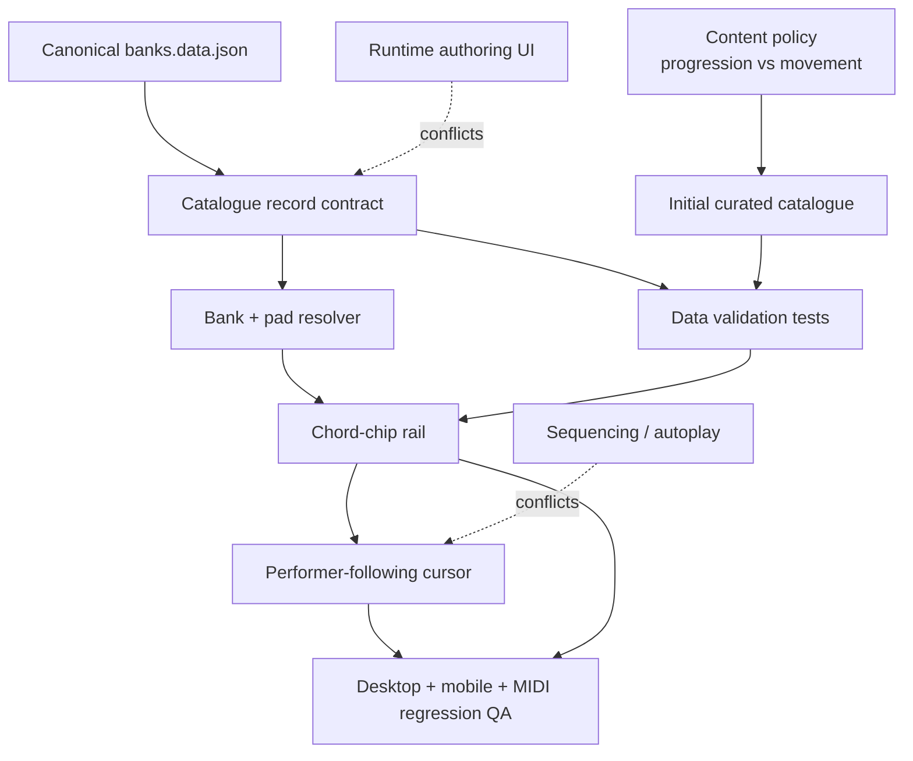

# 🎼 Feature Research

**Domain:** Bank-aware chord-progression guidance in a performance-first browser instrument  
**Researched:** 2026-07-29  
**Confidence:** MEDIUM

## 🗺️ Feature Landscape



### ✅ Table Stakes

| Feature | Why Expected | Complexity | Implementation-ready contract |
|---|---|---:|---|
| Suggestions change with the selected bank | A suggestion is only useful when every step exists in the visible 12-pad set | MEDIUM | Catalogue entries reference `bank` plus pad keys; chord names always resolve from `banks.data.json` |
| Guidance only | Jay-6 remains an instrument; the player decides when and how each chord sounds | LOW | Selecting a row/chip emits no MIDI, changes no latch state, and starts no timer |
| Immediate useful content | An empty authoring system does not deliver the milestone outcome | HIGH | Ship curated coverage, not placeholder/demo rows; see **Initial Content Contract** |
| Clear identity for every step | Inversions, slash chords, repeated chord names, and blank names otherwise become ambiguous | MEDIUM | Every chip shows pad key; show resolved chord name when present; define a fallback label for banks 14–16 |
| Lightweight progression selection | Multiple suggestions must remain browsable without competing with the pads | MEDIUM | Desktop rail below pads; mobile sheet; one active suggestion at a time |
| Non-judgmental progress tracking | The player may deviate, repeat, or improvise | MEDIUM | Matching the next pad advances guidance; any other pad still performs normally and shows no error, score, or correction |
| Stable reset behavior | Bank changes and suggestion changes must never leave stale guidance | LOW | New bank selects its first suggestion and resets to step 1; choosing another suggestion resets to its step 1 |
| Agent-editable, reviewable catalogue | Content will evolve through agent-assisted edits | MEDIUM | One plain data file, stable IDs, small records, deterministic ordering, and data-only tests |
| Catalogue validation | A typo must fail before it becomes a dead chip in the UI | MEDIUM | Test IDs, bank references, pad keys, bounds, duplicates, coverage, and name resolution |
| Accessible empty/failure state | Special banks and malformed data must not break the performance surface | LOW | Rail can say “No curated suggestions” and disappear/collapse cleanly; pad playback remains untouched |

### ✨ Differentiators

| Feature | Value Proposition | Complexity | Notes |
|---|---|---:|---|
| Factory-bank-aware curation | Suggestions use the exact Roland voicings already under the player’s fingers | HIGH | More valuable than generic Roman-numeral generation; requires musical audition |
| Pad-key-first chips | A player can immediately perform the suggestion without translating theory into the keyboard layout | LOW | Keep formula/name secondary to `C`, `D#`, `A`, etc. |
| Suggestion cursor follows the performer | Guidance stays useful during live exploration without becoming a sequencer | MEDIUM | Advance only on a matching next pad; final step may point back to step 1 for looping |
| Honest content modes | Conventional progressions and experimental movement studies are not mislabeled as the same thing | MEDIUM | Use a quiet `kind`: `progression` or `movement`; label utility/stack-bank content accordingly |
| Formula plus resolved voicing | Shows the reusable musical idea and the specific bank colour together | MEDIUM | Formula is editorial metadata; resolved chord names come from canonical bank data |
| Musical QA status outside runtime UI | Agents can draft content while Flo retains the taste decision | LOW | Track draft/review state in source control or review notes, not as end-user UI or persistence |

### 🚫 Anti-Features

| Feature | Why Requested | Why Problematic | Alternative |
|---|---|---|---|
| Auto-play / progression sequencer | Lets users hear a whole progression quickly | Takes timing and performance away from the player; duplicates explicitly excluded scope | Player presses the indicated pads; existing styles shape only the chord currently played |
| “Play this chip” interaction | Seems like a convenient preview | Creates a second performance surface and ambiguous pointer/latch behavior | Chips select/navigate guidance only; pads remain the sole chord triggers |
| Algorithmic “best next chord” | Appears limitless and smart | Implies authority, needs harmonic inference, produces unstable results on altered/stack/utility banks | Curated, finite suggestions with explicit editorial names |
| Generic formula copied to every bank | Cheap way to claim full coverage | Many banks contain inversions, repeated pads, nonfunctional sonorities, or no chord labels | Audition each bank and use distinct `progression` / `movement` content |
| User-defined banks or progression editor UI | Makes the feature extensible | Adds import, validation UX, persistence, and ownership questions outside this milestone | Keep the source catalogue agent-editable in the repository |
| Song titles or “sounds like” claims | Familiar reference point | Copyright/provenance ambiguity and overpromising exact harmony | Use neutral functional names: “Pop turnaround”, “Minor lift”, “Chromatic drift” |
| Key/scale detector | Could explain why suggestions work | Banks are curated chord sets, not guaranteed diatonic scales; inference will be wrong or reductive | Store an optional editorial formula only when the mapping is musically defensible |
| Ratings, scoring, streaks, or wrong-note states | Makes guidance feel interactive | Converts exploration into assessment and punishes valid improvisation | Quiet matched-step advancement; unmatched presses are ignored by guidance |
| Runtime catalogue editing or cloud content | Enables instant additions | Requires backend/persistence and expands failure modes | Build-time static data plus tests |
| Timing semantics hidden in `lengthBars` | Makes rows resemble a song form | Without playback, “bars” can imply a rhythm the system does not enforce | Treat bar count as display-only editorial metadata, or omit until Flo approves the intended rhythm |

## 🔗 Feature Dependencies



### Dependency Notes

- **Catalogue requires canonical bank data**
  - Store bank number and pad keys, never copied chord names.
  - Resolution must preserve slash chords, altered chords, and duplicate names exactly as extracted.
- **Initial content requires a content policy**
  - Functional genre banks can use named progression conventions.
  - Stack and utility banks need explicitly labeled movement/voicing studies or an honest empty state.
- **Rail requires validation**
  - UI work should not begin against hand-waved sample data that later changes shape.
- **Performer-following cursor requires the rail, not MIDI-engine changes**
  - Observe existing pad actions at the UI/state seam.
  - Do not route guidance into `engines/host.ts`.
- **Browser QA requires real content**
  - Long chord names, repeated labels, 12-step blues, and blank-name fallbacks are layout cases.

## 📚 Initial Content Contract

### Recommended launch coverage

- **Minimum**
  - Two suggestions for each of the 100 banks.
  - This avoids presenting one subjective sequence as “the answer.”
- **Content types**
  - Banks 1–13 and 27–100
    - At least one short 3–4 chord progression.
    - At least one contrasting progression or turnaround.
  - Banks 14–16
    - Two `movement` studies based on interval-stack motion.
    - Never call them common chord progressions.
  - Banks 17–24
    - Two parallel-harmony movement studies suited to the bank’s uniform chord quality.
  - Banks 25–26
    - Two voicing-path studies where pad identity is prominent because names repeat.
- **Useful target after the first complete audition**
  - Add a third “signature” suggestion to genre banks.
  - Do not block launch on reaching the same count for every special-purpose bank.

### Seed families

These are starting hypotheses for curation, not blind templates.

| Bank families | Research-backed seed | Editorial variants to audition | Confidence |
|---|---|---|---|
| Pop, House, EDM | Four-chord schemas such as `I–V–vi–IV` and rotations | `vi–IV–I–V`, `I–vi–IV–V`, short plagal loop | MEDIUM |
| Trad Maj, bright Utility | Functional tonic/predominant/dominant motion | `I–IV–V–I`, `I–vi–ii–V` | MEDIUM |
| Trad Min, Pop Min, dark Synthwave/Cinematic | Minor tonic with common modal neighbours | `i–♭VI–♭III–♭VII`, `i–♭VII–♭VI–♭VII` | LOW until Flo auditions |
| Jazz, Jazz House, Bossa | `ii–V–I`; turnarounds | `I–vi–ii–V`, minor `iiø–V–i`, tritone-colour variant where bank supports it | MEDIUM |
| Blues, Funk | 12-bar blues skeleton using I/IV/V | One full 12-step form plus one compact turnaround | MEDIUM |
| Gospel/R&B, Lofi R&B, Neo Soul | Voice-leading-rich cadential motion | `ii–V–I–vi`, `IV–iv–I`, bass-line or diminished-passing variant | LOW until Flo auditions |
| Classical | Cadential and circle motion | `I–IV–V–I`, `vi–ii–V–I`, pedal/bass-line study | MEDIUM |
| Stack / chromatic Utility / fixed-voicing banks | No universal functional formula | Ascending/descending contour, third/fourth jumps, symmetric return, closest-voice-leading path | Product judgment |

### Authoring record

```yaml
bank: 3
suggestions:
  - id: b003-jazz-ii-v-i
    name: ii–V–I
    kind: progression
    feel: resolve
    formula: ii–V–I
    lengthBars: 3
    steps: [D, G, C]
```

- **Required**
  - `bank`
  - unique stable `id`
  - short `name`
  - `kind`
  - ordered `steps`
- **Optional editorial metadata**
  - `feel`
  - `formula`
  - `lengthBars`
- **No duplicated chord names**
  - Rendering resolves each step from `banks.data.json`.
- **No playback fields**
  - No BPM, duration, gate, style, velocity, probability, or scheduling.

### Testable catalogue rules

- Banks are integers `1..100` and exist in canonical bank data.
- Every step is one of the 12 existing pad keys.
- Every suggestion has `2..12` steps and at least two distinct pad keys.
- IDs are globally unique and prefixed with the zero-padded bank number.
- Suggestion names are unique within a bank.
- Step sequences are not duplicated within a bank.
- Every intended launch bank meets the two-suggestion coverage floor.
- `kind` is exactly `progression` or `movement`.
- `formula`, when present, must be deliberately authored; it is never inferred at runtime.
- Consecutive repeated steps require an explicit exception because they otherwise look like catalogue mistakes.
- Blank chord names are allowed only where canonical bank data is blank; the UI fallback must be tested.
- A resolved chip snapshot test covers:
  - altered chord name
  - slash chord
  - duplicate chord name on different pads
  - blank chord name
  - 12-step row

### Musical audition gate

- Audition every suggestion with Style off.
  - Does the harmonic motion make sense?
  - Is the final-to-first loop useful or intentionally open?
- Audition with one restrained phrase style.
  - Does a voicing jump become harsh or muddy?
  - Does a long 12-step suggestion remain playable?
- Check both OP-1 and OP-1 field only where their sound/connection reveals a real difference.
- Mark agent-generated entries as draft until Flo approves the musical result.
- Sample deeply across each family before bulk authoring the rest.
  - One Pop, one Jazz, one minor, one electronic, one Neo Soul, one Classical, one stack, one utility bank.

## 🚀 Milestone Definition

### Launch with v2.0

- [ ] Static catalogue contract and validation tests.
- [ ] Bank-aware resolver using canonical chord data.
- [ ] Two curated suggestions per bank, using honest `progression` / `movement` labels.
- [ ] Approved desktop rail and mobile sheet.
- [ ] Suggestion selection with no MIDI side effects.
- [ ] Matching-pad cursor that never penalizes deviations.
- [ ] Browser QA for long, blank, altered, slash, and repeated chord labels.
- [ ] Flo musical-approval pass for initial content.

### Add after validation

- [ ] Third signature suggestion for genre banks.
  - Add when two-per-bank coverage feels too repetitive.
- [ ] Manual previous/next suggestion shortcuts.
  - Add only if switching suggestions during performance is awkward.
- [ ] Optional compact formula explanation.
  - Add only if formula labels help rather than clutter.

### Future consideration

- [ ] Favourites and persistence.
  - Already deferred with broader preset persistence.
- [ ] User-authored progression import.
  - Requires a safe validation and ownership workflow.
- [ ] Corpus-ranked or generative next-chord suggestions.
  - Only if curated content proves too static and Flo wants probabilistic guidance.
- [ ] Sequencing or automated playback.
  - Explicitly outside this milestone and contrary to the companion contract.

## 📊 Feature Prioritization

| Feature | User Value | Cost | Priority |
|---|---:|---:|---:|
| Bank-aware curated suggestions | HIGH | HIGH | P1 |
| Static catalogue validation | HIGH | MEDIUM | P1 |
| Chord-chip rail + mobile sheet | HIGH | MEDIUM | P1 |
| Guidance-only selection | HIGH | LOW | P1 |
| Performer-following cursor | MEDIUM | MEDIUM | P1 |
| Two-per-bank coverage | HIGH | HIGH | P1 |
| Third signature suggestions | MEDIUM | HIGH | P2 |
| Formula explanations | LOW | MEDIUM | P2 |
| Runtime authoring/import | LOW | HIGH | P3 |
| Generation, ranking, autoplay | LOW for this product | HIGH | P3 / excluded |

## 🥁 Competitive Pattern Check

| Pattern | Roland J-6 | Hooktheory Trends | Jay-6 recommendation |
|---|---|---|---|
| Harmonic source | 100 curated factory chord sets | Large analysed-song corpus | Fixed Roland banks plus a curated static catalogue |
| Suggestion model | User explores pads and composes on the fly | Probabilistic next-chord exploration | Small bank-specific rows; no probability claim |
| Performance ownership | Hardware supports both live play and sequencing | Composition/exploration tool | Pads exclusively own performance; rail only guides |
| Representation | Bank number, genre, pad, chord voicing | Key/scale plus chord path | Pad key first, resolved chord name, optional formula |
| Content promise | Genre-spanning inspiration | Common usage in analysed songs | Useful starting points, explicitly editorial and auditioned |

## 🎛️ Decisions Flo Must Own

- **Special-bank policy**
  - Recommendation
    - Include clearly labeled movement/voicing studies for banks 14–26.
  - Alternative
    - Show “No curated suggestions” rather than imply functional harmony.
- **Launch density**
  - Recommendation
    - Two per bank now; third signature rows after audition.
  - Trade-off
    - More rows improve variety but multiply subjective review.
- **Cursor semantics**
  - Recommendation
    - Advance only when the next expected pad is played; ignore deviations.
  - Open detail
    - Whether the last step immediately points back to step 1 or ends in a neutral completed state.
- **Orange state**
  - Recommendation
    - Orange only while the matched current chord is actually sounding/latched; dashed steel marks the next suggestion.
  - Reason
    - Preserves the project rule that orange means sounding.
- **Bar metadata**
  - Recommendation
    - Keep `lengthBars` display-only or omit it from the first catalogue.
  - Open choice
    - Whether a chip row should imply one chord per bar.
- **Taste gate**
  - Flo must approve the actual pad sequences, names, and genre fit.
  - Research can supply schemas and tests; it cannot certify that a particular altered Roland voicing feels right in performance.

## 📎 Sources

- [Roland J-6 product page](https://www.roland.com/global/products/j-6/)
  - Official positioning: 100 genre-spanning chord sets and on-the-fly progression creation.
  - Confidence: MEDIUM.
- [Roland J-6 Owner’s Manual v1.02](https://static.roland.com/manuals/J-6_manual_v102/eng/index.html)
  - Official chord-set list and pad mapping.
  - Confidence: MEDIUM.
- [Open Music Theory: ii–V–I](https://viva.pressbooks.pub/openmusictheory/chapter/ii-v-i/)
  - Jazz schema.
  - Confidence: MEDIUM.
- [Open Music Theory: Blues Harmony](https://viva.pressbooks.pub/openmusictheory/chapter/blues-harmony/)
  - 12-bar blues, jazz-blues, and turnaround conventions.
  - Confidence: MEDIUM.
- [Open Music Theory: Four-Chord Schemas](https://viva.pressbooks.pub/openmusictheory/chapter/4-chord-schemas/)
  - Pop four-chord schema framing.
  - Confidence: MEDIUM.
- [Hooktheory Trends](https://www.hooktheory.com/trends)
  - Corpus-backed next-chord and progression exploration pattern.
  - Confidence: MEDIUM.
- [JSON Schema: Enumerated Values](https://json-schema.org/understanding-json-schema/reference/enum)
  - Structural validation pattern for bounded fields.
  - Confidence: MEDIUM.
- [Problems and Prospects for Intimate Musical Control of Computers](https://arxiv.org/abs/2010.01570)
  - Musical-interface criteria: predictable gesture mapping, ease of use, and performance responsiveness.
  - Confidence: MEDIUM.
- Project evidence:
  - `.planning/PROJECT.md`
  - `.codex/skills/sketch-findings-jay-6/references/progressions.md`
  - `.planning/todos/pending/2026-05-23-per-bank-common-chord-progression-authoring-system.md`
  - `src/banks.data.json`
  - Confidence: HIGH for current scope and bank edge cases.

---
*Feature research for bank-aware chord-progression suggestions in Jay-6.*
