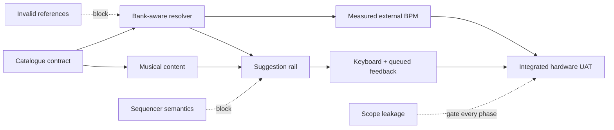

# Pitfalls Research

**Domain:** Retrofitting bank-aware chord suggestions and performance feedback into an existing Web MIDI instrument  
**Researched:** 2026-07-29  
**Confidence:** HIGH for Jay-6 integration risks; MEDIUM for browser timing heuristics

## 🗺️ Risk Map

- Build the data contract before the rail.
- Prove content musically before polishing discovery UI.
- Keep measured tempo separate from playback tempo.
- End with real OP-1 and responsive-browser UAT.

## 🚨 Critical Pitfalls

### Pitfall 1: A suggestion rail quietly becomes a sequencer

**Confidence:** HIGH

**What goes wrong:**

- The rail gains a playhead, auto-advance, step scheduling, transport coupling, or a “play progression” action.
- “Current” and “next” styling implies Jay-6 is tracking progression position even though the player still chooses every chord.
- Tapping a suggestion starts a multi-chord process rather than making one explicit user-controlled choice.
- Product language shifts from “try these chords” to “playback,” “pattern,” “queue,” or “timeline.”

**Why it happens:**

- Chord chips arranged left-to-right resemble steps.
- The approved sketch includes current/next visual states that are easy to implement as autonomous step state.
- Existing 24 PPQ and transport infrastructure makes progression scheduling look deceptively cheap.
- A bar-notation ribbon imports DAW/sequencer affordances into a suggestion-only milestone.

**How to avoid:**

- Make the catalogue and rail pure recommendation data.
  - No timers.
  - No tick subscriptions.
  - No transport listeners.
  - No progression-owned engine calls.
- Treat each displayed pad key as an idea, not an instruction scheduled in time.
- If sounding feedback is shown, derive orange only from the existing actually-sounding pad state.
  - Never maintain a progression playhead.
  - Never infer “next” from elapsed time.
- Keep chip interactions display-only unless a later requirement explicitly authorizes one-pad audition.
- Ban sequencer nouns and fields from this milestone.
  - `playhead`
  - `currentStep`
  - `scheduledAt`
  - `autoAdvance`
  - `transportPosition`

**Warning signs:**

- The progression module imports `tickSource`, `EngineHost`, MIDI output, or transport types.
- A progression component owns a timer or subscribes to clock ticks.
- Tests advance fake time to test suggestion behavior.
- Orange moves through the rail without the player pressing pads.
- A design review needs to explain why a play-looking control does not play.

**Verification strategy:**

- Static dependency test or review.
  - Catalogue/resolver/UI modules have no imports from engines, MIDI, clock, or transport.
- Interaction smoke test.
  - Leave a suggestion visible for several bars under Int and Ext clock.
  - Nothing advances and no MIDI is emitted.
- MIDI monitor test.
  - Selecting/browsing a suggestion emits zero Note, Clock, Start, Continue, or Stop messages.
- Language review.
  - UI and manual consistently say “suggestion,” “try,” or “chords.”

**Phase to address:**

- **Progression Catalogue Contract**
  - Lock suggestion-only semantics before data and UI work.
- Re-verify in **Integrated Hardware UAT**.

---

### Pitfall 2: Catalogue entries contain invalid or stale bank/pad references

**Confidence:** HIGH

**What goes wrong:**

- A progression references an unsupported pad key, missing bank, duplicate ID, empty step list, or malformed metadata.
- A rail shows chord names from the previous bank after bank navigation.
- Catalogue content duplicates chord names that later diverge from `src/banks.data.json`.
- Empty published chord names render as blank chips instead of using the existing `labelFor()` fallback.
- A schema rejects valid repeated chords because progression steps are incorrectly required to be unique.

**Why it happens:**

- Plain agent-editable data is easy to edit but also easy to mistype.
- Structural validation is mistaken for referential validation.
- Bank-aware display is implemented by storing resolved labels rather than resolving from live state.
- Generic catalogue rules ignore Jay-6 details.
  - Exactly 100 factory banks.
  - Exactly 12 chromatic `Key` values.
  - Some banks intentionally have unnamed chords.
  - Musical progressions may legitimately repeat a pad.

**How to avoid:**

- Define one small typed catalogue contract.
  - Stable unique `id`.
  - Explicit bank applicability.
  - Non-empty `name`.
  - Constrained `feel` values.
  - Positive `lengthBars` only if the UI genuinely uses it.
  - Non-empty `steps: Key[]`.
- Reuse `Key`, `KEYS`, `getBank()`, and `labelFor()`.
  - Do not create a second pad-key list.
  - Do not store chord names or MIDI notes in progression data.
- Add domain validation beyond parsing.
  - Every bank reference exists.
  - Every step resolves in every applicable bank.
  - IDs are unique.
  - Applicability is non-empty and unambiguous.
  - Duplicate steps remain allowed.
- Resolve chip labels from `ui.bankIndex` at render time.
- Fail tests loudly on invalid catalogue content.
  - Never silently drop a bad step.

**Warning signs:**

- Progression data contains strings such as `Cmaj7` or MIDI note numbers.
- A second `PAD_KEYS` constant appears outside `banks.ts`.
- The UI has `?? ''`, “Unknown chord,” or filtered-out steps.
- Changing banks leaves one or more chip labels unchanged when the underlying chords differ.
- Validation checks JSON shape but never calls the bank resolver.

**Verification strategy:**

- Unit-test every catalogue entry against every applicable bank.
- Mutation tests.
  - Bad pad key.
  - Bank `0` and `101`.
  - Duplicate ID.
  - Empty steps.
  - Unknown feel.
  - Repeated valid pad.
- Reactive UI test or browser smoke.
  - Select one suggestion.
  - Cycle through contrasting named and unnamed banks.
  - Verify every label matches `labelFor(getBank(index), chord)`.
- Run the catalogue test in `just ci` so agent edits cannot bypass it.

**Phase to address:**

- **Progression Catalogue Contract**
  - Type, validate, and test before initial content.
- **Suggestion Rail**
  - Verify reactive label resolution.

---

### Pitfall 3: The initial catalogue is valid but musically weak

**Confidence:** HIGH

**What goes wrong:**

- Every bank receives the same pad-letter sequence regardless of its actual harmony.
- Suggestions are technically playable but monotonous, awkwardly voiced, misleadingly named, or poor fits for the bank.
- Catalogue rows differ only cosmetically.
- Metadata such as “uplifting,” “jazz,” or bar length overclaims what was actually reviewed.
- A large catalogue creates the appearance of usefulness while only a small portion has been listened to.

**Why it happens:**

- Pad letters are not Roman numerals.
  - `C`, `G`, or `A` identify physical factory-bank slots, not universal harmonic functions.
- The 100 factory banks include different chord systems and voicing behaviours.
- Structural tests can prove references resolve but cannot prove a progression feels useful.
- Content volume is easier to count than musical diversity and quality.

**How to avoid:**

- Curate from the actual chords and voicings in each applicable bank.
- Start smaller and useful.
  - A few distinct, defensible suggestions per covered bank/family.
  - Clear gaps are better than filler.
- Review four dimensions separately.
  - Harmonic movement.
  - Voice leading/register movement.
  - Rhythmic/form implication.
  - Variety against neighbouring suggestions.
- Use repeated chords intentionally.
  - Do not optimise for unique pad keys.
- Keep subjective metadata modest and controlled.
- Record provenance or review status in developer-facing notes/tests if useful, not in the performance UI.
- Listen through the OP-1 target path.
  - MIDI note validity does not guarantee satisfying voicing on the target instrument.

**Warning signs:**

- A generator produced most entries from one template.
- All banks have identical step arrays.
- Suggestion names can be permuted without changing meaning.
- “Useful initial content” is measured only by entry count or bank coverage.
- No one can name which entries were auditioned on the OP-1.
- Inversions and bass movement create unexpected jumps that were never reviewed.

**Verification strategy:**

- Automated diversity report.
  - Duplicate step sequences.
  - Duplicate names.
  - Coverage by bank/family.
  - Distribution of lengths and repeated steps.
- Structured musical review.
  - Audition every shipped entry if the catalogue is small.
  - Otherwise define a reviewed initial subset and do not claim unreviewed coverage.
- Target-hardware UAT.
  - Play suggestions manually on OP-1/OP-1 field.
  - Check transitions, register, repetition, and whether each suggestion invites performance.
- Blind usefulness check.
  - Can the player find at least two meaningfully different ideas in representative contrasting banks?

**Phase to address:**

- **Musical Content & Discovery Model**
  - Own content quality, coverage, naming, and listening evidence.
- Do not defer musical review to UI UAT.

---

### Pitfall 4: The rail dominates the instrument or breaks responsive reachability

**Confidence:** HIGH

**What goes wrong:**

- Suggestions visually compete with the pads, making the app feel like a browser catalogue instead of an instrument.
- Multiple progression rows push pads or keyboard guidance below the fold.
- Mobile becomes a long scrolling list.
- The rail clashes with Jay-6’s coarse-pointer scroll lock and short-landscape escape hatch.
- Orange is used for selection or recommendation, weakening its locked meaning of “sounding now.”
- Dense feel/category colours make the quiet secondary surface louder than the performance surface.

**Why it happens:**

- New features attract visual emphasis.
- Desktop rail density is copied directly to iPad and iPhone landscape.
- Chip timelines look important when given strong borders, large labels, or animation.
- Developers optimise the new component in isolation rather than testing the whole instrument hierarchy.

**How to avoid:**

- Follow the validated chord-chip rail.
  - Directly beneath pads.
  - Small pad key plus resolved chord name.
  - Quiet metadata.
  - No bar-notation ribbon.
- Keep the pad grid larger, higher, and higher-contrast.
- Reserve orange for actual sounding/latched-pad feedback.
- Use muted steel only for genuinely pending system state.
- Mobile:
  - Show one suggestion at a time.
  - Use the previously designed collapsed/sheet treatment.
  - Avoid permanent vertical expansion.
- Preserve visible focus and readable names without adding competing chrome.

**Warning signs:**

- The rail occupies more vertical space than the pad grid.
- More than one progression is fully expanded on mobile.
- The first viewport shows suggestions before all pads.
- A user describes the screen as a sequencer or progression app.
- New rail CSS introduces fresh accent colours.
- iPhone landscape needs scrolling but the page is still fixed.

**Verification strategy:**

- Screenshot comparison at the already-used breakpoints.
  - Desktop.
  - iPad-sized.
  - iPhone landscape.
- Hierarchy check at thumbnail size.
  - Pads must read first.
  - Suggestions second.
- Reachability smoke test on coarse pointer and short landscape.
  - All pads remain reachable.
  - Rail can be inspected without trapping the page.
- Colour-state audit.
  - Orange appears only when sound is active.
  - Steel appears only for queued/pending state.
- Keyboard-only focus walkthrough if any rail element is interactive.

**Phase to address:**

- **Suggestion Rail**
  - Treat responsive hierarchy as a completion criterion, not later polish.

---

### Pitfall 5: Up/Down cycling regresses existing keyboard and control behaviour

**Confidence:** HIGH

**What goes wrong:**

- Arrow keys change variation while focus is inside a select, number/range input, picker, or future composite widget.
- The page scrolls when the body owns focus because `preventDefault()` moved behind the repeat guard.
- Holding an arrow cycles repeatedly despite the existing single-action-on-keydown contract.
- Hold style unexpectedly acquires a variation.
- Wraparound is off by one.
- Left/Right bank navigation, Space latch, pad release, or style number keys regress.
- The shortcut exists only globally and is undiscoverable to keyboard/screen-reader users.

**Why it happens:**

- `App.svelte` already swallows Up/Down but does nothing.
- The current target guard covers common controls, not every future ARIA composite.
- Global handlers are easy to extend without checking `defaultPrevented`, focus context, or event repeat.
- Direct arithmetic bypasses the current style-derived variation count.

**How to avoid:**

- Extend the existing handler rather than add a second global listener.
- Preserve the ordering.
  - Yield to focused editable/native/composite controls.
  - Yield if another handler already called `preventDefault()`.
  - Prevent body scroll for recognised app keys.
  - Ignore repeat for the action only.
- Add one state helper for cycling.
  - Derive max from `STYLE_VARIATION_COUNT[ui.style]`.
  - Wrap `1 ↔ max`.
  - No-op for `hold`.
- Keep the existing visible variation control fully keyboard operable.
- Document Up/Down in the footer and `MANUAL.md`.
- If the variation trigger exposes shortcut metadata, use `aria-keyshortcuts="ArrowUp ArrowDown"` without making it the only access path.

**Warning signs:**

- New `window.addEventListener('keydown', ...)` appears outside the existing mount block.
- Up/Down logic calls `setVariation(ui.variation ± 1)` without explicit wraparound.
- A test covers variation changes but not scroll suppression, focus guards, repeat, and Hold.
- Focused range/select controls stop responding to arrows.
- The footer still lists Left/Right but not Up/Down.

**Verification strategy:**

- Pure helper tests.
  - `1 → 12`.
  - `12 → 1`.
  - Middle values.
  - Hold no-op.
- Browser keyboard matrix.
  - Body focus.
  - Setup select.
  - BPM input.
  - Gate range.
  - Variation picker button.
  - Open popover/dialog.
  - Held key repeat.
- Regression pass for all existing shortcuts and key-up note release.
- Verify body does not scroll on Up/Down while focused controls retain native behaviour.

**Phase to address:**

- **Performance Controls & Feedback**
  - Implement helper and shortcut as one tested slice.

---

### Pitfall 6: Queued-change feedback is noisy, inaccurate, or becomes a second timing engine

**Confidence:** HIGH for product/state risks; MEDIUM for the exact visibility threshold

**What goes wrong:**

- Every variation change flashes a toast, including fast patterns where feedback is unnecessary.
- The toast says “queued” when nothing is playing, while Hold is selected, or after the change has already become audible.
- A countdown drifts from the engine because the UI starts its own timer.
- Rapid cycling stacks many toasts or causes repeated screen-reader announcements.
- The toast uses orange and looks like active sound.
- Stale feedback survives style changes, panic, clock-mode switches, or component teardown.

**Why it happens:**

- `ui.variation` changes immediately while engine behaviour becomes audible at its next hit.
- `EngineHost.setStyle()` updates variation in place but exposes no explicit “applied audibly” event.
- “More than ~0.5 s to next hit” depends on current engine phase and clock source, not only variation metadata.
- The sketch’s example countdown is tempting to reproduce without a trustworthy phase source.

**How to avoid:**

- Model the toast as feedback about an existing state transition.
  - Do not let it schedule or apply the variation.
- Show only when all are true.
  - A timed style is actively playing.
  - The new variation will not be heard promptly.
  - The pending state remains valid.
- Prefer truthful coarse copy over a fabricated exact countdown.
  - `Queued · V08`
  - Add “arms in N beats” only if the engine exposes authoritative phase information.
- Use one replaceable global toast.
  - Deduplicate rapid changes.
  - Latest valid change wins.
  - Auto-dismiss and cleanup.
- Use steel styling and textual “Queued” status.
- Make announcements polite and concise.
  - `role="status"` / `aria-live="polite"`.
  - Do not move focus.
- Clear on audible application, stop/panic, style change, mode switch, and unmount.

**Warning signs:**

- The toast component imports `setInterval`.
- Countdown math uses only `ui.bpm` and variation length.
- Multiple toast DOM nodes accumulate.
- Toasts appear while no pad is sounding.
- Changing to Hold produces queued feedback.
- Ext clock shows countdowns based on the internal BPM setting.

**Verification strategy:**

- Deterministic state tests around a small pure visibility/formatting helper.
- Fake-clock engine tests if an authoritative pending/applied event is introduced.
- Browser matrix.
  - Fast variation.
  - Slow variation.
  - Not playing.
  - Hold.
  - Rapid Up/Down.
  - Panic.
  - Style change.
  - Int/Ext mode switch.
- Screen-reader/live-region smoke.
  - One concise announcement per meaningful pending change.
- Hardware listening check.
  - Toast disappears when the selected variation is actually perceptible.

**Phase to address:**

- **Performance Controls & Feedback**
  - Define truth source before toast rendering.
- If exact external-clock countdown is required, order after **Measured External BPM**.

---

### Pitfall 7: External BPM jitters, lies when stale, or overwrites internal tempo

**Confidence:** HIGH for state separation and MIDI semantics; MEDIUM for smoothing constants

**What goes wrong:**

- BPM flickers on every incoming clock interval.
- A delayed browser task produces a dramatic one-frame tempo spike.
- The last measured value remains displayed as live after clock loss or input disconnect.
- Switching back to Int restores the measured external BPM instead of the user’s configured internal BPM.
- A new input inherits the old input’s smoothing window.
- Measurement only runs while an engine is subscribed, so the top bar is blank until a pad is played.
- Stop is treated as loss of clock even when the sender continues Timing Clock while transport is stopped.

**Why it happens:**

- MIDI Timing Clock is 24 pulses per quarter note, so single-tick interval estimates magnify ordinary event jitter.
- Browser delivery is main-thread mediated.
- `ui.bpm` currently means internal configured tempo and drives both `host.setBpm()` and `tickSource.setBpm()`.
- `tickSource` already binds external clock independently of active engines; a separate measurement listener can accidentally undo that design.
- “Transport running” and “clock present” are related but not identical states.

**How to avoid:**

- Keep two explicit values.
  - `ui.bpm`
    - User’s internal tempo.
    - Existing 40–240 setting.
  - `measuredExternalBpm`
    - Read-only.
    - Nullable/unavailable.
    - Never fed into `host.setBpm()` or `tickSource.setBpm()`.
- Measure from MIDI event receive timestamps, not render time.
- Estimate across multiple tick intervals.
  - Median/trimmed window or elapsed time across a bounded window.
  - Formula: `BPM = 60_000 × intervalCount / (elapsedMs × 24)`.
- Reject impossible/non-monotonic gaps and reset rather than contaminating the window.
- Reset measurement on:
  - Ext entry.
  - Input change/disconnect.
  - Ext exit.
  - Long no-clock gap.
- Mark unavailable/stale when no recent clock arrives.
  - Base the timeout on expected tick interval with a sensible floor.
  - Do not use transport Stop alone if clock bytes continue.
- Publish UI updates at a human-readable cadence instead of every tick.
- Keep listener ownership inside `tickSource`.
  - One Web MIDI clock binding.
  - One detach path.

**Warning signs:**

- Incoming clock calls `setBpm()`.
- `measuredExternalBpm` lives in the same writable field as the internal control.
- BPM is computed from `Date.now()` inside `TopBar.svelte`.
- The UI rerenders 24 times per quarter note.
- Switching input leaves the same measured value visible.
- A second `input.addListener('clock', ...)` appears outside `tickSource`.
- Ext BPM is still shown after unplugging the input.

**Verification strategy:**

- Pure estimator tests with timestamp sequences.
  - Exact 60, 110, 120, and 240 BPM.
  - Small deterministic jitter.
  - One large delayed event.
  - Non-monotonic timestamp.
  - Tempo change and convergence.
  - Stale timeout.
- Extend the existing fake-input listener tests.
  - Still exactly one binding per MIDI event.
  - Ext→Int detaches cleanly.
  - Input change resets measurement.
- State preservation test.
  - Set Int BPM to 110.
  - Measure Ext at 128.
  - Return to Int.
  - Display and tick source return to 110.
- Real OP-1 test over several tempos.
  - Stable display.
  - Reasonable convergence.
  - Honest unavailable state after cable/input loss.
- Main-thread stress smoke.
  - UI delay must not leave a permanent false value.

**Phase to address:**

- **Measured External BPM**
  - Own estimator, timestamp input, reset/stale semantics, and top-bar display.
- Re-verify in **Integrated Hardware UAT**.

---

### Pitfall 8: New state creates parallel truths and listener leaks

**Confidence:** HIGH

**What goes wrong:**

- Selected suggestion, resolved chips, queued variation, toast, and measured BPM each live in separate component-local states that disagree after bank/style/mode changes.
- Bank navigation changes pads but not rail labels.
- A second external-clock listener double-counts ticks or survives Int mode.
- Toast cleanup or BPM stale timers survive component teardown.
- Progression highlighting reimplements held/latched state and disagrees with the pad grid.
- A “small” feature touches the fragile host latch/transport state machine.

**Why it happens:**

- Jay-6 intentionally bridges reactive Svelte state to imperative host/tick-source state in `App.svelte`.
- Existing regressions have come from duplicated truths.
  - UI versus host latch state.
  - External listener attach/detach.
  - Resetting external tick position at the wrong lifecycle point.
- New feature state appears harmless when reviewed one component at a time.

**How to avoid:**

- Assign one owner per truth.
  - Bank/style/variation/internal BPM: `state.svelte.ts`.
  - Actual held/latched pad display: existing `App.svelte` path.
  - MIDI clock events and measured Ext BPM: `tickSource.ts`.
  - Catalogue content: static data module.
  - Resolved chord labels: derived from catalogue + current bank.
  - Toast lifecycle: one global feedback owner.
- Derive instead of mirror.
  - Do not copy resolved chord labels into state.
  - Do not create progression-local sounding-pad state.
- Reuse existing subscription cleanup patterns.
- Keep catalogue/rail work out of `EngineHost`.
- Add lifecycle/reset tables before implementation.

**Warning signs:**

- The same value appears in both `$state` and a class field without a documented bridge.
- More than one component tracks the selected bank or chord label.
- Progression UI imports host internals.
- Tick-source tests report more than four bound external event listeners.
- A mode switch fixes stale UI only after reload.
- Implementing suggestions requires editing latch or transport logic.

**Verification strategy:**

- State-ownership review using the architecture boundary above.
- Transition matrix.
  - Bank change.
  - Style change.
  - Variation change.
  - Pad press/release/latch.
  - Panic.
  - Input change/disconnect.
  - Int↔Ext.
  - Component teardown.
- Extend existing listener-count and detach tests.
- Browser soak.
  - Repeatedly open/close popovers, change banks, switch clock modes, and play pads.
  - No duplicate events, stuck highlights, stale labels, or lingering toasts.

**Phase to address:**

- **Every implementation phase**
  - Require an explicit owner for each new state value.
- **Integrated Hardware UAT**
  - Run the transition matrix end to end.

---

### Pitfall 9: The milestone absorbs attractive but excluded work

**Confidence:** HIGH

**What goes wrong:**

- Progression discovery expands into:
  - Sequencing or automated playback.
  - Progression authoring UI.
  - User-defined banks/import.
  - Persistence or favourites.
  - New styles or velocity.
- External BPM expands into:
  - Transport-reset/record-sync changes.
  - Web Audio scheduling.
  - Internal clock architecture replacement.
- Keyboard/toast polish expands into:
  - Touch selector exploration.
  - Host-owned play/latch refactor.
- The roadmap becomes a hidden architecture milestone rather than a focused musical-companion release.

**Why it happens:**

- Adjacent backlog items are real and tempting.
- A catalogue can be confused with an authoring product.
- Tempo measurement exposes clock code where deferred scheduler and transport work lives.
- Existing comments mention future sequencer semantics.
- Cleanups feel cheaper while nearby files are open.

**How to avoid:**

- Add an explicit non-goals gate to every phase plan.
- Treat the catalogue as agent-editable source content.
  - No runtime editor.
  - No save/import/export.
- Allow only changes required for:
  - Suggestion data and resolution.
  - Useful initial content.
  - Approved rail.
  - Up/Down cycling.
  - Truthful queued feedback.
  - Read-only measured Ext BPM.
- Capture newly discovered adjacent work as todos instead of implementing it.
- Require a separate decision before touching:
  - Host latch architecture.
  - Transport semantics.
  - Internal scheduling.
  - Persistence.
  - Factory bank source data.

**Warning signs:**

- A phase plan includes `localStorage`, file upload, recording, playback, transport, velocity, or Web Audio.
- `src/banks.data.json` is edited for progression work.
- Progression modules call MIDI or engines.
- Clock measurement changes outbound clock cadence.
- A PR is justified mainly as “while we are here.”
- Requirement acceptance needs features absent from `.planning/PROJECT.md` Active scope.

**Verification strategy:**

- Phase-plan scope diff against `.planning/PROJECT.md`.
- Changed-file and dependency audit at each phase close.
- MIDI monitor.
  - Suggestions emit no messages.
  - Ext measurement emits no messages and changes no transport behaviour.
- Confirm all excluded work remains either untouched or separately captured.
- UAT verifies the original core loop before new features.
  - Bank → pad → correct chord/style → OP-1.

**Phase to address:**

- **Roadmap definition and every phase close**
  - Scope gate is continuous, not a final cleanup.

## 🧱 Technical Debt Patterns

| Shortcut | Immediate Benefit | Long-term Cost | When Acceptable |
|----------|-------------------|----------------|-----------------|
| Store resolved chord names in catalogue | Simple rendering | Labels drift from current bank and canonical data | Never |
| Use one universal progression list for all banks | Fast coverage | “Bank-aware” becomes cosmetic; content quality collapses | Only as private throwaway UI fixture |
| Silently filter invalid steps | UI never crashes | Catalogue corruption ships unnoticed | Never |
| Add a second global keydown handler | Small diff | Ordering, repeat, focus, and scroll regressions | Never |
| Use a UI timer for queued countdown | Easy animation | Countdown diverges from engine phase | Never |
| Put measured Ext BPM into `ui.bpm` | Reuses existing display | Destroys internal setting and alters playback bridge | Never |
| Estimate BPM from one tick interval | Instant response | Severe visible jitter and spikes | Diagnostic logging only |
| Add a second Web MIDI clock listener | Local implementation | Double-counts and leaks across mode changes | Never |
| Render all suggestions on mobile | Maximum browsing | Rail dominates and harms pad reachability | Never for approved mobile design |
| “Clean up” host/transport while nearby | Fewer future todos | Expands regression surface and milestone scope | Separate approved phase only |

## 🔌 Integration Gotchas

| Integration | Common Mistake | Correct Approach |
|-------------|----------------|------------------|
| Catalogue ↔ factory banks | Store names/notes or a duplicate key enum | Store typed `Key` references; resolve through `getBank()` + `labelFor()` |
| Rail ↔ `ui.bankIndex` | Cache labels on selection | Derive labels reactively from current bank |
| Rail ↔ sounding state | Create a progression playhead | Reuse actual pad sounding/latched state only |
| Keyboard ↔ variation state | Clamp `n ± 1` | Dedicated wraparound helper using current style count |
| Keyboard ↔ focused controls | Capture all arrows globally | Yield to native/composite controls and already-handled events |
| Toast ↔ engines | Infer application from UI selection time | Consume an authoritative pending/applied transition or use coarse truthful copy |
| Ext BPM ↔ `ui.bpm` | Mutate internal setting | Separate nullable measured readout |
| Ext BPM ↔ Web MIDI | Bind another input listener | Measure inside the existing tick-source listener lifecycle |
| BPM ↔ transport | Treat Stop as clock loss | Base liveness on clock arrival; transport and timing clock are distinct |
| New UI ↔ responsive shell | Assume desktop flow scales down | Verify coarse-pointer and short-landscape behaviour explicitly |

## ⏱️ Performance Traps

| Trap | Symptoms | Prevention | When It Breaks |
|------|----------|------------|----------------|
| Re-render on every external tick | Top bar churn, avoidable main-thread work | Aggregate in tick source; publish measured BPM at a lower cadence | 24 events per quarter note, especially high BPM |
| Unbounded timestamp history | Slow growth during long sessions | Fixed-size estimator window | Long-running performance session |
| Single-interval BPM | Constant digit flicker | Multi-interval robust estimate | Normal MIDI/browser jitter |
| Long smoothing window | Stable but sluggish after tempo changes | Bound the window and test convergence | Live tempo changes |
| Separate toast timer per change | Stacked callbacks and stale UI | One replaceable toast lifecycle | Rapid keyboard cycling |
| Render every suggestion row | Large mobile layout and visual dominance | Page/filter/collapse; one progression on mobile | Useful catalogue size, not user scale |

## 🔐 Security Mistakes

Jay-6 remains a static, local Web MIDI application. This milestone adds no meaningful server-side attack surface.

| Mistake | Risk | Prevention |
|---------|------|------------|
| Turn agent-editable catalogue into runtime arbitrary HTML | Script/content injection and broken layout | Static typed data; render all labels as text |
| Add remote catalogue loading “for easy updates” | Network/trust dependency outside scope | Bundle reviewed catalogue with the SPA |
| Request broader MIDI/SysEx access for BPM | Unnecessary permission expansion | Timing Clock needs ordinary MIDI input only |

## 🎛️ UX Pitfalls

| Pitfall | User Impact | Better Approach |
|---------|-------------|-----------------|
| Rail looks playable/automatic | Player cannot tell whether Jay-6 will take over | Quiet suggestion language; no playhead or transport affordance |
| Orange marks selected suggestion | “Sounding now” loses meaning | Neutral selection; orange only for actual sound |
| Steel marks ordinary selection | Pending semantics become ambiguous | Reserve steel for real queued state |
| Blank names on unnamed factory banks | Chips look broken | Existing `labelFor()` fallback |
| Too many near-identical suggestions | Discovery feels like filler | Smaller curated, diverse initial set |
| Toast on every change | Visual and screen-reader noise | Show only for meaningfully delayed audible changes |
| Exact but wrong countdown | Erodes trust | Coarse queued confirmation unless phase is authoritative |
| Ext BPM freezes on last value | UI implies a live clock that is gone | Explicit unavailable/stale state |
| Shortcut captures focused controls | Setup and pickers become difficult to use | Context-aware global handler |
| Mobile rail expands permanently | Pads lose priority and reachability | One collapsed suggestion/sheet |

## ✅ “Looks Done But Isn’t” Checklist

- [ ] **Suggestion-only semantics:** Browsing/selecting suggestions emits no MIDI and advances nothing over time.
- [ ] **Catalogue integrity:** Every entry resolves for every applicable bank; duplicate IDs and bad keys fail CI.
- [ ] **Repeated chords:** Valid musical repetition is accepted.
- [ ] **Unnamed chords:** Factory banks with empty published names show `labelFor()` fallbacks.
- [ ] **Bank reactivity:** Chip labels update immediately across contrasting bank changes.
- [ ] **Initial usefulness:** Shipped entries have listening evidence, not only schema validity.
- [ ] **Musical diversity:** Duplicate-sequence and coverage reports have been reviewed.
- [ ] **Rail hierarchy:** Pads remain visually primary on desktop, iPad, and iPhone landscape.
- [ ] **Colour semantics:** Orange means sounding; steel means genuinely queued/pending.
- [ ] **Keyboard wrap:** Up/Down wraps; Hold remains inert.
- [ ] **Keyboard safety:** Focused controls keep native arrows; body never scrolls during app shortcuts.
- [ ] **Keyboard discovery:** Footer and manual include Up/Down.
- [ ] **Toast truth:** No toast when stopped, on Hold, or when the change is immediately audible.
- [ ] **Toast cleanup:** Rapid changes, panic, style/mode switch, and teardown leave no stale notification.
- [ ] **Ext BPM stability:** Deterministic jitter/outlier tests pass.
- [ ] **Ext BPM liveness:** Disconnect and no-clock timeout show unavailable/stale.
- [ ] **Internal BPM preservation:** Int → Ext → Int restores the original configured BPM.
- [ ] **Listener lifecycle:** External mode has one clock listener and clean Ext→Int detach.
- [ ] **Core loop:** Bank → pad → correct chord/style → OP-1 still passes on hardware.
- [ ] **Scope gate:** No sequencing, playback, persistence, authoring UI, new styles, velocity, transport expansion, scheduler refactor, or user-defined banks slipped in.

## 🛟 Recovery Strategies

| Pitfall | Recovery Cost | Recovery Steps |
|---------|---------------|----------------|
| Sequencer semantics entered rail | HIGH | Remove clock/host dependencies; collapse state back to static suggestion + derived sounding feedback |
| Invalid catalogue references shipped | MEDIUM | Add failing domain validator; repair entries; remove silent filtering |
| Catalogue is musically weak | MEDIUM | Reduce to reviewed subset; run structured OP-1 listening pass; rebuild coverage deliberately |
| Rail dominates responsive UI | MEDIUM | Restore compact rail; collapse mobile to one suggestion/sheet; rerun viewport matrix |
| Shortcut regressed controls | LOW | Centralise cycling helper; strengthen focus/default-prevented guards; rerun keyboard matrix |
| Toast is noisy/inaccurate | LOW–MEDIUM | Remove exact countdown; use one deduplicated coarse status; add pending-state truth table |
| Ext BPM overwrote internal BPM | MEDIUM | Split state fields; restore internal setter path; add round-trip regression test |
| BPM estimator is jittery | LOW | Replace one-tick estimate with bounded robust window; add outlier/convergence tests |
| External listener leak | HIGH | Return measurement to tick-source lifecycle; extend existing four-listener detach tests |
| Scope drift underway | MEDIUM–HIGH | Stop phase; separate required diff from adjacent work; capture excluded work as todos |

## 🧭 Pitfall-to-Phase Mapping

| Pitfall | Prevention Phase | Verification |
|---------|------------------|--------------|
| Accidental sequencer semantics | Progression Catalogue Contract | No clock/engine/MIDI imports; zero emitted MIDI |
| Invalid bank/pad references | Progression Catalogue Contract | Full catalogue × applicable-bank resolver tests |
| Musically weak initial content | Musical Content & Discovery Model | Diversity report + OP-1 listening review |
| Stale labels after bank change | Suggestion Rail | Reactive bank-switch smoke test |
| Rail dominance/responsive reachability | Suggestion Rail | Desktop/iPad/iPhone-landscape visual and reachability pass |
| Shortcut collision/regression | Performance Controls & Feedback | Focus/repeat/scroll/wrap/Hold keyboard matrix |
| Toast noise or false timing | Performance Controls & Feedback | Pending-state truth table + rapid-change/panic tests |
| BPM jitter/outliers | Measured External BPM | Deterministic estimator tests |
| BPM staleness/internal corruption | Measured External BPM | Disconnect/no-clock and Int→Ext→Int tests |
| Listener/state duplication | Every implementation phase | Ownership review + existing listener-count tests |
| Scope leakage | Roadmap definition + every phase close | Non-goals diff and changed-dependency audit |
| Cross-feature regressions | Integrated Hardware UAT | Full core-loop, OP-1, MIDI-monitor, and viewport walkthrough |

## 📚 Sources

### Project sources

- `.planning/PROJECT.md`
  - Current milestone contract, architecture constraints, and explicit exclusions.
  - Confidence: HIGH.
- `.planning/codebase/CONCERNS.md`
  - Historical fragility map.
  - Used only where re-confirmed against current source because the audit predates closed v1 fixes.
  - Confidence: MEDIUM.
- `.codex/skills/sketch-findings-jay-6/references/progressions.md`
  - Approved chord-chip rail and anti-sequencer warning.
  - Confidence: HIGH.
- `.codex/skills/sketch-findings-jay-6/references/pads-and-feedback.md`
  - Orange/steel semantics and queued toast direction.
  - Confidence: HIGH.
- `.codex/skills/sketch-findings-jay-6/references/topbar.md`
  - Ext BPM stays visible/read-only and top-bar hierarchy.
  - Confidence: HIGH.
- Pending todos for variation toast, Up/Down cycling, and measured external BPM.
  - Acceptance intent and known trigger conditions.
  - Confidence: HIGH.
- Current `src/App.svelte`, `src/state.svelte.ts`, `src/tickSource.ts`, `src/engines/host.ts`, `src/banks.ts`, and related tests.
  - Present integration seams and regression history.
  - Confidence: HIGH.

### External sources

- [MIDI Association: About MIDI, Part 3 — MIDI Messages](https://midi.org/about-midi-part-3midi-messages)
  - Timing Clock is System Real Time and is sent 24 times per quarter note.
  - Confidence: MEDIUM via verified Brave classification.
- [MIDI Association: Summary of MIDI 1.0 Messages](https://midi.org/summary-of-midi-1-0-messages)
  - Start, Continue, Stop, and Timing Clock semantics.
  - Confidence: MEDIUM via verified Brave classification.
- [W3C: Web MIDI API](https://www.w3.org/TR/webmidi/)
  - MIDI event receive timestamps and System Real Time delivery.
  - Confidence: MEDIUM via verified Brave classification.
- [W3C WAI: Developing a Keyboard Interface](https://www.w3.org/WAI/ARIA/apg/practices/keyboard-interface/)
  - Focus conventions, arrow-key conflicts, shortcut scope, and discoverability.
  - Confidence: MEDIUM via verified Brave classification.
- [MDN: `KeyboardEvent.key`](https://developer.mozilla.org/en-US/docs/Web/API/KeyboardEvent/key)
  - Key repeat, already-handled events, and targeted `preventDefault()`.
  - Confidence: MEDIUM via verified Brave classification.
- [JSON Schema: Arrays](https://json-schema.org/understanding-json-schema/reference/array)
  - Structural array length, allowed values, and uniqueness constraints.
  - Confidence: MEDIUM via verified Brave classification.
- [Ableton: Making Music — Parallel Harmony](https://makingmusic.ableton.com/parallel-harmony)
  - Voice leading and re-voicing affect how a progression feels beyond chord-symbol validity.
  - Confidence: MEDIUM via verified Brave classification.

---
*Pitfalls research for: Jay-6 v2.0 Musical Companion*  
*Researched: 2026-07-29*
