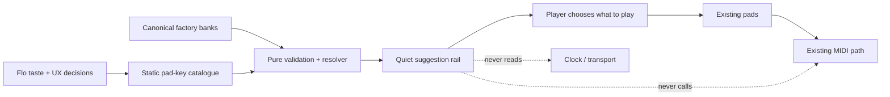

# 🎼 Project Research Summary

**Project:** Jay-6 v2.0 Musical Companion  
**Domain:** Bank-aware chord discovery in a performance-first browser MIDI instrument  
**Researched:** 2026-07-29  
**Confidence:** MEDIUM

## 🧭 Executive Summary

Jay-6 v2.0 should add a curated musical-companion layer without changing what the product fundamentally is: a player-controlled browser instrument. The selected Roland bank determines which chord suggestions are useful; the catalogue supplies ordered pad keys and restrained editorial metadata; the existing pad surface remains the only way to perform. Suggestions never sequence, schedule, trigger, or time chords.

The implementation should stay inside the existing Vite 6, Svelte 5, strict TypeScript, Vitest, and WEBMIDI.js stack with no new packages. Add one static JSON catalogue, a pure validated resolver, and a visually subordinate Svelte rail. Resolve chord labels from the canonical `banks.data.json`; never copy chord names, voicings, MIDI notes, or playback fields into suggestion data. Keep progression modules entirely separate from `EngineHost`, engines, MIDI, transport, and `TickSource`.

The largest risk is not technical complexity but false musical authority and accidental sequencer semantics. Validation can prove that catalogue entries resolve, but only Flo can decide whether the sequences, names, genre fit, special-bank treatment, and interaction model are useful. Build a representative reviewed sample before bulk authoring. Treat cursor behaviour, coverage targets, mobile interaction, bar metadata, and toast policy as explicit product gates rather than implementation details.

## 🔑 Key Findings

### 🧱 Recommended Stack

No dependency or framework change is justified. This feature is static data, deterministic lookup, derived Svelte presentation, and data/math testing.

**Core technologies:**

- **JSON**
  - One bundled, versioned, agent-editable catalogue in stable source order.
- **TypeScript**
  - Reuse the canonical `Key` vocabulary.
  - Validate cross-file invariants and return immutable view data.
- **Svelte 5**
  - Derive rail content from `ui.bankIndex`.
  - Keep mobile presentation state component-local.
- **Vitest**
  - Test schema integrity, coverage, ordering, bank resolution, fallback labels, and estimator/control helpers.
- **Existing browser smoke and hardware UAT**
  - Cover Svelte interaction, responsive hierarchy, Web MIDI, and OP-1 behaviour outside unit tests.

**Version requirements:**

- Keep the existing package ranges.
  - Vite `^6.0.0`
  - Svelte `^5.0.0`
  - TypeScript `^5.6.0`
  - Vitest `^2.1.0`
- Do not upgrade packages for this milestone.
- Do not add music-theory, schema, sequencing, store, UI-library, YAML, or runtime-fetch dependencies.

### 🎹 Expected Features

**Must have:**

- Bank-aware suggestions whose pad keys resolve against the currently selected factory bank.
- Plain, reviewable catalogue records with stable IDs and deterministic ordering.
- Strict validation for banks, pad keys, IDs, names, kinds, step bounds, duplicates, coverage policy, and resolution.
- Useful initial content rather than placeholder rows.
- A quiet desktop rail below the pads and a contained mobile treatment.
- Pad-key-first chips with canonical chord labels and fallback labels for unnamed banks.
- Selection/browsing with zero MIDI, latch, timer, engine, or transport effects.
- Stable bank/suggestion reset behaviour and an honest empty state.
- Up/Down variation cycling with wraparound, focus safety, repeat safety, and Hold as a no-op.
- Truthful queued-variation feedback only when a change is genuinely delayed.
- Stable read-only external BPM that never overwrites the internal BPM setting.

**Should have when explicitly approved:**

- Two meaningfully different suggestions per covered bank.
- Honest `progression` versus `movement` labels for functional and special-purpose banks.
- Formula metadata only where musically defensible.
- Performer-following guidance that advances only on the expected manual pad press and ignores deviations.
  - This is not a sequencer, but it still introduces product semantics and must be approved before implementation.
- A third signature suggestion for genre banks after the first catalogue proves useful.

**Defer beyond v2.0:**

- Favourites and persistence.
- Runtime progression editing, import/export, or user-defined banks.
- Generative, probabilistic, or ranked next-chord systems.
- New styles, velocity, Web Audio scheduling, transport expansion, and host/latch refactoring.
- Any sequencer, autoplay, chip audition, automatic progression advance, or timed playhead.

### 🏗️ Architecture Approach

The progression feature is a one-way projection from fixed data and the selected bank into UI. It does not join the playback graph.

**Major components:**

1. **`progressions.data.json`**
   - Owns bank applicability, stable IDs, short editorial metadata, `kind`, and ordered pad keys.
   - Never stores chord names, MIDI notes, tempo, duration, gate, velocity, scheduling, or playhead state.
2. **`progressions.ts`**
   - Owns types, one-time validation, bank indexing, deterministic filtering, and canonical label resolution through `banks.ts`.
   - Has no Svelte, DOM, MIDI, host, engine, transport, or clock dependency.
3. **`ProgressionRail.svelte`**
   - Derives resolved suggestions from `ui.bankIndex`.
   - Owns presentation and component-local mobile disclosure only.
4. **`state.svelte.ts`**
   - Remains the source for selected bank, style, variation, and internal BPM.
   - Does not mirror resolved catalogue data.
5. **`tickSource.ts`**
   - Remains the single external-clock listener owner.
   - May own a bounded external-BPM estimator and publish a nullable read-only measurement.
6. **Existing playback path**
   - `App.svelte` → `EngineHost` → engines → MIDI remains unchanged by suggestion work.

**Patterns to follow:**

- Validate at the data boundary; fail loudly instead of silently filtering.
- Derive labels and views; do not synchronize copies into global state.
- Give every new state value one owner and define reset/cleanup transitions.
- Keep orange reserved for actually sounding/latched pads.
- Keep steel reserved for genuinely queued/pending state.
- Extend the existing keyboard and external-clock listener paths; never add parallel global listeners.

### 🚨 Critical Pitfalls

1. **Suggestion UI becomes a sequencer**
   - Ban timing, transport, engine, MIDI, auto-advance, and playhead semantics from catalogue and rail modules.
   - Verify that leaving or browsing a suggestion emits nothing and advances nothing.
2. **Valid JSON hides stale or invalid musical references**
   - Validate every entry against every applicable canonical bank.
   - Reuse `Key`, `KEYS`, `getBank()`, and `labelFor()`; never duplicate bank truth.
3. **Catalogue passes CI but is musically weak**
   - Separate mechanical validation from musical review.
   - Audition representative families and approve real pad sequences before bulk coverage.
4. **Rail displaces the performance surface**
   - Keep pads visually primary.
   - Test desktop, iPad-sized, and iPhone-landscape layouts with real long and unusual labels.
5. **New feedback creates parallel timing/state systems**
   - Queue toasts must report an authoritative transition, not simulate it.
   - External BPM must be measured inside the existing clock-listener lifecycle and remain separate from `ui.bpm`.
6. **Focused polish expands into excluded architecture work**
   - Put a non-goals check in every phase.
   - Capture host, transport, persistence, authoring, and scheduler work as separate todos.

## 🎛️ Mechanical Work vs Flo Decisions

### Mechanical and implementation-ready

- JSON import, schema version, types, and validation errors.
- Canonical pad-key resolution and stable source ordering.
- Resolver tests for named, altered, slash, duplicate, repeated, blank-name, and 12-step cases.
- Pure wraparound helper for variation cycling.
- Focus, repeat, scroll, and Hold guards using the existing key handler.
- Bounded timestamp-based external-BPM estimation with jitter, outlier, reset, stale, and Int↔Ext tests.
- Dependency and MIDI-monitor checks proving the rail is inert.

### Flo must decide or approve

- **Launch coverage**
  - Research recommends two suggestions per bank.
  - Architecture supports either all 100 banks or a named reviewed subset with an honest empty state.
- **Musical content**
  - Actual pad sequences, names, formulas, genre claims, emotional labels, and final-to-first usefulness.
- **Special banks**
  - Movement/voicing studies for banks 14–26 versus deliberately showing no curated suggestions.
- **Guidance state**
  - Completely read-only rail versus performer-following expected-step guidance.
  - If guidance advances, decide loop-to-start versus neutral completion.
- **Mobile interaction**
  - Trigger placement, default state, selection method, dismissal, and focus behaviour.
- **Visual density**
  - Visible desktop row count and overflow policy using real catalogue content.
- **Timing language**
  - Whether `lengthBars` appears at all and whether it risks implying one chord per bar.
- **Queued feedback**
  - What delay is meaningful enough to show, and whether coarse “Queued · V08” copy is sufficient.

## 🗺️ Implications for Roadmap

### Phase 1: Catalogue Contract & Resolver

**Rationale:** Every later slice depends on a stable, non-executable content boundary.  
**Delivers:** JSON contract, types, validator, bank index, pure resolver, fixtures, integrity tests, and coverage reporting.  
**Addresses:** Agent-editable catalogue, bank-aware resolution, deterministic ordering, fallback labels.  
**Avoids:** Sequencer semantics, duplicated bank truth, invalid references, silent filtering.

### Phase 2: Musical Content & Interaction Contract

**Rationale:** Schema validity cannot establish musical usefulness, and bulk authoring before a taste gate multiplies rework.  
**Delivers:** Representative samples across functional, minor, jazz, electronic, Neo Soul, Classical, stack, and utility families; a recorded Flo decision on coverage, special-bank policy, cursor semantics, bar metadata, and naming; then the approved initial catalogue.  
**Addresses:** Useful initial content, honest `progression`/`movement` modes, meaningful diversity.  
**Avoids:** Generic templates, filler coverage, misleading metadata, unreviewed musical authority.

### Phase 3: Suggestion Rail

**Rationale:** UI should consume an approved contract and real content rather than invent both.  
**Delivers:** Desktop rail, mobile containment, bank reactivity, empty state, accessibility, and only the explicitly approved manual guidance semantics.  
**Addresses:** Pad-key-first chips, lightweight selection, responsive discovery UI.  
**Avoids:** Rail dominance, stale labels, false playhead cues, orange/steel semantic drift, playback coupling.

### Phase 4: Performance Controls & Queued Feedback

**Rationale:** Up/Down cycling and queued feedback share variation state and should be verified as one behaviour slice.  
**Delivers:** Wraparound helper, safe shortcut integration, footer/manual discovery, one replaceable accessible toast, and lifecycle cleanup.  
**Addresses:** Variation keyboard cycling and queued-change feedback.  
**Avoids:** Focus collisions, body scroll, repeated-key churn, Hold regressions, noisy or fabricated countdowns.

### Phase 5: Measured External BPM

**Rationale:** Tempo measurement is independent of suggestion UI but touches the most sensitive listener lifecycle, so it deserves an isolated phase.  
**Delivers:** Bounded estimator, reset/stale semantics, read-only top-bar value, lower-cadence publication, and listener/state regression tests.  
**Addresses:** Stable external-clock BPM while preserving internal BPM.  
**Avoids:** Single-tick jitter, stale values, overwritten `ui.bpm`, duplicate MIDI listeners, transport coupling.

### Phase 6: Integrated Hardware & Responsive UAT

**Rationale:** Static checks cannot prove musical usefulness, truthful feedback, Web MIDI lifecycle safety, or target-hardware feel.  
**Delivers:** OP-1/OP-1 field listening pass, MIDI-monitor proof of inert suggestions, keyboard matrix, clock-mode/input transition matrix, viewport checks, soak test, and core-loop regression sign-off.  
**Addresses:** The milestone as one coherent musical companion.  
**Avoids:** Cross-feature regressions, listener leaks, stale UI, scope leakage, and “looks done” completion.

### Phase Ordering Rationale

- Contract and pure resolution precede both content volume and UI.
- Musical and interaction decisions precede bulk content and stateful-looking UI.
- Rail, controls/feedback, and external BPM stay separate because they have different state owners and regression surfaces.
- Hardware UAT closes the milestone because musical taste, MIDI truth, timing behaviour, and responsive reachability cannot be proven by unit tests.
- Every phase closes with a non-goals diff against `.planning/PROJECT.md`.

### 🔬 Research Flags

**Needs deeper research or structured discovery:**

- **Phase 2**
  - Use focused musical audition and discussion rather than more generic web research.
  - The unresolved questions are taste and product policy.
- **Phase 3**
  - Use a UI/design clarification pass for mobile and guidance semantics if Phase 2 does not fully lock them.

**Established patterns; skip research-phase:**

- **Phase 1**
  - Current code, official TypeScript/Vite/Svelte behaviour, and project data patterns are sufficient.
- **Phase 4**
  - Existing keyboard and variation paths are known; planning should focus on the pending/applied truth source.
- **Phase 5**
  - MIDI semantics and architecture are documented; empirical tuning belongs in tests and hardware validation.
- **Phase 6**
  - This is execution of a defined UAT matrix, not an implementation research problem.

## 📊 Confidence Assessment

| Area | Confidence | Notes |
|------|------------|-------|
| Stack | HIGH | Existing stack already supports JSON imports, strict typing, derived Svelte UI, and pure tests; no dependency is needed. |
| Features | MEDIUM | The companion boundary is firm, but coverage, special-bank policy, cursor semantics, metadata, and content quality need Flo decisions. |
| Architecture | HIGH | Component and state boundaries were verified against the current codebase and reinforce existing project decisions. |
| Pitfalls | HIGH | Integration risks are grounded in current code and previous regressions; exact BPM smoothing and toast thresholds remain empirical. |

**Overall confidence:** MEDIUM

### Gaps to Address

- **Coverage is not locked**
  - Decide all 100 banks versus a reviewed subset before making coverage a failing test.
- **Content quality is not mechanically decidable**
  - Require Flo approval of representative families before bulk authoring and all shipped entries before release.
- **Feature and architecture research disagree on cursor state**
  - Default to inert read-only presentation until Flo explicitly approves performer-following semantics.
- **Mobile details are incomplete**
  - Resolve sheet trigger, default state, selection, focus, and dismissal before implementation.
- **Queued toast lacks a confirmed authoritative “audibly applied” signal**
  - Inspect the existing variation application path during planning; use coarse copy or omit the toast if truth cannot be established without architecture expansion.
- **BPM estimator constants are not yet tuned**
  - Choose window, publication cadence, and stale timeout through deterministic tests plus OP-1 observation.

## 📚 Sources

### Primary

- `.planning/PROJECT.md`
  - Milestone goal, active scope, architecture constraints, and exclusions.
- `.planning/research/STACK.md`
  - Technology and validation recommendation.
- `.planning/research/FEATURES.md`
  - Feature landscape, content policy, anti-features, and Flo-owned decisions.
- `.planning/research/ARCHITECTURE.md`
  - Verified component, data-flow, and state boundaries.
- `.planning/research/PITFALLS.md`
  - Integration risks, test matrices, phase warnings, and recovery strategies.
- `src/banks.data.json`, `src/banks.ts`, `src/state.svelte.ts`, `src/App.svelte`, `src/tickSource.ts`, `src/engines/host.ts`
  - Current sources of truth and integration seams inspected by the research agents.
- Jay-6 sketch findings
  - Approved chord-chip rail, responsive direction, colour semantics, toast direction, and top-bar hierarchy.

### Secondary

- [Vite 6 Features](https://v6.vite.dev/guide/features)
  - Direct JSON imports and TypeScript transpilation boundary.
- [Svelte `$derived`](https://svelte.dev/docs/svelte/%24derived)
  - Side-effect-free reactive derivation.
- [TypeScript `resolveJsonModule`](https://www.typescriptlang.org/tsconfig/resolveJsonModule.html)
  - Typed static JSON imports.
- [W3C Web MIDI API](https://www.w3.org/TR/webmidi/)
  - MIDI event delivery and timestamps.
- [MIDI Association MIDI Message References](https://midi.org/summary-of-midi-1-0-messages)
  - Timing Clock and transport semantics.
- [WAI Keyboard Interface Guidance](https://www.w3.org/WAI/ARIA/apg/practices/keyboard-interface/)
  - Focus ownership and arrow-key interaction.
- [Open Music Theory](https://viva.pressbooks.pub/openmusictheory/)
  - Conventional progression families used only as audition seeds.
- [Ableton Making Music: Parallel Harmony](https://makingmusic.ableton.com/parallel-harmony)
  - Voice-leading and voicing movement considerations.

---
*Research completed: 2026-07-29*  
*Ready for roadmap: yes*
