# Jay-6 Future Work

> **Historical snapshot:** This inventory supported the v2.0 milestone decision on 2026-07-29. The active source of truth is now .planning/ROADMAP.md. Ideas not otherwise captured were promoted to SEED-001, SEED-002, and SEED-003 before archival.

> Pick the next outcome first. “Sequencer” is one option, not the assumed v2.

```mermaid
flowchart TD
    V2["Choose the next Jay-6 milestone"]

    V2 --> A["A · 🎹 Performance UX"]
    V2 --> B["B · 🔌 MIDI confidence"]
    V2 --> C["C · 🎼 Composition aids"]
    V2 --> D["D · ⏱ Sequencing"]
    V2 --> E["E · 💾 Recall"]
    V2 --> F["F · 📦 Expansion"]

    A --> A1["Variation shortcuts"]
    A --> A2["Queued-change feedback"]
    A --> A3["Touch selectors"]

    B --> B1["Host-owned play state"]
    B --> B2["OP-1 transport reset"]
    B --> B3["External BPM display"]

    C --> C1["Progression authoring"]
    C --> C2["More styles + velocity"]
    C --> C3["Custom chord banks"]

    D --> D1["Step grid"]
    D --> D2["Pattern chaining"]
    D --> D3["Song mode"]

    E --> E1["Remember settings"]
    E --> E2["Save + recall presets"]

    F --> F1["Help + browser support"]
    F --> F2["Routing + multi-user"]
    F --> F3["Developer tooling"]
```

## 🗺️ Selection map

| Pick | Product outcome | Official todos | Shape |
|------|-----------------|----------------|-------|
| **A · Performance UX** | Faster, clearer playing across keyboard and touch | 3 | Compact and user-visible |
| **B · MIDI confidence** | OP-1 timing, state, and tempo always tell the truth | 3 | Foundational and engine-heavy |
| **C · Composition aids** | Help players discover what to play | 1 | Feature-led and extensible |
| **D · Sequencing** | Turn chord pads into an arrangement tool | 0 | Large; still needs discovery |
| **E · Recall** | Restore a preferred setup instantly | 0 | Medium; product-behaviour decisions |
| **F · Expansion** | Broaden audience, routing, or tooling | 0 | Parking lot; not yet scoped |

The seven official pending todos are fully accounted for under **A**, **B**, and **C**.

## A · 🎹 Performance UX

**Outcome:** make live control faster and remove moments where the interface feels unresponsive.

- ✅ **Cycle variations with Up/Down**
  - Completes keyboard performance controls
  - Wraps within the current style
- ✅ **Confirm slow queued variation changes**
  - Toast only when the next hit is far enough away to feel ambiguous
- ✅ **Touch-oriented Bank and Channel selectors**
  - Better tactile control without regressing mouse, keyboard, or compact layouts
- 📦 **In-app help overlay**
  - Optional learnability follow-up

**Good v2 when:** the instrument already does enough, but playing it should feel quicker and more obvious.

## B · 🔌 MIDI confidence

**Outcome:** make Jay-6 and the OP-1 behave like one trustworthy instrument.

- ✅ **Host-owned play/latch state**
  - Removes the remaining audio-versus-highlight desync class
  - Useful foundation for any future feature
- ✅ **OP-1 Start/Continue reset**
  - Aligns a running pattern to step zero when recording begins
- ✅ **Measure external-clock BPM**
  - Shows the tempo actually arriving from the OP-1
  - Preserves the separate internal BPM setting
- ⚠ **Web Audio scheduling**
  - Only promote if internal-clock drift becomes a real-use problem

**Good v2 when:** reliability, timing, and confidence matter more than adding a new creative surface.

## C · 🎼 Composition aids

**Outcome:** help players discover useful musical combinations without automating the performance.

- ✅ **Per-bank progression authoring and display**
  - Plain agent-editable source
  - Progression bars mapped to each bank
- ◇ **Styles 6–9 phrases**
  - More rhythmic vocabulary
- ◇ **Velocity control**
  - More expressive output
- 📦 **User-defined chord banks**
  - Larger authoring and product-design step

**Good v2 when:** the priority is musical inspiration rather than transport or arrangement.

## D · ⏱ Sequencing

**Outcome:** turn chord-pad presses into editable arrangements.

- ◇ **Chord-pad step grid**
- ◇ **Pattern chaining**
- ◇ **Basic song mode**
- 📦 **Strict sequencer transport mode**

**Important boundaries:**

- This is only a roadmap candidate
- No requirements or phases exist yet
- Host-owned state and OP-1 transport reset may become prerequisites
- It needs discovery before commitment

**Good v2 when:** Jay-6 should become a composition and arrangement tool, not only a live instrument.

## E · 💾 Recall

**Outcome:** reopen Jay-6 and immediately recover a preferred setup.

- ◇ **Persist bank, BPM, MIDI port, and latch**
- ◇ **Save and recall presets**

**Good v2 when:** repeated setup is the main friction in real use.

## F · 📦 Expansion

**Outcome:** broaden the product beyond its current focused browser-instrument role.

- 📦 **Safari or Firefox support**
- 📦 **Multi-channel or multi-output routing**
- 📦 **Backend, accounts, or multi-user support**
- 📦 **Reusable voicing-audit skill**

These are retained ideas, not current commitments. Promote them only after a deliberate product decision.

## 🧪 Mix-and-match milestone candidates

- **Performance polish**
  - A1 + A2 + A3
- **OP-1 confidence**
  - B1 + B2 + B3
- **Musical companion**
  - C1, optionally C2 or C3
- **Reliable live instrument**
  - A1 + A2 + B1 + B3
- **Sequencer discovery**
  - Research D first
  - Decide whether B1 and B2 are prerequisites
- **Personal setup**
  - E1 + E2

## ✅ Completed cleanup

- Planning metadata is reconciled
- Old `TRANSPORT-IN` instrumentation is removed
- Favicon and octave readout are shipped locally
- Archived UAT and milestone evidence remains unchanged
- Canonical cleanup and all seven todo captures are committed
- This inventory intentionally remains untracked

## ▶️ Next decision

Choose one cluster, mix specific items, or nominate an outcome in your own words.

Only then run `$gsd-new-milestone` and let that decision define v2.
