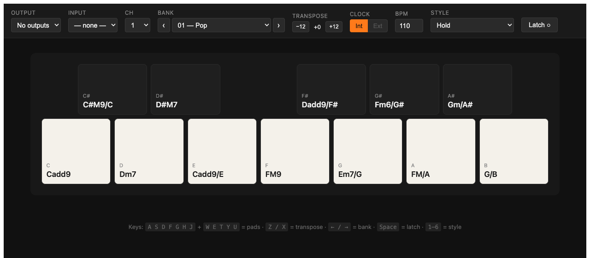

# Jay-6 🎹

> A browser-based [Roland J-6](https://www.roland.com/global/products/j-6/) — chord pads in your Chrome tab, MIDI flowing out to anything that listens. Built so I could drive my OP-1 with the J-6's beautiful chord library without buying the hardware.



## ✨ What it does

- 🎵 **All 100 Roland J-6 chord banks**, 12 chords each — extracted straight from Roland's manual
- 🎛️ **12-pad piano layout** mirroring the J-6 hardware (5 black on top, 7 white on bottom)
- 🌀 **5 playback styles**: Hold · Arp 8th · Arp 16th · Phrase Duration · Rhythm Gate × 2 — 60 variations total
- ⛓️ **Latch** that follows the J-6 HOLD convention (same-pad re-press retriggers)
- ⌨️ **Ableton-style keyboard shortcuts** so you can play without a mouse
- 🕰️ **External MIDI clock receive** — slave it to your OP-1's tempo
- 🎚️ **Transpose**, **gate length**, **BPM**, **per-channel output**

## 🚀 Quick start

```bash
just dev     # vite on localhost:5173 — Web MIDI works in Chrome / Edge
just serve   # + Cloudflare tunnel to https://jay-6.kempenich.dev
```

Then plug in your USB MIDI device, pick it from the **Output** dropdown, and play.

## ⌨️ Keyboard

| Keys | What |
|---|---|
| `A S D F G H J` | White pads (C D E F G A B) |
| `W E T Y U` | Black pads (C♯ D♯ F♯ G♯ A♯) |
| `Z` / `X` | Transpose ±1 octave |
| `← / →` | Previous / next bank |
| `Space` | Toggle latch |
| `1`–`6` | Switch style |

## 🛠️ Stack

Vite 6 · Svelte 5 (runes) · TypeScript strict · Vitest · [WEBMIDI.js v3](https://webmidijs.org/)

## 🌐 Browser support

| Browser | Web MIDI |
|---|---|
| Chrome / Edge (desktop) | ✅ |
| Firefox | ❌ — no Web MIDI |
| Safari | ❌ — no Web MIDI |
| iPad (any built-in browser) | ❌ — iOS lacks Web MIDI |
| iPad via **Web MIDI Browser** app | ✅ |

Note: Web MIDI requires a *secure context* — `localhost` or HTTPS. Plain `http://` LAN IPs will be denied.

## 📚 More docs

- [`CURRENT-STATE.md`](CURRENT-STATE.md) — roadmap, what's shipped, what's next
- [`.research/PLAN.md`](.research/PLAN.md) — design rationale and decision log

## 🎬 Why "Jay-6"?

It's the [Roland J-6](https://www.roland.com/global/products/j-6/) spelled out. Same idea, different surface.
